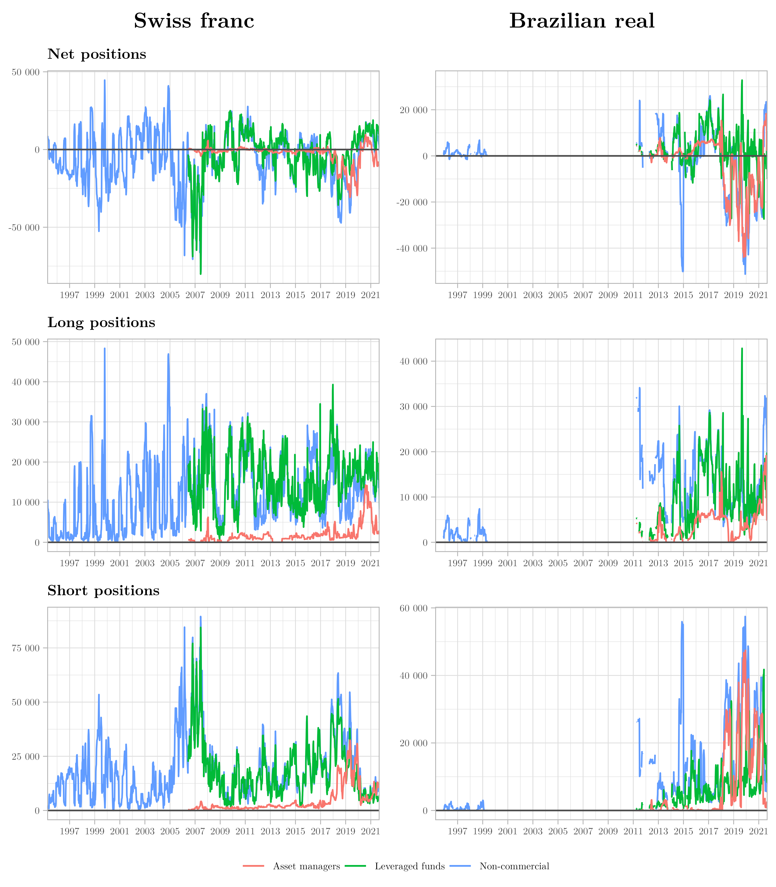
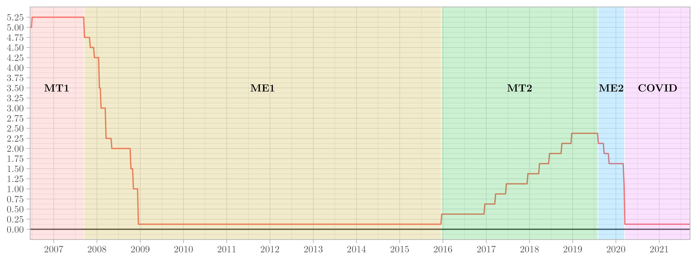
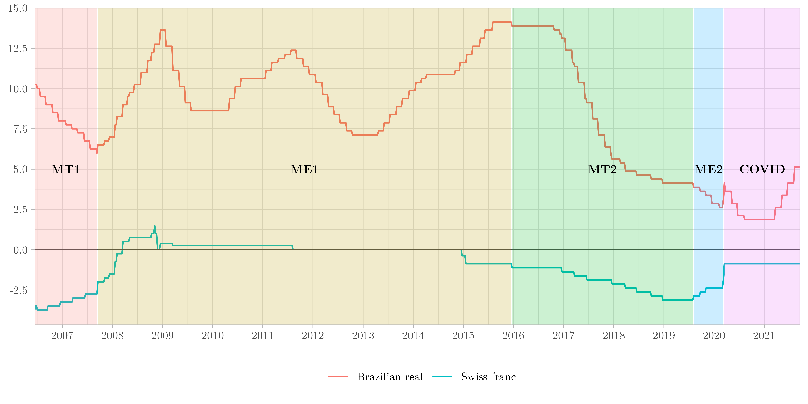
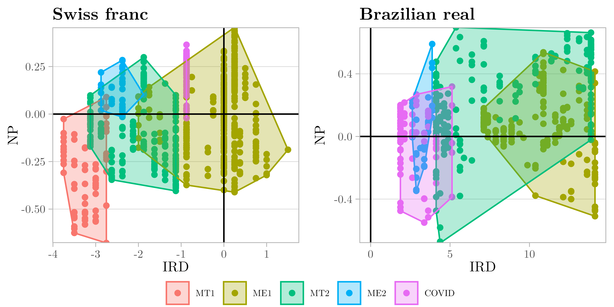
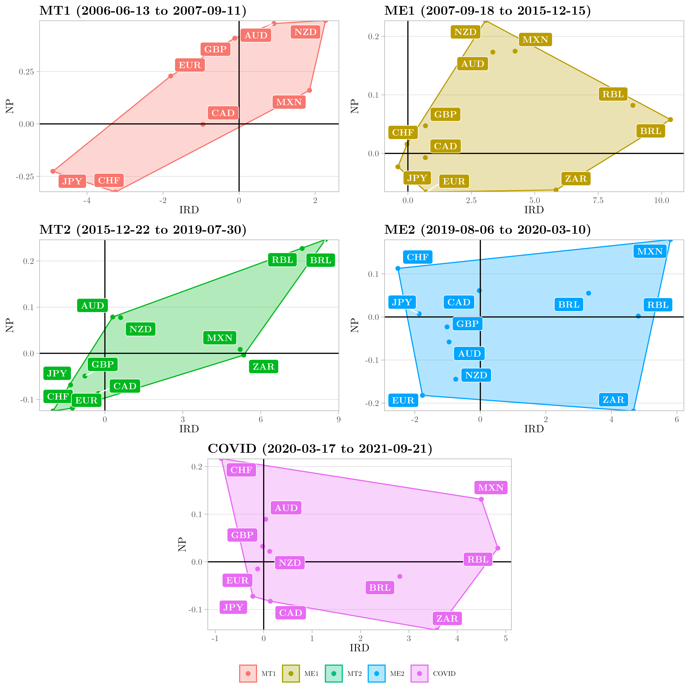

---
#########################################
# options for knitting a single chapter #
#########################################
output:
  bookdown::pdf_document2:
    template: templates/brief_template.tex
    citation_package: biblatex
  bookdown::html_document2: default
  bookdown::word_document2: default
documentclass: book
#bibliography: references.bib
---

```{block type='savequote', quote_author='(ref:minsky-quote)', include=knitr::is_latex_output()}
The general economic tone since the mid-sixties has been conducive to short-run speculation rather than to the long-run capital development of the economy.
```
(ref:minsky-quote) --- Hyman @minsky2015 [\text{p.} 57] <!-- Alternative: Hyman Minsky -@minsky2015 [\text{p.} 57]-->

# Research design {#two}
\minitoc

## Introduction {#twoone}

\noindent This chapter shows how the research approach in this thesis is designed. Beyond explaining the research methods, the main goal is to provide a clear view of the intended contribution of this thesis. As shown in the chapter [General introduction], this thesis questions how developing and developed countries are impacted by the carry trade activity. Notably, two countries are at the center of this research: Brazil and Switzerland. Both countries were not chosen randomly, neither by my Brazilian roots or main research interests. The Brazilian real and the Swiss franc are major target and funding currencies in the carry trade strategy, respectively. In recent economic history, the two have been challengers of the monetary policy rules. For example, after the GFC, the Brazilian government imposed capital controls on portfolio investments [@tomio2011; @centralbankofbrazil2013], and the SNB set a minimum Swiss franc to euro exchange rate [@swissnationalbank2011] and introduced negative policy rates in 2014 [@swissnationalbank2014].

At the time they were implemented, these policies surprised financial market participants. Another common feature was the willingness to defend the domestic currency from foreign capital excesses. In the highly intertwined financial system we live in, countries lose policy space to tame negative international spillovers. In order to escape TINA ("there is no alternative"), central banks have to innovate to achieve different results from those obtained following the usual rule book supplied by global governance institutions (e.g., International Monetary Fund - IMF). Since there is no global regulation, central banks often act unilaterally to tame the negative impacts of the carry trade activity. Overall, investigating the carry trade effects implies also exploring the current international monetary system.

To clarify the aim and scope of this investigation, the initial sections of this chapter explore the theoretical framework. First, Section \@ref(twotwo) looks into the origins and the current state of our financialized economic system. It is a system developed by a process known as financialization. Second, in Section \@ref(twothree), there is the carry trade itself. This speculative investment strategy would not cause harm in a world without financialization. Due to the excesses of global finance, the carry trade spread damage worldwide. This background is essential to understand the next chapters. In the following, the conceptual framework is presented in Section \@ref(twofour) based on the main research question.

Additionally, the epistemological approach and the research methodology are adapted to the study of the carry trade. Based on the concepts in the philosophy of science, the epistemology used is rooted in realism, skepticism, empiricism and the principle of parsimony. Basically, using assumptions as close as possible to the real economy (realism/realisticness), the reliability of current knowledge (skepticism) on the carry trade literature is empirically tested (empiricism) in simplified models (the principle of parsimony).

Regarding the research methodology, it is a holistic study using quantitative methods, collecting and analyzing secondary data. In holism, the interdependence of actors and institutions is essential. Consequently, this fits the political economy approach to study the complexity of the carry trade activity. In our current dysfunctional system, power relations go beyond the usual binary rationales (i.e., developed or emerging/developing countries; funding or target currencies) explored in the literature. Though relevant to some extent, such dichotomies do not reflect the complexity of carry trade activities and their power relations.

This implies to focusing on the States, but also on central banks and on private investors of different kinds (dealers/intermediaries, asset managers, leveraged funds, etc.). Being the guardians of the currencies, central banks' non-cooperative actions exemplify this logic of power between States that dictate the carry trade. Monetary policy is "a peculiar form of economic state power" [@braun2020, \text{p.} 242]. In this sense, monetary policy fostered financialization while depending on financial markets to be effectively implemented [@krippner2011; @braun2018; @braun2020a; @walter2020]. The dependence of the monetary authority on financial market actors, whom sought to impose their will, is explored by two types of power in the modern political economy: instrumental power ("lobbying capacity") and structural power ("the financial sector's central position in the economy") [@braun2020a, \text{p.} 1].

In the same line as the analysis of the relationship between central banking and the shadow banking developed by @braun2020, the carry trade activity also implies both infrastructural entanglement and power. With free capital movement worldwide and inflation targeting as the main monetary policy, incentives for the carry trade are created with systematic interest rate differentials. On the one hand, the U.S. monetary policy drives the "global financial cycle" [@miranda-agrippino2020]. On the other hand, there are two other types of monetary policy in this context. First, other developed countries with central currencies can independently implement their monetary policy (e.g., Euro area, Switzerland, and Japan). Second, the other peripheric countries must subordinate their monetary policy accordingly to the U.S. or other developed countries. Within the carry trade activity, this subordination means relatively higher interest rates and exchange rate volatility, which are "necessary to compensate for these currencies' lower standing in the international currency hierarchy" [@bonizzi2020, \text{p.} 183].

This thesis aims to fill a gap in the literature by combining the empirical investigation of the carry trade effects on the real economy with a political economy approach. Concerning the quantitative methods, advanced time-series econometrics is used. The choice for these econometric methods is based on the type of data available to proxy the carry trade activity. Moreover, one of the main features of this thesis design is reproducibility. An online repository^[Accessible on https://github.com/bttomio/UGA_thesisdown.] is available to reproduce the entire thesis with ```R```. In an effort to foster a more ethical and transparent engagement to research in Economics, all econometric procedures are reproducible on Stata (Chapters \@ref(three) and \@ref(four)) and ```R``` (Chapter \@ref(five)).

## Financialization {#twotwo}

\noindent Episodes of financial crisis have not ceased to increase after the "Golden Age" of capitalism. This capitalist phase comprises the period of the 1950s until the early 1970s, when major capitalist economies exhibited great economic performance (e.g., high growth rates and low inflation and unemployment). The end of this golden phase is linked to the "stagflation" of the 1970s. Financial markets deregulation was one of the implemented policies to deal with the dual problem of stagnation and inflation. Consequently, a new phenomenon sprouted with deregulated finance: financialization. In the beginning, in the early 1980s, it was restricted to the United States and the United Kingdom. Nevertheless, it did not take too long to spread worldwide [@hein2015b]. One of the well-known manifestations of the global expansion of this new financialized system is the carry trade activity.

Finance-dominated capitalism [@hein2015c] or financialization is defined, following Epstein's seminal work [-@epstein2005, \text{p.} 3], as "the increasing role of financial motives, financial markets, financial actors and financial institutions in the operation of the domestic and international economies." This is a very broad ("macro-level") definition, which helped to aggregate a significant body of literature and create a research agenda [@mader2020]. Table \@ref(tab:Table21) shows other definitions, based on three levels of analysis [@vanderzwan2014]: macro ("the emergence of a new regime of accumulation"), meso ("the ascendency of the shareholder value orientation") and micro ("the financialization of everyday life"). 

(ref:abel-cit1) @mader2020 [Table 1.1, \text{p.} 7]
(ref:abel-cit2) @krippner2005 [\text{p.} 174]
(ref:abel-cit3) @boyer2000 [\text{p.} 121]$^\bigstar$
(ref:abel-cit4) @tang2010 [\text{p.} 3]
(ref:abel-cit5) @palley2008 [\text{p.} 29]
(ref:abel-cit6) @aalbers2008 [\text{p.} 149]
(ref:abel-cit7) @stockhammer2004 [\text{p.} 720]
(ref:abel-cit8) @froud2000 [\text{p.} 104]
(ref:abel-cit9) @orhangazi2008 [\text{p.} 864]
(ref:abel-cit10) @froud2006 [\text{p.} 4]
(ref:abel-cit11) @martin2002 [\text{p.} 43]

```{r Table21, echo = FALSE, message=FALSE, warning=FALSE}

library(kableExtra)
library(tidyverse)

tab21 <- data.frame("Author" = c("(ref:abel-cit2)", 
                                 "(ref:abel-cit3)", 
                                 "(ref:abel-cit4)", 
                                 "(ref:abel-cit5)", 
                                 "(ref:abel-cit6)", 
                                 "(ref:abel-cit7)", 
                                 "(ref:abel-cit8)", 
                                 "(ref:abel-cit9)", 
                                 "(ref:abel-cit10)", 
                                 "(ref:abel-cit11)"), 
                    "Definition of financialization" = 
                      c("\``a pattern of accumulation in which profits accrue primarily through financial channels rather than through trade and commodity production\''",
                        "process by which \``all the elements of national demand bear the consequences of the dominance of finance\''",
                        "\``process [...] through which commodity prices became more correlated with prices of financial assets and with each other\''",
                        "\``(1) elevate the significance of the financial sector relative to the real sector; (2) transfer income from the real sector to the financial sector; and (3) contribute to increased income inequality and wage stagnation\''",
                        "\``capital switching from the primary, secondary or tertiary circuit to the quaternary circuit of capital [...]; that is, the rise of financial markets not for the facilitation of other markets but for the trade in money, credit, securities, etc.\''",
                        "\``increased activity of non-financial businesses on financial markets, [...] measured by the corresponding income streams\''",
                        "\``a new form of competition which involves a change in orientation towards financial results but also a kind of speed up in management work\''",
                        "\``designate[s] the changes that have taken place in the relationship between the non-financial corporate sector and financial markets\''",
                        "\``changes induced by the rhetoric of shareholder value [which] sets firms and households utopian objectives such as value creation by management intervention for giant firms or security through stock-market saving for households\''",
                        "\``insinuates an orientation toward accounting and risk management into all domains of life\''"), 
                    "Main level of analysis" = 
                      c("Macro", "Macro", "Macro", "Macro", "Macro", "Meso", "Meso", "Meso", "Meso-Micro", "Micro"))
colnames(tab21) <- c("Author", "Definition of financialization", "Main level")

kable(tab21, "latex", caption = "Main definitions of financialization", position = "!ht", 
      booktabs = T, escape = F) %>%
  kable_styling(latex_options = c("scale_down")) %>%
  column_spec(2, width = "8,5cm") %>%
    footnote(
    general = paste0("\\\\footnotesize{Adapted from (ref:abel-cit1). From their table notes: \``Selection based on articles carrying `financialization' or `financialisation' in title, and Google Scholar citations $>$ 500, last accessed Feb. 14, 2019; ${}^\\\\bigstar$derived, no explicit definition of financialization given and does not carry `financialization' in title.\''}"),
    general_title = "\\\\footnotesize{Source:}",
    footnote_as_chunk = T,
    escape = F,
    threeparttable = T)
```

More precisely, @mader2020 [\text{p.} 6] define each of these levels as the following: "macro-level approaches, which usually focus on the transformation of capitalist accumulation or changes in macroeconomic aggregates and often engage with a state/market-dichotomy in processes of financialization; meso-level analyses, which put (mostly non-financial) corporations center stage and examine issues of ownership and control as well as changing corporate relations with financial markets; and micro-level approaches, which highlight how (mostly) non-elite actors are implicated in a 'financialization of daily life,' zooming in on financial practices and rationalities in, for instance, saving and borrowing."

An analysis of the carry trade using these levels shows that it is inherently connected to financialization. Based on the macro-level approaches, this speculative activity gained (i) ground with the internationalization of financial markets and (ii) monetary magnitude with leverage. At the meso level, speculation by non-financial firms with derivatives is "rare" [@bartram2019]. Using a sample of S\&P 500 nonfinancial firms for 1993, @allayannis2001 show that firms use foreign currency derivatives for hedging purposes rather than speculative opportunities. Nonetheless, @bruno2017 [\text{p.} 741] find that "found evidence of divergence between emerging and advanced economy firms, with emerging economy firms being more susceptible to carry trades and the associated surrogate financial intermediation activities." Indeed, Brazil provides two recent and notorious examples of the problems generated by this facet of financialization, where non-financial firms seek profits from speculative finance. One of the examples is the Brazilian company Aracruz Celulose, which registered losses of U.S.\$2.13 billion in derivatives in the last quarter of 2008 [@zeidan2013]. Another example is Sadia, one of the biggest Brazilian food producers in 2008. Sadia booked a net loss of approximately U.S.\$ 1 billion in 2008 [@desouzamurcia2017], by turning itself to speculative investments in currency derivatives during the Brazilian carry trade boom. 

 >Talk of “carry trades” feels out of place in the context of nonfinancial firms, as carry trades are more commonly associated with financial institutions better equipped to take on financial exposures. However, if the nonfinancial firm comes from an emerging economy with capital controls that restricts cross-border financial transactions, the activities of nonfinancial firms take on greater importance in providing avenues to circumvent capital controls. [@bruno2017, \text{pp.} 704-705]

At the micro-level, we may not be far from seeing an increase in ordinary people's pursuit of carry trade investment strategies. The popularization of stock trading with apps like Robinhood and Acorns is an example of the recent developments of financialization of daily life. The dangers of speculative financial activity are increasing, notably when trading is handled as a game. This is the gamification^[By implementing "game design elements in non-game contexts" [@deterding2011, \text{p.} 2], gamification seeks the mimetism of games/entertainment in other areas. Hence, "since video games are designed with the primary purpose of entertainment, and since they can demonstrably motivate users to engage with them with unparalleled intensity and duration, game elements should be able to make other, non-game products and services more enjoyable and engaging as well" [@deterding2011, \text{p.} 1].] of finance. As shown by @heide2021 [\text{p.} 13], "With millions of unskilled investors flocking to easy-access smartphone-based brokerages with in-built gamified features, it is perhaps reasonable to be sceptical." Therefore, the carry trade strategy may be popularized in further developments of the gamification of financial markets.

In order to better understand the tendencies towards financialization, @hein2015c provide a comparative analysis of different theoretical approaches (the French Regulation School, the Social Structures of Accumulation [SSA] approach, and the contribution by several post-Keynesians authors, with particular emphasis on the long-run views provided by Hyman Minsky's contributions). "What these approaches have in common is the notion that capitalist development is embedded in social institutions and that there is a kind of interdependence between the set of institutions and economic development, each feeding back on the other." [@hein2015c, \text{p.} 7] While investigating the modern capitalism, each approach describes the period of financialization in a specific manner: (i) "finance-led growth regime" [@boyer2000] in the French Regulation School, (ii) "global neoliberal social structure of accumulation" [@tabb2010] in the SSA approach, (iii) "finance-dominated capitalism" [@hein2012] among post-Keynesians, and (iv) "money manager capitalism" for @minsky1996.

@hein2015c use a four-step pattern to compare these approaches. First, they sketch the common views regarding the basic structures. "[A]ll approaches consider ‘capitalist’ (Regulation School, SSA), ‘monetary production’ (post-Keynesians) or ‘financial’ (Minsky) economies to be inherently unstable and argue that these economies require stabilizing social institutions." [@hein2015c, \text{p.} 43] Based on a Marxian interpretation, the Regulation School and the SSA approach point to the class conflict (capital versus labor) in the production and distribution as the root for the instability. For post-Keynesians, based on their approach of the monetary production economy, institutions require "the need to cope with fundamental uncertainty, to provide stable monetary and financial relations, to constrain distribution conflict, and to stabilize aggregate demand in the short and in the long run." [@hein2015c, \text{p.} 43] For Minsky, institutions are undermined by human behavior in financial economies, where the paradox of stability holds (a stable period in the economy breeds an unstable one). Regarding institutional change, on the one hand, within an endogenous mechanism, the Regulation School, the SSA approach, and Minsky view the collapse of the economic system as a result of its success. On the other hand, for post-Keynesians, "institutional changes seem to be contingent on exogenous shocks, changing power relations and economic policy failures" [@hein2015c, \text{p.} 43].

Second, @hein2015c search for the explanation of the origin of financialization. The collapse of profitability in the "Fordism" or the "regulated capitalist SSA" are the reasons for the emergence of the financialization for the Regulation School and the SSA approach, respectively. For post-Keynesians, economic policy responses to the increasing inflation rates in the 1970s are related to the collapse of a social bargain/compromise of the period of the "Golden Age" (1950s-early 1970s). "Minsky’s approach differs from those previously outlined in that he views the transition towards money manager capitalism rather as a gradual process, driven by the stability of ‘paternalistic capitalism’, and based on his credo ‘stability breeds instability’ by increasing appetite for risk etc." [@hein2015c, \text{p.} 44]

Third, the different approaches present complementarities on their views of financialization's main characteristics and features, rather than fundamental differences [@hein2015c]. "In particular the Regulation School, the SSA approaches and the post-Keynesian contributions seem to agree that the financialization period is characterized by the deregulation and liberalization of national and international financial markets, goods markets and labour markets, by the reduction of government intervention in the market economy, by a rentier/shareholder–manager coalition dominating labour, by a pronounced shareholder value and short-term profitability orientation of firms at the expense of long-run profitable investments in capital stock, by redistribution of income from wages to broad profits, and among wages from direct labour to managers, and by increasing opportunities of creating household debt for consumption purposes, as well as structural changes in the banking sector through securitization, in particular." [@hein2015c, \text{pp.} 44-45] Minsky's approach is more concentrated on the financial economy, emphasizing the instability created by leverage, speculative and Ponzi financing, and frauds. More fundamentally, whereas Minsky's view claims a stronger role of government and central banks ("rescuer of last resort"), the other approaches characterize "financialization by downsizing governments" [@hein2015c, \text{p.} 45].  

Fourth, @hein2015c explore the consequences of financialization for long-run economic and social development. They demonstrate that the approaches of the Regulation School and the SSA "seem to accept the post-Keynesian argument that, in particular, redistribution at the expense of (lower) wages during the financialization period has caused a major problem for aggregate demand" [@hein2015c, \text{p.} 45]. Post-Keynesians emphasize the different macroeconomic regimes^[Regarding Brazil and Switzerland, see @hartwig2013 and @tomio2020a, respectively.] or type of developments under the period of financialization that contribute to "inequality and global current account imbalances". Both are identified as "causes for the worldwide Great Recession^[Occurred between 2007 and 2009 [@maclean2015].]" [@hein2015c, \text{p.} 45] For Minsky, the "increasing instability potentials" [@hein2015c, \text{p.} 46] are essential to understand the possible negative spillovers of financialization on the long-run economic and social development of the world economy.

As a consequence of financialization, the disconnection between the monetary and real sides of the economy is increasing. As demonstrated by @lane2018, global external assets as a ratio of world GDP increased significantly from 1995 until 2007. By analyzing the international currency positions over 1990–2012, @benetrix2015 [\text{p.} S108] find that "the increase in the scale of international balance sheets (especially for advanced economies) means that a given exchange rate shift can now generate much larger cross-border wealth effects relative to GDP." Nevertheless, between 2007 and 2015,

 >the growth in cross-border positions in relation to world GDP has come to a halt, reflecting primarily two factors. The first is much weaker capital flows to and from advanced economies, including financial centers, and in particular diminished cross-border activity by banks in advanced economies, including within the euro area. The second is an increase in the relative weight of emerging economies in global GDP, since these economies have lower ratios of external assets and liabilities to GDP relative to advanced economies. [@lane2018, \text{p.} 190]

One way of showing this is to divide the amount negotiated in foreign exchange markets (monetary side) by the amount needed for trade, given by the sum of exports and imports, and foreign direct investment, i.e., productive investment (real side)^[This indicator is similar to the ratios proposed by @mccauley2011 and Ramos [-@ramos2016; -@ramos2017]. Nonetheless, the use of the sum of trade and direct investment, as a daily mean, as the denominator in the ratio's equation is a novelty in the literature, to my knowledge.]. This ratio indicates how much the foreign exchange markets are disconnected from the real economy necessity of foreign exchange. Moreover, it also shows the strengthening of financialization in the global foreign exchange market. Paradoxically, the more disconnected they are, the monetary side becomes more harmful to the real side.

Apropos the world economy, Figure \@ref(fig:Figure21) illustrates the foreign exchange daily turnover (FDT) and the FDT ratio. The latter is given by dividing FDT by the sum of trade and direct investment. The source for the FDT data is the BIS Triennial Central Bank Survey, which "is the most comprehensive source of information on the size and structure of global foreign exchange (Forex or FX) and over-the-counter (OTC) derivatives markets" [@bankforinternationalsettlements2019, \text{p.} 3]. For the real side variables, data is gathered from the IMF's Balance of Payments and International Investment Position Statistics (BOP/IIP)^[Check Appendix (ref:appendixa1) for further details on the data.]. As shown in Figure \@ref(fig:Figure21), the ratio increased from 12.81 in 1986 to 42.57 in 2019^[Table \@ref(tab:TableA11) provides the FDT ratio for several countries in each period.]. There was a rapid increase in the ratio between the mid-1980s and mid-1990s. In the 2000s, the ratio declined quite significantly with a rebound from 2010 onward. The evolution of this ratio shows evidence of the extent of the disconnection from the reality caused by financialization. Moreover, the 2019 ratio demonstrates that the foreign exchange daily turnover exceeded the sum of trade and direct investment by roughly 43 times. 

(ref:appendixa1) \@ref(appendixa1)
(ref:nyse) [@newyorkstockexchange2021]

```{r Figure21code, tab.cap = NULL, echo = FALSE, message=FALSE, warning=FALSE}

# SOURCE FILE: plotnomics (PLOTS - Chapter 1.R)

library(ggplot2)
library(jcolors)
library(lubridate)
library(kableExtra)
library(tidyverse)
library(tibble)
library("extrafont")
library(cowplot)
#extrafont::font_import()
#font_import(paths = c('./Latin-Modern-Roman-fontfacekit/web fonts/latinmodernroman_10regular_macroman', prompt = F))
# manually install the font in the directory
#extrafont::loadfonts()

g1_option2_df <- structure(list(Date = structure(c(5844, 6940, 8035, 9131, 10227, 
11323, 12418, 13514, 14610, 15706, 16801, 17897), class = "Date", tzone = "Europe/Paris"), 
    MULT = c(12.8105396770191, 30.829210360965, 36.5339934045687, 
    38.8141059079374, 39.1540693092515, 28.2835269487681, 28.3192697392836, 
    27.4422977887559, 32.1212310896478, 34.1263033775576, 37.041896515762, 
    42.572209599972), FDT = c(0.206, 0.7437, 1.115493796629, 
    1.63274928087, 2.099423166555, 1.704680257201, 2.608106343031, 
    4.281096095043, 5.045305541228, 6.685737173451, 6.513536541376, 
    8.300586371084)), row.names = c(NA, -12L), class = "data.frame")

g1_option2 <- g1_option2_df %>%
  ggplot(aes(x = Date)) + 
  geom_line(aes(y = FDT, colour = "Forex daily turnover (FDT) [LHS]")) + 
  geom_line(aes(y = MULT/4.4, colour = "Ratio, FDT/(Trade + DI) [RHS]")) + 
  geom_hline(yintercept = 0) + 
  scale_y_continuous(expand = c(0, 0), limits = c(0,10), breaks = c(0, 2.5, 5, 7.5, 10), 
                     sec.axis = sec_axis(~.*4.4, name = "Ratio, FDT/(Trade + DI)",
                                         breaks = c(0, 11, 22, 33, 44))) + 
  scale_x_date(expand = c(0, 0), date_labels = "%Y", breaks = g1_option2_df$Date) + 
  theme_light() + 
  labs(y = "FDT, in trillion of U.S. dollars",
       colour = "") + 
  theme(legend.position = "bottom", 
        legend.direction = "horizontal",
        legend.background = element_blank(),
        axis.title.x = element_blank(), 
        panel.grid.minor = element_blank(),
        text = element_text(family = "LM Roman 10"),
        axis.text.x = element_text(size = 9))
```

```{r Figure21, out.width='0.99\\columnwidth', fig.height=4, fig.cap="Forex daily turnover (FDT) and ratio between FDT and the sum of daily trade and direct investment (DI), 1989-2019 \\\\ \\scriptsize \\textit{Source:} Bank for International Settlements (BIS) for the Forex daily turnover (FDT), using the net-gross basis. International Monetary Fund (IMF) for trade (sum of exports and imports of goods and services in U.S. dollars) and direct investment (sum of net acquisition of financial assets and net incurrence of liabilities in U.S. dollars). \\\\ \\scriptsize \\textit{Notes:} Since FDT series are daily means for April, the sum of trade and DI are divided by 252, which is a rule of thumb for the number of trading days in a year (ref:nyse). See Appendix (ref:appendixa1) for more details. LHS and RHS are the abbreviations for left-hand axis and right-hand axis, respectively.", fig.scap="Forex daily turnover (FDT) and ratio between FDT and the sum of daily trade and direct investment (DI), 1989-2019", fig.pos="!ht", fig.align="center", echo = FALSE, message=FALSE, warning=FALSE}
plot(g1_option2)
```

The global picture does not capture the specificities of the current international monetary system. By separating emerging/developing and developed economies, the FDT and FDT ratio differences are very significant. In Figure \@ref(fig:Figure22), emerging/developing economies show a volatile FDT ratio. In this same figure, there is the data for this group with the exclusion of Russia. With the exclusion of this outlier, the FDT ratio shows some stability in the period between 2001 and 2019. Similarly, in Figure \@ref(fig:Figure23), the FDT ratio for developed economies is quite stable, after removing the United Kingdom (outlier). Overall, the FDT ratio is much higher in developed countries than in emerging/developing economies by comparing both groups.

(ref:fig21) \@ref(fig:Figure21)

```{r Figure22code, tab.cap = NULL, echo = FALSE, message=FALSE, warning=FALSE}

# SOURCE FILE: plotnomics (PLOTS - Chapter 1.R)

library(ggplot2)
library(jcolors)
library(lubridate)
library(kableExtra)
library(tidyverse)
library(tibble)
library("extrafont")
library(cowplot)

# EMERGING/DEVELOPING ECONOMIES ####
# AVOID ZEROS TO ACHIEVE A REASONABLE MEAN IN option2_plot_df1_ede
# TO ACHIEVE A LARGE NUMBER OF COUNTRIES, DF STARTS IN 2001 (EXCLUDING ZEROS)

gEDE_option2_df <- structure(list(Date = structure(c(11323, 12418, 13514, 14610, 
15706, 16801, 17897), class = "Date", tzone = "Europe/Paris"), 
    MULT = c(18.2453122361336, 33.7003341083134, 40.3669509417965, 
    30.9628540659374, 32.5175138320924, 24.3423081710531, 22.9869146027438
    ), FDT = c(57.110089442, 91.833617545, 170.110917654, 183.618778521, 
    257.822634254, 221.395669838, 232.86791134)), row.names = c(NA, 
7L), class = "data.frame")

gEDE_option2 <- gEDE_option2_df %>%
  ggplot(aes(x = Date)) + 
  geom_line(aes(y = FDT, colour = "Forex daily turnover (FDT) [LHS]")) + 
  geom_line(aes(y = MULT*5.833333, colour = "Ratio, FDT/(Trade + DI) [RHS]")) + 
  geom_hline(yintercept = 0) + 
  scale_y_continuous(expand = c(0, 0), limits = c(0, 280), breaks = c(0, 70, 140, 210, 280),
                     sec.axis = sec_axis(~./5.833333, name = "Ratio, FDT/(Trade + DI)",
                                         breaks = c(0, 12, 24, 36, 48),
                                         labels = scales::label_number(accuracy = 1))) + 
  scale_x_date(expand = c(0, 0), date_labels = "%Y", breaks = gEDE_option2_df$Date) + 
  theme_light() + 
  labs(y = "FDT, in billion of U.S. dollars",
       colour = "",
       title = "Emerging/Developing Economies") + 
  theme(legend.position = "bottom", 
        legend.direction = "horizontal",
        legend.background = element_blank(),
        axis.title.x = element_blank(), 
        panel.grid.minor = element_blank(),
        text = element_text(family = "LM Roman 10"),
        plot.title = element_text(hjust = 0.5, face = "bold", size = 10),
        axis.text.x = element_text(size = 9))

# EMERGING/DEVELOPING ECONOMIES (EXCL RUSSIA) ####

gEDE_option2_ER_df <- structure(list(Date = structure(c(11323, 12418, 13514, 14610, 
15706, 16801, 17897), class = "Date", tzone = "Europe/Paris"), 
    MULT = c(8.65736377423453, 6.75135418591506, 7.08577921675199, 
    8.02023344681465, 8.70222940657051, 9.15712537606463, 8.14975235589123
    ), FDT = c(47.521470395, 62.042094487, 119.917982649, 141.961189703, 
    197.097404568, 176.298134707, 186.30556727)), row.names = c(NA, 
7L), class = "data.frame")

gEDE_option2_ER <- gEDE_option2_ER_df %>%
  ggplot(aes(x = Date)) + 
  geom_line(aes(y = FDT, colour = "Forex daily turnover (FDT) [LHS]")) + 
  geom_line(aes(y = MULT/0.1, colour = "Ratio, FDT/(Trade + DI) [RHS]")) + 
  geom_hline(yintercept = 0) + 
  scale_y_continuous(expand = c(0, 0), limits = c(0, 200), breaks = c(0, 50, 100, 150, 200),
                     sec.axis = sec_axis(~.*0.1, name = "Ratio, FDT/(Trade + DI)")) + 
  scale_x_date(expand = c(0, 0), date_labels = "%Y", breaks = gEDE_option2_ER_df$Date) + 
  theme_light() + 
  labs(y = "FDT, in billion of U.S. dollars",
       colour = "",
       title = "Excluding Russia") + 
  theme(legend.position = "bottom", 
        legend.direction = "horizontal",
        legend.background = element_blank(),
        axis.title.x = element_blank(), 
        panel.grid.minor = element_blank(),
        text = element_text(family = "LM Roman 10"),
        plot.title = element_text(hjust = 0.5, face = "bold", size = 10),
        axis.text.x = element_text(size = 9))

# EMERGING/DEVELOPING ECONOMIES TOGETHER ####

gEDE_option2_legend <- get_legend(gEDE_option2)

gEDE_option2_wl <- plot_grid(gEDE_option2 + theme(legend.position = "none"), 
                     gEDE_option2_ER + theme(legend.position = "none"),
                     ncol = 2, nrow = 1, align = "hv")
gEDE_option2_together <- plot_grid(gEDE_option2_wl, 
                           gEDE_option2_legend, 
                           ncol = 1, 
                           rel_heights = c(1, .05))
```

```{r Figure22, out.width='0.99\\columnwidth', fig.height=3, fig.cap="FDT and ratio between FDT and the sum of daily trade and DI, emerging/developing economies (2001-2019) \\\\ \\scriptsize \\textit{Countries:} Brazil, Chile, Colombia, Hungary, India, Indonesia, Malaysia, Mexico, Peru, Philippines, Poland, Russia, Saudi Arabia, South Africa, Thailand, and Turkey. \\\\ \\scriptsize \\textit{Notes:} See Figure (ref:fig21) for more details.", fig.scap="FDT and ratio between FDT and the sum of daily trade and DI, emerging/developing economies (2001-2019)", fig.pos="!ht", fig.align="center", echo = FALSE, message=FALSE, warning=FALSE}
plot(gEDE_option2_together)
```

```{r Figure23code, tab.cap = NULL, echo = FALSE, message=FALSE, warning=FALSE}

# SOURCE FILE: plotnomics (PLOTS - Chapter 1.R)

library(ggplot2)
library(jcolors)
library(lubridate)
library(kableExtra)
library(tidyverse)
library(tibble)
library("extrafont")
library(cowplot)

# DEVELOPED ECONOMIES ####

gAE_option2_df <- structure(list(Date = structure(c(11323, 12418, 13514, 14610, 
15706, 16801, 17897), class = "Date", tzone = "Europe/Paris"), 
    MULT = c(29.0234046016014, 30.1278602803592, 34.2792057339901, 
    41.4969493070246, 42.3515348520138, 42.1843281616013, 49.0551884548242
    ), FDT = c(1598.9916432, 2442.200319052, 3949.653124672, 
    4709.284779659, 6239.765396615, 6098.637797142, 7730.641645626
    )), row.names = c(NA, 7L), class = "data.frame")

gAE_option2 <- gAE_option2_df %>%
  ggplot(aes(x = Date)) + 
  geom_line(aes(y = FDT, colour = "Forex daily turnover (FDT) [LHS]")) + 
  geom_line(aes(y = MULT*133.3333, colour = "Ratio, FDT/(Trade + DI) [RHS]")) + # 133.3333 = 2000/15
  geom_hline(yintercept = 0) + 
  scale_y_continuous(expand = c(0, 0), limits = c(0, 8000), breaks = c(0, 2000, 4000, 6000, 8000),
                     sec.axis = sec_axis(~./133.3333, name = "Ratio, FDT/(Trade + DI)",
                                         breaks = c(0, 15, 30, 45, 60),
                                         labels = scales::label_number(accuracy = 1))) + 
  scale_x_date(expand = c(0, 0), date_labels = "%Y", breaks = gAE_option2_df$Date) + 
  theme_light() + 
  labs(y = "FDT, in billion of U.S. dollars",
       colour = "",
       title = "Developed economies") + 
  theme(legend.position = "bottom", 
        legend.direction = "horizontal",
        legend.background = element_blank(),
        axis.title.x = element_blank(), 
        panel.grid.minor = element_blank(),
        text = element_text(family = "LM Roman 10"),
        plot.title = element_text(hjust = 0.5, face = "bold", size = 10),
        axis.text.x = element_text(size = 9))

# DEVELOPED ECONOMIES (EXCL UK) ####

gAE_option2_EUK_df <- structure(list(Date = structure(c(11323, 12418, 13514, 14610, 
15706, 16801, 17897), class = "Date", tzone = "Europe/Paris"), 
    MULT = c(23.3161297159103, 23.9768539187336, 27.2439472979115, 
    29.1190833155553, 26.4793446542303, 29.0795191189122, 27.5829976372766
    ), FDT = c(1057.292274779, 1606.921000878, 2466.44320362, 
    2855.691204659, 3513.772877114, 3692.336969416, 4154.232645626
    )), row.names = c(NA, 7L), class = "data.frame")

gAE_option2_EUK <- gAE_option2_EUK_df %>%
  ggplot(aes(x = Date)) + 
  geom_line(aes(y = FDT, colour = "Forex daily turnover (FDT) [LHS]")) + 
  geom_line(aes(y = MULT*150, colour = "Ratio, FDT/(Trade + DI) [RHS]")) + # 133.3333 = 2000/15
  geom_hline(yintercept = 0) + 
  scale_y_continuous(expand = c(0, 0), limits = c(0, 4500), breaks = c(0, 1125, 2250, 3375, 4500),
                     sec.axis = sec_axis(~./150, name = "Ratio, FDT/(Trade + DI)",
                                         breaks = c(0, 7.5, 15, 22.5, 30),
                                         labels = scales::label_number(accuracy = 1))) + 
  scale_x_date(expand = c(0, 0), date_labels = "%Y", breaks = gAE_option2_EUK_df$Date) + 
  theme_light() + 
  labs(y = "FDT, in billion of U.S. dollars",
       colour = "",
       title = "Excluding United Kingdom") + 
  theme(legend.position = "bottom", 
        legend.direction = "horizontal",
        legend.background = element_blank(),
        axis.title.x = element_blank(), 
        panel.grid.minor = element_blank(),
        text = element_text(family = "LM Roman 10"),
        plot.title = element_text(hjust = 0.5, face = "bold", size = 10),
        axis.text.x = element_text(size = 9))

# DEVELOPED ECONOMIES TOGETHER ####

gAE_option2_legend <- get_legend(gAE_option2)

gAE_option2_wl <- plot_grid(gAE_option2 + theme(legend.position = "none"),
                    gAE_option2_EUK + theme(legend.position = "none"),
                    ncol = 2, nrow = 1, align = "hv")

gAE_option2_together <- plot_grid(gAE_option2_wl,
                          gAE_option2_legend,
                          ncol = 1,
                          rel_heights = c(1, .05))
```

```{r Figure23, out.width='0.99\\columnwidth', fig.height=3, fig.cap="FDT and ratio between FDT and the sum of daily trade and DI, developed economies (2001-2019) \\\\ \\scriptsize \\textit{Countries:} Australia, Canada, Czech Republic, Denmark, Finland, France, Germany, Greece, Hong Kong SAR, Israel, Italy, Japan, Netherlands, New Zealand, Norway, Portugal, Singapore, Slovakia, South Korea, Spain, Sweden, Switzerland, United Kingdom, and United States. \\\\ \\scriptsize \\textit{Notes:} See Figure (ref:fig21) for more details.", fig.scap="FDT and ratio between FDT and the sum of daily trade and DI, developed economies (2001-2019)", fig.pos="!ht", fig.align="center", echo = FALSE, message=FALSE, warning=FALSE}
plot(gAE_option2_together)
```

As far as Brazil and Switzerland are concerned, they follow the same pattern shown by the emerging/developing and developed economies groups, respectively. In 1998, whereas the FDT ratio was 7.7 for Brazil, Switzerland presented a ratio equal to 88.67. In the following surveys, the ratios oscillated significantly for both countries. In the latest figures, the ratio for Brazil is 7.79 against 70.72 in Switzerland.

```{r Figure24code, tab.cap = NULL, echo = FALSE, message=FALSE, warning=FALSE}

# SOURCE FILE: plotnomics (PLOTS - Chapter 1.R)

library(ggplot2)
library(jcolors)
library(lubridate)
library(kableExtra)
library(tidyverse)
library(tibble)
library("extrafont")
library(cowplot)

# BRAZIL ####

g3_option2_df <- structure(list(Date = structure(c(10227, 11323, 12418, 13514, 
14610, 15706, 16801, 17897), class = "Date", tzone = "Europe/Paris"), 
    MULT = c(7.69893216379845, 8.71392267930845, 4.44954880583661, 
    3.59350359535904, 6.07305590198771, 6.22860460754997, 9.75677736264887, 
    7.79295972532668), FDT = c(5.127, 5.5285, 3.790017589, 5.761504646, 
    14.093575, 17.203152943, 19.747008045, 18.766380985)), row.names = 5:12, na.action = structure(1:4, .Names = c("1", "2", "3", "4"), class = "omit"), class = "data.frame")

g3_option2 <- g3_option2_df %>%
  ggplot(aes(x = Date)) + 
  geom_line(aes(y = FDT, colour = "Forex daily turnover (FDT) [LHS]")) + 
  geom_line(aes(y = MULT/0.5, colour = "Ratio, FDT/(Trade + DI) [RHS]")) + 
  geom_hline(yintercept = 0) + 
  scale_y_continuous(expand = c(0, 0), limits = c(0, 20), breaks = c(0, 5, 10, 15, 20),
                     sec.axis = sec_axis(~.*0.5, name = "Ratio, FDT/(Trade + DI)",
                                         c(0, 2.5, 5, 7.5, 10))) + 
  scale_x_date(expand = c(0, 0), date_labels = "%Y", breaks = g3_option2_df$Date) + 
  theme_light() + 
  labs(y = "FDT, in billion of U.S. dollars",
       colour = "",
       title = "Brazil") + 
  theme(legend.position = "bottom", 
        legend.direction = "horizontal",
        legend.background = element_blank(),
        axis.title.x = element_blank(), 
        panel.grid.minor = element_blank(),
        text = element_text(family = "LM Roman 10"),
        plot.title = element_text(hjust = 0.5, face = "bold", size = 10),
        axis.text.x = element_text(size = 7))

# SWITZERLAND ####

g4_option2_df <- structure(list(Date = structure(c(6940, 8035, 9131, 10227, 11323, 
12418, 13514, 14610, 15706, 16801, 17897), class = "Date", tzone = "Europe/Paris"), 
    MULT = c(82.8683053354893, 85.7149538912465, 89.973639160564, 
    88.6724129475075, 64.2213302485857, 51.2962404378213, 96.3109111563652, 
    78.35381293288, 59.7510998450479, 33.4613055531622, 70.7192081292915
    ), FDT = c(57, 68.0389, 88.432332024, 91.619135, 76.339157894, 
    85.34995537, 253.639157675, 249.452785167, 216.394034582, 
    156.43118268, 275.718643912)), row.names = 2:12, na.action = structure(c(`1` = 1L), class = "omit"), class = "data.frame")

g4_option2 <- g4_option2_df %>%
  ggplot(aes(x = Date)) + 
  geom_line(aes(y = FDT, colour = "Forex daily turnover (FDT) [LHS]")) + 
  geom_line(aes(y = MULT*3, colour = "Ratio, FDT/(Trade + DI) [RHS]")) + 
  geom_hline(yintercept = 0) + 
  scale_y_continuous(expand = c(0, 0), limits = c(0, 300), breaks = c(0, 75, 150, 225, 300),
                     sec.axis = sec_axis(~./3, name = "Ratio, FDT/(Trade + DI)",
                                         breaks = c(0, 25, 50, 75, 100))) + 
  scale_x_date(expand = c(0, 0), date_labels = "%Y", breaks = g4_option2_df$Date) + 
  theme_light() + 
  labs(y = "FDT, in billion of U.S. dollars",
       colour = "",
       title = "Switzerland") + 
  theme(legend.position = "bottom", 
        legend.direction = "horizontal",
        legend.background = element_blank(),
        axis.title.x = element_blank(), 
        panel.grid.minor = element_blank(),
        text = element_text(family = "LM Roman 10"),
        plot.title = element_text(hjust = 0.5, face = "bold", size = 10),
        axis.text.x = element_text(size = 7))

# BRAZIL AND SWITZERLAND TOGETHER ####

gBS_option2_legend <- get_legend(g3_option2)

gBS_option2_wl <- plot_grid(g3_option2 + theme(legend.position = "none"), 
                    g4_option2 + theme(legend.position = "none"), 
                    ncol = 2, nrow = 1, align = "hv")
gBS_option2 <- plot_grid(gBS_option2_wl, gBS_option2_legend, ncol = 1, rel_heights = c(1, .05))
```

```{r Figure24, out.width='0.99\\columnwidth', fig.height=3, fig.cap="FDT and ratio between FDT and the sum of daily trade and DI, Brazil (1998-2019) and Switzerland (1989-2019) \\\\ \\scriptsize \\textit{Notes:} See Figure (ref:fig21) for more details.", fig.scap="FDT and ratio between FDT and the sum of daily trade and DI, Brazil (1998-2019) and Switzerland (1989-2019)", fig.pos="!ht", fig.align="center", echo = FALSE, message=FALSE, warning=FALSE}
plot(gBS_option2)
```

The BIS Triennial Bank Survey is very useful to show the evolution of financialization in the foreign exchange markets, using the FDT ratios. Additionally, it also shows the differences between emerging/developing and developed economies. While the former is often a group of target currencies in the carry trade strategy, the currencies from the latter group are instead funding or safe haven currencies. Nonetheless, the FDT ratio is not a precise indicator to proxy the carry trade. The next section presents a thorough explanation of the carry trade and its proxies.

Overall, uncoordinated monetary policy is one of the main drivers of the carry trade in our current financialized economic system. As conceptualized by @karwowski2019 [\text{p.} 1005], "[t]he financialisation of monetary policy [...] refers to the institutions and policies representing the monetary policy framework (typically with inflation targeting at its heart) and regulating financial markets to maintain financial stability." With the policy interest rate being the main tool to control inflation, this framework systematically sets up interest rate differentials on the global financial markets. Therefore, speculative capital can profit from higher yields in one country by borrowing with lower interest rates in another country. In order to curb this type of carry trade, central banks also use sterilization operations to absorb excess foreign capital flows [Gabor -@gabor2010; -@gabor2010a]. This monetary policy setup is more problematic for emerging/developing countries, which entered into a vicious cycle. According to @darista2018, by building up international reserves with the sterilization operations, emerging/developing countries' currencies appreciate, creating more incentive to the carry trade activity. For instance, one action prompted the reaction with continuous feedback while negatively impacting the domestic economy on this cycle.

## Carry trade {#twothree}

\noindent In the context of this thesis, carry trade is defined as a speculative investment strategy in the foreign exchange market that seeks profits from interest rate differentials and expected exchange rate depreciation and appreciation between countries/currencies. As developed in Subsection \@ref(twothreeone), this definition derives from the research design applied here. Moreover, Subsection \@ref(twothreetwo) highlights that the carry trade is a recent subject. As shown in Subsection \@ref(twothreethree), speculators take advantage of the invalidity of one of the major puzzles in international finance theory, the uncovered interest rate parity (UIP). Therefore, it is possible to profit from the carry trade because the expected exchange rate depreciation and appreciation does not offset interest rate differentials. Most importantly, carry trade must not be mistaken as a risk-less market arbitrage^[See more details in Subsection \@ref(twothreethree).]. In order to proxy this speculative investment activity, the volume of future contracts involving speculators is used, as explained in Subsection \@ref(twothreefour). Within the currency pair in the carry trade, one side represents a target currency while the other side is a funding currency. Subsection \@ref(twothreefive) shows that this currency classification may change accordingly to the interest rate differentials. 

### Definition {#twothreeone}

\noindent A precise definition of the carry trade is problematic. As indicated by @gagnon2007 [\text{p.} 2]: "[t]here is no generally accepted definition of what constitutes a carry trade." A "useful" and comprehensive definition of carry trade would be “any investment strategy that involves shifting out of low-interest-rate assets and into anything else – like emerging-market debt, equities, real estate or commodities.” [@frankel2008, \text{p.} 41] In this sense, “carry trade could describe the behavior of any trader seeking to maximize returns on his portfolio”. [@gagnon2007, \text{p.} 2] Narrowing the definition down, “carry trade refers to a class of trading strategies that exploit predictable cross-country differences in returns.” [@evans2017, \text{p.} 4]

For @lee2020 [\text{p.} 6], the "carry" is the "regular stream of income or accounting profits" produced by the engagement of the trader on this speculative investment strategy. "The classic finance carry trade takes place in the foreign exchange market, when a trader borrows in a low interest rate currency and invests the proceeds in another, higher-yielding currency." [@lee2020, \text{p.} 6] @frankel2008 [\text{p.} 40] emphasizes another meaning of the "carry" with a simple example: "In the narrowest sense of the carry trade, the speculator borrows in yen, converts the proceeds to New Zealand dollars, and invests in securities denominated in those dollars. The New Zealand assets are the ones being 'carried,' much as a Toyota dealer might carry an inventory of Camrys financed with a bank loan."

The classic finance carry trade is also known as the *currency* carry trade. Thence, hereafter, carry trade and currency carry trade are used interchangeably. @bakshi2013 [\text{p.} 139]'s definition goes into this direction: "Currency carry trade strategies involve borrowing in countries with low interest rates and investing in the currencies of countries that offer high interest rates." Otherwise, there is the *equity* carry trade, as investigated by @cenedese2016, @koijen2018 and @girardin2019. It is defined as "[t]he profit opportunities from selling the low-return domestic equities and buying the high-return foreign ones. As opposed to currency carry trades which target interest rate discrepancies in different countries, equity carry trades track different countries’ equity return differentials." [@girardin2019, \text{p.} 422] There are also other examples of carry trades: bond carry trade, yield-curve carry trade, commodity carry trade, credit carry trade and diversified carry trade [@pedersen2015, \text{pp.} 187-188].

For the carry trade practitioner, "[c]arry is the amount of interest you earn or pay when you own or short a currency." [@donnelly2019, \text{p.} 42] The notion of short and long positioning is essential here. Normally, a trader would go "short (betting the foreign exchange value will fall) in a low-interest rate currency like the Japanese yen, while simultaneously going long (betting the foreign exchange value will rise) in a high-interest rate currency like the New Zealand dollar."^["If you have the opposite position — long the low-yielder and short the high-yielder — the interest-rate differential is against you, and it is known as the *cost of carry*." [@brooks2015, \text{p.} 191]] [@frankel2008, \text{p.} 40] Going into the details, @donnelly2019 [\text{p.} 20] says that

  >In any financial market, long is the position where you own something, betting that its price will rise. Short is a position where you sell something you dont't own, expecting it to fall. In FX, every currency trade is both a long and a short---you are always selling one currency and buying another.  
  >For example, if you go long EURUSD, you own euros and owe dollars, hoping that the euro will go up against the dollar. If you are short EURUSD, you make money when the euro goes down.

Regarding the yields, they derive from the central bank policy rates. By deriving from the policy rate, other rates are also important: overnight rate and "2-year, 5-year, or 10-year yields." [@donnelly2019, \text{p.} 43] Nonetheless, the policy rate is the most important, "since there is a strong relationship between yields all along the curve" [@donnelly2019, \text{p.} 43]. Thus, monetary policy is a key factor in understanding the carry trade activity. As highlighted by @donnelly2019 [\text{p.} 82], "[i]nterest rates are the most important variable driving FX markets much of the time and they tend to be a product of central bank policy." More importantly, the influence of main central banks on the carry trade goes beyond the interest rate, as they may exert a "structural power"^[It is the "power to shape and mould the structures of production, knowledge, security and credit within which others have no choice but to live if they are to participate in the world market economy" [@strange1997, \text{p.} 67]. In this sense, by holding this structural power, the monetary policy (notably, the interest rate policy) applied by main central banks create a restriction for other central banks' monetary policy. This is the fundamental argument of the political economy of the carry trade, which is further developed in Section \@ref(twofour) and Chapter \@ref(five).] [@strange1997].

The simple fact of being a high interest rate currency (i.e., paying a high short-term yield) is not enough to integrate the carry trade in the global financial markets. @kritzer2012 [\text{p.} 96] highlights some reasons why not every emerging market currency is necessarily a target currency:

> Emerging market currencies represent the primary targets for carry traders since their corresponding short-term interest rates are perennially high. Their industrialized counterparts, on the flipside, are known for low rates and are better utilized on the short end of the carry trade as funding currencies. Of course, emerging market currencies are also plagued by higher volatility, monetary instability, lower liquidity, and logistical issues related to trading them. The benchmark interest rates of Angola and Kenya, for example, are perennially among the highest in the world, but, for many reasons, their currencies are not well suited for carry trading, let alone normal currency speculation.

Another key element for this integration is the degree of currency internationalization. @kenen2011 [\text{p.} 9] defines "[a]n international currency is one that is used and held beyond the borders of the issuing country, not merely for transactions with that country’s residents, but also, and importantly, for transactions between non-residents." As shown by @kaltenbrunner2018 [\text{p.} 13]'s interviews with foreign exchange market participants in Brazil and London, "Australian dollar, the Mexican peso, the Turkish lira, the New Zealand dollar and the South African rand (in order of frequency of mentioning)" are the main emerging market currencies. Table \@ref(tab:Table22) presents a list with the emerging market currencies "most commonly traded by global speculators." [@donnelly2019, \text{p.} 42] Similarly, the same currencies appear on the ranking provided by the @bankforinternationalsettlements2021b, using data on the turnover of OTC foreign exchange instruments^[Appendix \@ref(appendixa2) provides more details.].

(ref:abel-tab22) @donnelly2019 [Figure 4.4, \text{p.} 42]
(ref:abel-tab22n) @donnelly2019 [\text{p.} 42]

```{r Table22, echo = FALSE, message=FALSE, warning=FALSE}

library(kableExtra)
library(tidyverse)

tab22 <- data.frame("Asia" = 
                      c("China offshore spot (CNH)",
                        "Chinese yuan (renminbi) (CNY)",
                        "Republic of Korean won (KRW)",
                        "Singapore dollar (SGD)",
                        "Indian rupee (INR)",
                        "Malaysian ringgit (MYR)",
                        "Philippine peso (PHP)",
                        "Taiwan dollar (TWD)",
                        "Thai baht (THB)",
                        "Indonesian rupiah (IDR)"), 
                    "Latin America" = 
                      c("Mexican new peso (MXN)",
                        "Brazilian real (BRL)",
                        "Chilean peso (CLP)",
                        "Colombian peso (COP)",
                        "Peruvian new sol (PEN)",
                        " ",
                        " ",
                        " ",
                        " ",
                        " "),
                    "Other emerging" = 
                      c("South African rand (ZAR)",
                        "Turkish lira (TRY)",
                        "Russian ruble (RUB)",
                        "Hungarian forint (HUF)",
                        "Polish new zloty (PLN)",
                        "Israeli shekel (ILS)",
                        "Czech koruna (CZK)",
                        " ",
                        " ",
                        " "),
                    check.names = F)

tab22[1:4,1] <- cell_spec(tab22[1:4,1], bold = T)
tab22[1:5,2] <- cell_spec(tab22[1:5,2], bold = T)
tab22[1:2,3] <- cell_spec(tab22[1:2,3], bold = T)

options(knitr.kable.NA = '')

kable(tab22, "latex", caption = "Main emerging market currencies, ranked by liquidity, volume and popularity", position = "!ht", 
      booktabs = T, escape = F, linesep = " ") %>%
    kable_styling(latex_options = c("scale_down"), font_size = 10) %>%
    column_spec(2:3, width = "4,75cm") %>%
    column_spec(1, width = "5,75cm") %>%
    footnote(
    general = paste0("\\\\footnotesize{$Source$: Adapted from (ref:abel-tab22). \\\\newline \\\\textit{Notes:} The most actively traded currencies are in bold. (ref:abel-tab22n) clarifies that \\``[t]he rankings are my informed but subjective opinion.\\'' In addition, the ZAR is incorrectly included as 'emerging Europe' in (ref:abel-tab22). This was corrected by changing the name to 'other emerging.' }"),
    general_title = "",
    footnote_as_chunk = T,
    escape = F,
    threeparttable = T)
```

Regardless of the presence of possible profits with interest rate differentials, the carry trade is not always profitable. The expected exchange rate volatility is also at the core of this speculative activity. As mentioned by @pedersen2015 [\text{p.} 185], "currency moves sometimes reduce the carry trade profit and sometimes add to the profit, and these profits and losses roughly balance out on average." There are market adages among traders in this sense. "Carry trades go up the escalator and down the elevator." [@donnelly2019, \text{p.} 43] Similarly, "[t]he carry trade goes up by the stairs and down by the elevator." [@pedersen2015, \text{p.} 185] Or, with an emphasis on the rollover, carry trade is "known as 'picking up nickels in front of a steam roller." [@donnelly2019, \text{p.} 43]

These sayings are related to the elevated risk of the carry trade. Events of sudden unwind of carry trade operations are known for their colossal impact on exchange rates^[As an illustration of these events, @donnelly2019 [\text{p.} 43] shows that the "AUDJPY fall from 107 to 86 in about one month in the Summer of 2007" and "the pair dropped all the way from 105.00 to 60.00 in 2008."] [i.e., currency crash, as developed by @brunnermeier2008]. Overall, globalized financial markets with high capital mobility are a central piece in this complex puzzle. "Concluding transactions on the forward (or futures) market is simple, flexible, incurs low transaction costs and is available for the general public." [@darvas2009, \text{p.} 945] Another attractive feature of the carry activity to traders is leverage. Therefore, profits can be exponentiated, as well as losses. Notably, with the daily rollover mechanism, leveraged carry trades may ignite panic movements in foreign exchange markets leading to currency crashes.
 
### Trends on academic and popular interests {#twothreetwo}

\noindent In academic research, the carry trade is a relatively recent subject. According to a search on Google Ngrams^[It is an online search engine (https://books.google.com/ngrams) to gather and plot data on the frequency of appearances of a specific keyword or phrase on Google Books (https://books.google.com). It is a useful tool to capture the usage of a term in books from the 1500s until 2019. @shiller2020 provides an example of its usage by researchers in Economics.], the usage of the term *carry trade* started increasing after the expansion of research on the *uncovered interest (rate) parity* (UIP)^[See Subsection \@ref(twothreethree) for further insights on this relationship. @moosa2009 [\text{p.} 5] coined a useful term to define the carry trade: "uncovered interest arbitrage".] around the 1980s (see Figure \@ref(fig:Figure25)). Previously, the presence of *carry trade* on books is mainly related to research on trade, where carry takes the form of the verb^[As an example: "In its regular publications the chamber finds it to advantage to list trade opportunities and to carry trade advertisements." [@foreigncommercedepartmentchamberofcommerceoftheunitedstates1931, \text{p.} 35]]. Figure \@ref(fig:Figure25) shows the 2000s as the period when carry trade gained notoriety, with a peak of uses in 2010. Similarly, in the 2000s, monetary authorities increased their interest on carry trade. For example, the first time the word "carry trade" appears in a BIS annual report is in the 69$^{th}$ report, which comprises the period 1998/99 [@bankforinternationalsettlements1999]. Moreover, one of the seminal papers by central bankers on the subject was published in 2007 [i.e., @galati2007].

(ref:fig25) @googlebooksngramviewer2021.

```{r Figure25code, tab.cap = NULL, echo = FALSE, message=FALSE, warning=FALSE}
library(ngramr)
library(ggplot2)

ng  <- ngram(c("carry trade",
               "uncovered interest parity",
               "uncovered interest rate parity"), 
             year_start = 1970)

ng1 <-
ggplot(ng, aes(x=Year, y=Frequency, colour=Phrase)) +
  geom_line() +
  scale_y_continuous(expand = c(0,0),
                     labels = scales::percent_format(accuracy=.0000001)) +
  scale_x_continuous(expand = c(0,0), 
                     breaks = c(seq(1970, 2020, by = 5), 2019)) +
  theme_light() +
  theme(legend.position = "bottom", 
        legend.direction = "horizontal",
        legend.background = element_blank(),
        legend.title = element_blank(),
        axis.title.x = element_blank(), 
        panel.grid.minor = element_blank(),
        text = element_text(family = "LM Roman 10"),
        plot.title = element_text(hjust = 0.5, face = "bold", size = 10),
        axis.text.x = element_text(size = 7, hjust = 0.8))
```

```{r Figure25, out.width='0.99\\columnwidth', fig.height=3, fig.cap="Frequency of appearance of the keywords \\textit{carry trade} and \\textit{uncovered interest (rate) parity}, 1970-2019 \\\\ \\scriptsize \\textit{Source:} Data obtained from (ref:fig25)", fig.scap="Frequency of appearance of the keywords \\textit{carry trade} and \\textit{uncovered interest (rate) parity}, 1970-2019", fig.pos="!ht", fig.align="center", echo = FALSE, message=FALSE, warning=FALSE}
plot(ng1)
```

Although @doskov2015 find evidence of profitable carry trades dating back to 1901, most authors focus on the period after the collapse of the Bretton Woods System in 1971. More recently, as shown in Figure \@ref(fig:Figure26), academic research on carry trade began exploring specific currencies. The *yen carry trade* firstly appeared in the 1990s. Moreover, "post 1993 the Japanese yen and Swiss franc have been funding currencies with low interest rates until today, a period covering two decades." [@doskov2015, \text{p.} 373] In the 2000s, the *yen carry trade* peaked its popularity. This is a consequence of some specific characteristics related to the Japanese economy, e.g., interest rates close to zero and "market actors ranging from Japanese housewives to sophisticated hedge funds" [@krugman2018, \text{p.} 373] By spreading globally to other currencies, the terms *currency carry trade* and *dollar carry trade* have been increasing their presence in academic research since the 2000s.

(ref:fig26) @googlebooksngramviewer2021a.

```{r Figure26code, tab.cap = NULL, echo = FALSE, message=FALSE, warning=FALSE}
library(ngramr)
library(ggplot2)

ng  <- ngram(c("dollar carry trade",
               "yen carry trade",
               "currency carry trade"), 
             year_start = 1990)

ng2 <-
ggplot(ng, aes(x=Year, y=Frequency, colour=Phrase)) +
  geom_line() +
  scale_y_continuous(expand = c(0,0),
                     labels = scales::percent_format(accuracy=.0000001)) +
  scale_x_continuous(expand = c(0,0), 
                     breaks = c(seq(1970, 2020, by = 5), 2019)) +
  theme_light() +
  theme(legend.position = "bottom", 
        legend.direction = "horizontal",
        legend.background = element_blank(),
        legend.title = element_blank(),
        axis.title.x = element_blank(), 
        panel.grid.minor = element_blank(),
        text = element_text(family = "LM Roman 10"),
        plot.title = element_text(hjust = 0.5, face = "bold", size = 10),
        axis.text.x = element_text(size = 7, hjust = 0.8))
```

```{r Figure26, out.width='0.99\\columnwidth', fig.height=3, fig.cap="Frequency of appearance of the keywords \\textit{currency carry trade}, \\textit{dollar carry trade} and \\textit{yen carry trade}, 1990-2019 \\\\ \\scriptsize \\textit{Source:} Data obtained from (ref:fig26)", fig.scap="Frequency of appearance of the keywords \\textit{currency carry trade}, \\textit{dollar carry trade} and \\textit{yen carry trade}, 1990-2019", fig.pos="!ht", fig.align="center", echo = FALSE, message=FALSE, warning=FALSE}
plot(ng2)
```

(ref:fig27) "currency carry trade" [@googletrends2021b], "dollar carry trade" [@googletrends2021c] and "yen carry trade" [@googletrends2021d].

According to Google Trends' interest over time^["Numbers represent search interest relative to the highest point on the chart for the given region and time[: ...] 100 is the peak popularity for the term[, ...] 50 means that the term is half as popular[, and ...] 0 means there was not enough data for this term." [@googletrends2021a]], there are three well-distinguished moments for the number of Web searches for *currency carry trade*, *dollar carry trade* and *yen carry trade* (see Figure \@ref(fig:Figure27)). First, the peak in Web searches for *currency carry trade* occurred at the beginning of 2004. After "the 1990s carry bubble", the Japanese yen started a new bubble in 2004 with "very little cost to borrow and very low volatility (thanks to BOJ extreme intervention), with seemingly no risk of appreciating" [@lee2020, \text{p.} 26]. The following well-defined moment takes place with the burst of this new carry bubble. Additionally, the number of Web searches for *yen carry trade* culminated in March 2007. With the initial signs of the GFC, the unwind of Japanese yen-funded carry trade explodes. Last but not least, the searches for the term *dollar carry trade* reached their highest point in September 2009. This is a consequence of the funding role assumed by the U.S. dollar, which interest rate was at the record-low level (0.50 bp) after the 1950s [@internationalmonetaryfund2021a]. With currencies altering their role as funding or target throughout time, the interest in the carry trade will persist while the UIP remains invalid. 

```{r Figure27code, tab.cap = NULL, echo = FALSE, message=FALSE, warning=FALSE}
#library(gtrendsR)
library(ggplot2)
#library(lubridate)
library(tidyverse)

#gt_cur <- gtrends(keyword = "currency carry trade",
#              time = "all")

#gt_jap <- gtrends(keyword = "yen carry trade",
#                  time = "all")

#gt_dol <- gtrends(keyword = "dollar carry trade",
#                  time = "all")

#gt_all <- rbind(#gt$interest_over_time,
#                gt_cur$interest_over_time,
#                gt_jap$interest_over_time,
#                gt_dol$interest_over_time) %>%
#  mutate(date = as.Date(date))

gt_all <- structure(list(date = structure(c(12418, 12449, 12478, 12509, 
12539, 12570, 12600, 12631, 12662, 12692, 12723, 12753, 12784, 
12815, 12843, 12874, 12904, 12935, 12965, 12996, 13027, 13057, 
13088, 13118, 13149, 13180, 13208, 13239, 13269, 13300, 13330, 
13361, 13392, 13422, 13453, 13483, 13514, 13545, 13573, 13604, 
13634, 13665, 13695, 13726, 13757, 13787, 13818, 13848, 13879, 
13910, 13939, 13970, 14000, 14031, 14061, 14092, 14123, 14153, 
14184, 14214, 14245, 14276, 14304, 14335, 14365, 14396, 14426, 
14457, 14488, 14518, 14549, 14579, 14610, 14641, 14669, 14700, 
14730, 14761, 14791, 14822, 14853, 14883, 14914, 14944, 14975, 
15006, 15034, 15065, 15095, 15126, 15156, 15187, 15218, 15248, 
15279, 15309, 15340, 15371, 15400, 15431, 15461, 15492, 15522, 
15553, 15584, 15614, 15645, 15675, 15706, 15737, 15765, 15796, 
15826, 15857, 15887, 15918, 15949, 15979, 16010, 16040, 16071, 
16102, 16130, 16161, 16191, 16222, 16252, 16283, 16314, 16344, 
16375, 16405, 16436, 16467, 16495, 16526, 16556, 16587, 16617, 
16648, 16679, 16709, 16740, 16770, 16801, 16832, 16861, 16892, 
16922, 16953, 16983, 17014, 17045, 17075, 17106, 17136, 17167, 
17198, 17226, 17257, 17287, 17318, 17348, 17379, 17410, 17440, 
17471, 17501, 17532, 17563, 17591, 17622, 17652, 17683, 17713, 
17744, 17775, 17805, 17836, 17866, 17897, 17928, 17956, 17987, 
18017, 18048, 18078, 18109, 18140, 18170, 18201, 18231, 18262, 
18293, 18322, 18353, 18383, 18414, 18444, 18475, 18506, 18536, 
18567, 18597, 18628, 18659, 18687, 18718, 18748, 18779, 12418, 
12449, 12478, 12509, 12539, 12570, 12600, 12631, 12662, 12692, 
12723, 12753, 12784, 12815, 12843, 12874, 12904, 12935, 12965, 
12996, 13027, 13057, 13088, 13118, 13149, 13180, 13208, 13239, 
13269, 13300, 13330, 13361, 13392, 13422, 13453, 13483, 13514, 
13545, 13573, 13604, 13634, 13665, 13695, 13726, 13757, 13787, 
13818, 13848, 13879, 13910, 13939, 13970, 14000, 14031, 14061, 
14092, 14123, 14153, 14184, 14214, 14245, 14276, 14304, 14335, 
14365, 14396, 14426, 14457, 14488, 14518, 14549, 14579, 14610, 
14641, 14669, 14700, 14730, 14761, 14791, 14822, 14853, 14883, 
14914, 14944, 14975, 15006, 15034, 15065, 15095, 15126, 15156, 
15187, 15218, 15248, 15279, 15309, 15340, 15371, 15400, 15431, 
15461, 15492, 15522, 15553, 15584, 15614, 15645, 15675, 15706, 
15737, 15765, 15796, 15826, 15857, 15887, 15918, 15949, 15979, 
16010, 16040, 16071, 16102, 16130, 16161, 16191, 16222, 16252, 
16283, 16314, 16344, 16375, 16405, 16436, 16467, 16495, 16526, 
16556, 16587, 16617, 16648, 16679, 16709, 16740, 16770, 16801, 
16832, 16861, 16892, 16922, 16953, 16983, 17014, 17045, 17075, 
17106, 17136, 17167, 17198, 17226, 17257, 17287, 17318, 17348, 
17379, 17410, 17440, 17471, 17501, 17532, 17563, 17591, 17622, 
17652, 17683, 17713, 17744, 17775, 17805, 17836, 17866, 17897, 
17928, 17956, 17987, 18017, 18048, 18078, 18109, 18140, 18170, 
18201, 18231, 18262, 18293, 18322, 18353, 18383, 18414, 18444, 
18475, 18506, 18536, 18567, 18597, 18628, 18659, 18687, 18718, 
18748, 18779, 12418, 12449, 12478, 12509, 12539, 12570, 12600, 
12631, 12662, 12692, 12723, 12753, 12784, 12815, 12843, 12874, 
12904, 12935, 12965, 12996, 13027, 13057, 13088, 13118, 13149, 
13180, 13208, 13239, 13269, 13300, 13330, 13361, 13392, 13422, 
13453, 13483, 13514, 13545, 13573, 13604, 13634, 13665, 13695, 
13726, 13757, 13787, 13818, 13848, 13879, 13910, 13939, 13970, 
14000, 14031, 14061, 14092, 14123, 14153, 14184, 14214, 14245, 
14276, 14304, 14335, 14365, 14396, 14426, 14457, 14488, 14518, 
14549, 14579, 14610, 14641, 14669, 14700, 14730, 14761, 14791, 
14822, 14853, 14883, 14914, 14944, 14975, 15006, 15034, 15065, 
15095, 15126, 15156, 15187, 15218, 15248, 15279, 15309, 15340, 
15371, 15400, 15431, 15461, 15492, 15522, 15553, 15584, 15614, 
15645, 15675, 15706, 15737, 15765, 15796, 15826, 15857, 15887, 
15918, 15949, 15979, 16010, 16040, 16071, 16102, 16130, 16161, 
16191, 16222, 16252, 16283, 16314, 16344, 16375, 16405, 16436, 
16467, 16495, 16526, 16556, 16587, 16617, 16648, 16679, 16709, 
16740, 16770, 16801, 16832, 16861, 16892, 16922, 16953, 16983, 
17014, 17045, 17075, 17106, 17136, 17167, 17198, 17226, 17257, 
17287, 17318, 17348, 17379, 17410, 17440, 17471, 17501, 17532, 
17563, 17591, 17622, 17652, 17683, 17713, 17744, 17775, 17805, 
17836, 17866, 17897, 17928, 17956, 17987, 18017, 18048, 18078, 
18109, 18140, 18170, 18201, 18231, 18262, 18293, 18322, 18353, 
18383, 18414, 18444, 18475, 18506, 18536, 18567, 18597, 18628, 
18659, 18687, 18718, 18748, 18779), class = "Date"), hits = c("0", 
"0", "100", "0", "0", "0", "72", "0", "0", "0", "0", "0", "0", 
"0", "0", "0", "0", "0", "0", "0", "0", "0", "0", "0", "0", "0", 
"0", "0", "0", "0", "0", "0", "0", "0", "23", "0", "20", "22", 
"19", "59", "0", "0", "53", "0", "16", "15", "14", "15", "13", 
"27", "37", "13", "0", "0", "0", "0", "45", "41", "32", "22", 
"0", "0", "0", "0", "0", "9", "9", "9", "0", "32", "8", "40", 
"7", "23", "21", "14", "7", "0", "0", "13", "6", "0", "6", "18", 
"5", "6", "21", "11", "5", "11", "21", "10", "10", "0", "5", 
"5", "21", "18", "4", "13", "12", "17", "16", "0", "0", "11", 
"11", "0", "3", "11", "3", "13", "0", "7", "10", "0", "0", "21", 
"6", "9", "9", "9", "6", "9", "6", "0", "10", "10", "9", "6", 
"21", "0", "14", "3", "11", "6", "5", "6", "3", "13", "5", "10", 
"10", "8", "8", "5", "8", "5", "8", "8", "0", "3", "11", "3", 
"3", "8", "5", "5", "7", "8", "5", "3", "10", "5", "8", "10", 
"10", "2", "7", "5", "9", "9", "18", "2", "2", "0", "5", "7", 
"5", "9", "9", "0", "9", "5", "11", "5", "4", "11", "4", "8", 
"8", "4", "6", "10", "0", "7", "5", "2", "2", "0", "0", "2", 
"4", "0", "2", "9", "6", "8", "12", "3", "0", "22", "0", "0", 
"0", "0", "0", "0", "0", "0", "0", "0", "0", "0", "12", "0", 
"0", "0", "0", "0", "0", "0", "0", "0", "0", "9", "8", "0", "7", 
"8", "0", "0", "0", "6", "0", "13", "27", "17", "100", "21", 
"14", "19", "28", "84", "30", "31", "37", "16", "28", "22", "10", 
"3", "13", "7", "3", "3", "12", "35", "20", "17", "0", "11", 
"2", "3", "5", "5", "0", "2", "7", "4", "8", "0", "0", "4", "6", 
"6", "4", "6", "2", "0", "2", "10", "2", "2", "4", "0", "14", 
"3", "3", "1", "0", "3", "1", "4", "2", "1", "8", "4", "3", "1", 
"2", "2", "0", "1", "2", "2", "1", "1", "2", "1", "3", "2", "2", 
"6", "2", "3", "3", "0", "2", "2", "1", "2", "0", "4", "0", "0", 
"2", "2", "2", "2", "2", "2", "1", "0", "0", "1", "1", "1", "2", 
"1", "1", "1", "0", "1", "0", "4", "0", "3", "1", "2", "0", "1", 
"3", "0", "1", "1", "2", "4", "2", "1", "1", "1", "1", "1", "0", 
"1", "1", "0", "1", "1", "0", "1", "1", "1", "1", "1", "0", "1", 
"0", "2", "0", "0", "1", "1", "1", "0", "2", "0", "1", "1", "0", 
"0", "0", "1", "<1", "1", "<1", "0", "0", "1", "1", "2", "1", 
"0", "0", "1", "1", "1", "1", "1", "0", "0", "0", "0", "0", "0", 
"0", "0", "0", "0", "0", "0", "0", "0", "0", "0", "0", "0", "0", 
"0", "0", "0", "0", "0", "0", "0", "0", "0", "0", "0", "25", 
"0", "0", "0", "0", "0", "0", "0", "16", "17", "0", "0", "0", 
"28", "0", "24", "36", "0", "0", "11", "0", "11", "0", "11", 
"10", "0", "0", "17", "0", "27", "8", "9", "8", "0", "8", "0", 
"8", "0", "7", "34", "100", "47", "12", "38", "18", "6", "12", 
"0", "12", "6", "5", "10", "0", "0", "5", "5", "13", "9", "0", 
"0", "4", "4", "12", "4", "8", "0", "7", "7", "3", "4", "0", 
"0", "0", "0", "3", "3", "3", "0", "3", "3", "0", "0", "0", "3", 
"0", "3", "0", "0", "0", "0", "0", "5", "2", "2", "0", "0", "0", 
"0", "3", "0", "5", "3", "5", "0", "5", "0", "2", "0", "7", "5", 
"2", "2", "2", "0", "0", "5", "2", "5", "2", "2", "0", "0", "0", 
"4", "0", "4", "0", "2", "2", "0", "4", "7", "2", "2", "0", "0", 
"0", "0", "0", "0", "0", "0", "4", "0", "2", "2", "2", "2", "0", 
"0", "0", "0", "0", "0", "0", "0", "4", "2", "0", "0", "0", "2", 
"0", "2", "2", "2", "5", "2", "0", "0", "0", "3", "2", "0", "2", 
"2", "0", "7", "0", "0"), keyword = c("currency carry trade", 
"currency carry trade", "currency carry trade", "currency carry trade", 
"currency carry trade", "currency carry trade", "currency carry trade", 
"currency carry trade", "currency carry trade", "currency carry trade", 
"currency carry trade", "currency carry trade", "currency carry trade", 
"currency carry trade", "currency carry trade", "currency carry trade", 
"currency carry trade", "currency carry trade", "currency carry trade", 
"currency carry trade", "currency carry trade", "currency carry trade", 
"currency carry trade", "currency carry trade", "currency carry trade", 
"currency carry trade", "currency carry trade", "currency carry trade", 
"currency carry trade", "currency carry trade", "currency carry trade", 
"currency carry trade", "currency carry trade", "currency carry trade", 
"currency carry trade", "currency carry trade", "currency carry trade", 
"currency carry trade", "currency carry trade", "currency carry trade", 
"currency carry trade", "currency carry trade", "currency carry trade", 
"currency carry trade", "currency carry trade", "currency carry trade", 
"currency carry trade", "currency carry trade", "currency carry trade", 
"currency carry trade", "currency carry trade", "currency carry trade", 
"currency carry trade", "currency carry trade", "currency carry trade", 
"currency carry trade", "currency carry trade", "currency carry trade", 
"currency carry trade", "currency carry trade", "currency carry trade", 
"currency carry trade", "currency carry trade", "currency carry trade", 
"currency carry trade", "currency carry trade", "currency carry trade", 
"currency carry trade", "currency carry trade", "currency carry trade", 
"currency carry trade", "currency carry trade", "currency carry trade", 
"currency carry trade", "currency carry trade", "currency carry trade", 
"currency carry trade", "currency carry trade", "currency carry trade", 
"currency carry trade", "currency carry trade", "currency carry trade", 
"currency carry trade", "currency carry trade", "currency carry trade", 
"currency carry trade", "currency carry trade", "currency carry trade", 
"currency carry trade", "currency carry trade", "currency carry trade", 
"currency carry trade", "currency carry trade", "currency carry trade", 
"currency carry trade", "currency carry trade", "currency carry trade", 
"currency carry trade", "currency carry trade", "currency carry trade", 
"currency carry trade", "currency carry trade", "currency carry trade", 
"currency carry trade", "currency carry trade", "currency carry trade", 
"currency carry trade", "currency carry trade", "currency carry trade", 
"currency carry trade", "currency carry trade", "currency carry trade", 
"currency carry trade", "currency carry trade", "currency carry trade", 
"currency carry trade", "currency carry trade", "currency carry trade", 
"currency carry trade", "currency carry trade", "currency carry trade", 
"currency carry trade", "currency carry trade", "currency carry trade", 
"currency carry trade", "currency carry trade", "currency carry trade", 
"currency carry trade", "currency carry trade", "currency carry trade", 
"currency carry trade", "currency carry trade", "currency carry trade", 
"currency carry trade", "currency carry trade", "currency carry trade", 
"currency carry trade", "currency carry trade", "currency carry trade", 
"currency carry trade", "currency carry trade", "currency carry trade", 
"currency carry trade", "currency carry trade", "currency carry trade", 
"currency carry trade", "currency carry trade", "currency carry trade", 
"currency carry trade", "currency carry trade", "currency carry trade", 
"currency carry trade", "currency carry trade", "currency carry trade", 
"currency carry trade", "currency carry trade", "currency carry trade", 
"currency carry trade", "currency carry trade", "currency carry trade", 
"currency carry trade", "currency carry trade", "currency carry trade", 
"currency carry trade", "currency carry trade", "currency carry trade", 
"currency carry trade", "currency carry trade", "currency carry trade", 
"currency carry trade", "currency carry trade", "currency carry trade", 
"currency carry trade", "currency carry trade", "currency carry trade", 
"currency carry trade", "currency carry trade", "currency carry trade", 
"currency carry trade", "currency carry trade", "currency carry trade", 
"currency carry trade", "currency carry trade", "currency carry trade", 
"currency carry trade", "currency carry trade", "currency carry trade", 
"currency carry trade", "currency carry trade", "currency carry trade", 
"currency carry trade", "currency carry trade", "currency carry trade", 
"currency carry trade", "currency carry trade", "currency carry trade", 
"currency carry trade", "currency carry trade", "currency carry trade", 
"currency carry trade", "currency carry trade", "currency carry trade", 
"currency carry trade", "currency carry trade", "currency carry trade", 
"currency carry trade", "currency carry trade", "currency carry trade", 
"currency carry trade", "currency carry trade", "yen carry trade", 
"yen carry trade", "yen carry trade", "yen carry trade", "yen carry trade", 
"yen carry trade", "yen carry trade", "yen carry trade", "yen carry trade", 
"yen carry trade", "yen carry trade", "yen carry trade", "yen carry trade", 
"yen carry trade", "yen carry trade", "yen carry trade", "yen carry trade", 
"yen carry trade", "yen carry trade", "yen carry trade", "yen carry trade", 
"yen carry trade", "yen carry trade", "yen carry trade", "yen carry trade", 
"yen carry trade", "yen carry trade", "yen carry trade", "yen carry trade", 
"yen carry trade", "yen carry trade", "yen carry trade", "yen carry trade", 
"yen carry trade", "yen carry trade", "yen carry trade", "yen carry trade", 
"yen carry trade", "yen carry trade", "yen carry trade", "yen carry trade", 
"yen carry trade", "yen carry trade", "yen carry trade", "yen carry trade", 
"yen carry trade", "yen carry trade", "yen carry trade", "yen carry trade", 
"yen carry trade", "yen carry trade", "yen carry trade", "yen carry trade", 
"yen carry trade", "yen carry trade", "yen carry trade", "yen carry trade", 
"yen carry trade", "yen carry trade", "yen carry trade", "yen carry trade", 
"yen carry trade", "yen carry trade", "yen carry trade", "yen carry trade", 
"yen carry trade", "yen carry trade", "yen carry trade", "yen carry trade", 
"yen carry trade", "yen carry trade", "yen carry trade", "yen carry trade", 
"yen carry trade", "yen carry trade", "yen carry trade", "yen carry trade", 
"yen carry trade", "yen carry trade", "yen carry trade", "yen carry trade", 
"yen carry trade", "yen carry trade", "yen carry trade", "yen carry trade", 
"yen carry trade", "yen carry trade", "yen carry trade", "yen carry trade", 
"yen carry trade", "yen carry trade", "yen carry trade", "yen carry trade", 
"yen carry trade", "yen carry trade", "yen carry trade", "yen carry trade", 
"yen carry trade", "yen carry trade", "yen carry trade", "yen carry trade", 
"yen carry trade", "yen carry trade", "yen carry trade", "yen carry trade", 
"yen carry trade", "yen carry trade", "yen carry trade", "yen carry trade", 
"yen carry trade", "yen carry trade", "yen carry trade", "yen carry trade", 
"yen carry trade", "yen carry trade", "yen carry trade", "yen carry trade", 
"yen carry trade", "yen carry trade", "yen carry trade", "yen carry trade", 
"yen carry trade", "yen carry trade", "yen carry trade", "yen carry trade", 
"yen carry trade", "yen carry trade", "yen carry trade", "yen carry trade", 
"yen carry trade", "yen carry trade", "yen carry trade", "yen carry trade", 
"yen carry trade", "yen carry trade", "yen carry trade", "yen carry trade", 
"yen carry trade", "yen carry trade", "yen carry trade", "yen carry trade", 
"yen carry trade", "yen carry trade", "yen carry trade", "yen carry trade", 
"yen carry trade", "yen carry trade", "yen carry trade", "yen carry trade", 
"yen carry trade", "yen carry trade", "yen carry trade", "yen carry trade", 
"yen carry trade", "yen carry trade", "yen carry trade", "yen carry trade", 
"yen carry trade", "yen carry trade", "yen carry trade", "yen carry trade", 
"yen carry trade", "yen carry trade", "yen carry trade", "yen carry trade", 
"yen carry trade", "yen carry trade", "yen carry trade", "yen carry trade", 
"yen carry trade", "yen carry trade", "yen carry trade", "yen carry trade", 
"yen carry trade", "yen carry trade", "yen carry trade", "yen carry trade", 
"yen carry trade", "yen carry trade", "yen carry trade", "yen carry trade", 
"yen carry trade", "yen carry trade", "yen carry trade", "yen carry trade", 
"yen carry trade", "yen carry trade", "yen carry trade", "yen carry trade", 
"yen carry trade", "yen carry trade", "yen carry trade", "yen carry trade", 
"yen carry trade", "yen carry trade", "yen carry trade", "yen carry trade", 
"yen carry trade", "yen carry trade", "yen carry trade", "yen carry trade", 
"yen carry trade", "yen carry trade", "yen carry trade", "yen carry trade", 
"yen carry trade", "yen carry trade", "yen carry trade", "yen carry trade", 
"yen carry trade", "dollar carry trade", "dollar carry trade", 
"dollar carry trade", "dollar carry trade", "dollar carry trade", 
"dollar carry trade", "dollar carry trade", "dollar carry trade", 
"dollar carry trade", "dollar carry trade", "dollar carry trade", 
"dollar carry trade", "dollar carry trade", "dollar carry trade", 
"dollar carry trade", "dollar carry trade", "dollar carry trade", 
"dollar carry trade", "dollar carry trade", "dollar carry trade", 
"dollar carry trade", "dollar carry trade", "dollar carry trade", 
"dollar carry trade", "dollar carry trade", "dollar carry trade", 
"dollar carry trade", "dollar carry trade", "dollar carry trade", 
"dollar carry trade", "dollar carry trade", "dollar carry trade", 
"dollar carry trade", "dollar carry trade", "dollar carry trade", 
"dollar carry trade", "dollar carry trade", "dollar carry trade", 
"dollar carry trade", "dollar carry trade", "dollar carry trade", 
"dollar carry trade", "dollar carry trade", "dollar carry trade", 
"dollar carry trade", "dollar carry trade", "dollar carry trade", 
"dollar carry trade", "dollar carry trade", "dollar carry trade", 
"dollar carry trade", "dollar carry trade", "dollar carry trade", 
"dollar carry trade", "dollar carry trade", "dollar carry trade", 
"dollar carry trade", "dollar carry trade", "dollar carry trade", 
"dollar carry trade", "dollar carry trade", "dollar carry trade", 
"dollar carry trade", "dollar carry trade", "dollar carry trade", 
"dollar carry trade", "dollar carry trade", "dollar carry trade", 
"dollar carry trade", "dollar carry trade", "dollar carry trade", 
"dollar carry trade", "dollar carry trade", "dollar carry trade", 
"dollar carry trade", "dollar carry trade", "dollar carry trade", 
"dollar carry trade", "dollar carry trade", "dollar carry trade", 
"dollar carry trade", "dollar carry trade", "dollar carry trade", 
"dollar carry trade", "dollar carry trade", "dollar carry trade", 
"dollar carry trade", "dollar carry trade", "dollar carry trade", 
"dollar carry trade", "dollar carry trade", "dollar carry trade", 
"dollar carry trade", "dollar carry trade", "dollar carry trade", 
"dollar carry trade", "dollar carry trade", "dollar carry trade", 
"dollar carry trade", "dollar carry trade", "dollar carry trade", 
"dollar carry trade", "dollar carry trade", "dollar carry trade", 
"dollar carry trade", "dollar carry trade", "dollar carry trade", 
"dollar carry trade", "dollar carry trade", "dollar carry trade", 
"dollar carry trade", "dollar carry trade", "dollar carry trade", 
"dollar carry trade", "dollar carry trade", "dollar carry trade", 
"dollar carry trade", "dollar carry trade", "dollar carry trade", 
"dollar carry trade", "dollar carry trade", "dollar carry trade", 
"dollar carry trade", "dollar carry trade", "dollar carry trade", 
"dollar carry trade", "dollar carry trade", "dollar carry trade", 
"dollar carry trade", "dollar carry trade", "dollar carry trade", 
"dollar carry trade", "dollar carry trade", "dollar carry trade", 
"dollar carry trade", "dollar carry trade", "dollar carry trade", 
"dollar carry trade", "dollar carry trade", "dollar carry trade", 
"dollar carry trade", "dollar carry trade", "dollar carry trade", 
"dollar carry trade", "dollar carry trade", "dollar carry trade", 
"dollar carry trade", "dollar carry trade", "dollar carry trade", 
"dollar carry trade", "dollar carry trade", "dollar carry trade", 
"dollar carry trade", "dollar carry trade", "dollar carry trade", 
"dollar carry trade", "dollar carry trade", "dollar carry trade", 
"dollar carry trade", "dollar carry trade", "dollar carry trade", 
"dollar carry trade", "dollar carry trade", "dollar carry trade", 
"dollar carry trade", "dollar carry trade", "dollar carry trade", 
"dollar carry trade", "dollar carry trade", "dollar carry trade", 
"dollar carry trade", "dollar carry trade", "dollar carry trade", 
"dollar carry trade", "dollar carry trade", "dollar carry trade", 
"dollar carry trade", "dollar carry trade", "dollar carry trade", 
"dollar carry trade", "dollar carry trade", "dollar carry trade", 
"dollar carry trade", "dollar carry trade", "dollar carry trade", 
"dollar carry trade", "dollar carry trade", "dollar carry trade", 
"dollar carry trade", "dollar carry trade", "dollar carry trade", 
"dollar carry trade", "dollar carry trade", "dollar carry trade", 
"dollar carry trade", "dollar carry trade", "dollar carry trade", 
"dollar carry trade", "dollar carry trade", "dollar carry trade", 
"dollar carry trade", "dollar carry trade", "dollar carry trade", 
"dollar carry trade", "dollar carry trade", "dollar carry trade", 
"dollar carry trade", "dollar carry trade", "dollar carry trade", 
"dollar carry trade"), geo = c("world", "world", "world", "world", 
"world", "world", "world", "world", "world", "world", "world", 
"world", "world", "world", "world", "world", "world", "world", 
"world", "world", "world", "world", "world", "world", "world", 
"world", "world", "world", "world", "world", "world", "world", 
"world", "world", "world", "world", "world", "world", "world", 
"world", "world", "world", "world", "world", "world", "world", 
"world", "world", "world", "world", "world", "world", "world", 
"world", "world", "world", "world", "world", "world", "world", 
"world", "world", "world", "world", "world", "world", "world", 
"world", "world", "world", "world", "world", "world", "world", 
"world", "world", "world", "world", "world", "world", "world", 
"world", "world", "world", "world", "world", "world", "world", 
"world", "world", "world", "world", "world", "world", "world", 
"world", "world", "world", "world", "world", "world", "world", 
"world", "world", "world", "world", "world", "world", "world", 
"world", "world", "world", "world", "world", "world", "world", 
"world", "world", "world", "world", "world", "world", "world", 
"world", "world", "world", "world", "world", "world", "world", 
"world", "world", "world", "world", "world", "world", "world", 
"world", "world", "world", "world", "world", "world", "world", 
"world", "world", "world", "world", "world", "world", "world", 
"world", "world", "world", "world", "world", "world", "world", 
"world", "world", "world", "world", "world", "world", "world", 
"world", "world", "world", "world", "world", "world", "world", 
"world", "world", "world", "world", "world", "world", "world", 
"world", "world", "world", "world", "world", "world", "world", 
"world", "world", "world", "world", "world", "world", "world", 
"world", "world", "world", "world", "world", "world", "world", 
"world", "world", "world", "world", "world", "world", "world", 
"world", "world", "world", "world", "world", "world", "world", 
"world", "world", "world", "world", "world", "world", "world", 
"world", "world", "world", "world", "world", "world", "world", 
"world", "world", "world", "world", "world", "world", "world", 
"world", "world", "world", "world", "world", "world", "world", 
"world", "world", "world", "world", "world", "world", "world", 
"world", "world", "world", "world", "world", "world", "world", 
"world", "world", "world", "world", "world", "world", "world", 
"world", "world", "world", "world", "world", "world", "world", 
"world", "world", "world", "world", "world", "world", "world", 
"world", "world", "world", "world", "world", "world", "world", 
"world", "world", "world", "world", "world", "world", "world", 
"world", "world", "world", "world", "world", "world", "world", 
"world", "world", "world", "world", "world", "world", "world", 
"world", "world", "world", "world", "world", "world", "world", 
"world", "world", "world", "world", "world", "world", "world", 
"world", "world", "world", "world", "world", "world", "world", 
"world", "world", "world", "world", "world", "world", "world", 
"world", "world", "world", "world", "world", "world", "world", 
"world", "world", "world", "world", "world", "world", "world", 
"world", "world", "world", "world", "world", "world", "world", 
"world", "world", "world", "world", "world", "world", "world", 
"world", "world", "world", "world", "world", "world", "world", 
"world", "world", "world", "world", "world", "world", "world", 
"world", "world", "world", "world", "world", "world", "world", 
"world", "world", "world", "world", "world", "world", "world", 
"world", "world", "world", "world", "world", "world", "world", 
"world", "world", "world", "world", "world", "world", "world", 
"world", "world", "world", "world", "world", "world", "world", 
"world", "world", "world", "world", "world", "world", "world", 
"world", "world", "world", "world", "world", "world", "world", 
"world", "world", "world", "world", "world", "world", "world", 
"world", "world", "world", "world", "world", "world", "world", 
"world", "world", "world", "world", "world", "world", "world", 
"world", "world", "world", "world", "world", "world", "world", 
"world", "world", "world", "world", "world", "world", "world", 
"world", "world", "world", "world", "world", "world", "world", 
"world", "world", "world", "world", "world", "world", "world", 
"world", "world", "world", "world", "world", "world", "world", 
"world", "world", "world", "world", "world", "world", "world", 
"world", "world", "world", "world", "world", "world", "world", 
"world", "world", "world", "world", "world", "world", "world", 
"world", "world", "world", "world", "world", "world", "world", 
"world", "world", "world", "world", "world", "world", "world", 
"world", "world", "world", "world", "world", "world", "world", 
"world", "world", "world", "world", "world", "world", "world", 
"world", "world", "world", "world", "world", "world", "world", 
"world", "world", "world", "world", "world", "world", "world", 
"world", "world", "world", "world", "world", "world", "world", 
"world", "world", "world", "world", "world", "world", "world", 
"world", "world", "world", "world", "world", "world", "world", 
"world", "world", "world", "world", "world", "world", "world", 
"world", "world", "world", "world", "world", "world", "world", 
"world", "world", "world", "world", "world", "world", "world", 
"world", "world", "world", "world", "world", "world", "world", 
"world", "world", "world", "world", "world", "world", "world", 
"world", "world", "world", "world", "world", "world", "world", 
"world", "world", "world", "world", "world", "world", "world", 
"world", "world", "world", "world", "world", "world", "world", 
"world", "world", "world", "world", "world", "world", "world", 
"world", "world", "world"), time = c("all", "all", "all", "all", 
"all", "all", "all", "all", "all", "all", "all", "all", "all", 
"all", "all", "all", "all", "all", "all", "all", "all", "all", 
"all", "all", "all", "all", "all", "all", "all", "all", "all", 
"all", "all", "all", "all", "all", "all", "all", "all", "all", 
"all", "all", "all", "all", "all", "all", "all", "all", "all", 
"all", "all", "all", "all", "all", "all", "all", "all", "all", 
"all", "all", "all", "all", "all", "all", "all", "all", "all", 
"all", "all", "all", "all", "all", "all", "all", "all", "all", 
"all", "all", "all", "all", "all", "all", "all", "all", "all", 
"all", "all", "all", "all", "all", "all", "all", "all", "all", 
"all", "all", "all", "all", "all", "all", "all", "all", "all", 
"all", "all", "all", "all", "all", "all", "all", "all", "all", 
"all", "all", "all", "all", "all", "all", "all", "all", "all", 
"all", "all", "all", "all", "all", "all", "all", "all", "all", 
"all", "all", "all", "all", "all", "all", "all", "all", "all", 
"all", "all", "all", "all", "all", "all", "all", "all", "all", 
"all", "all", "all", "all", "all", "all", "all", "all", "all", 
"all", "all", "all", "all", "all", "all", "all", "all", "all", 
"all", "all", "all", "all", "all", "all", "all", "all", "all", 
"all", "all", "all", "all", "all", "all", "all", "all", "all", 
"all", "all", "all", "all", "all", "all", "all", "all", "all", 
"all", "all", "all", "all", "all", "all", "all", "all", "all", 
"all", "all", "all", "all", "all", "all", "all", "all", "all", 
"all", "all", "all", "all", "all", "all", "all", "all", "all", 
"all", "all", "all", "all", "all", "all", "all", "all", "all", 
"all", "all", "all", "all", "all", "all", "all", "all", "all", 
"all", "all", "all", "all", "all", "all", "all", "all", "all", 
"all", "all", "all", "all", "all", "all", "all", "all", "all", 
"all", "all", "all", "all", "all", "all", "all", "all", "all", 
"all", "all", "all", "all", "all", "all", "all", "all", "all", 
"all", "all", "all", "all", "all", "all", "all", "all", "all", 
"all", "all", "all", "all", "all", "all", "all", "all", "all", 
"all", "all", "all", "all", "all", "all", "all", "all", "all", 
"all", "all", "all", "all", "all", "all", "all", "all", "all", 
"all", "all", "all", "all", "all", "all", "all", "all", "all", 
"all", "all", "all", "all", "all", "all", "all", "all", "all", 
"all", "all", "all", "all", "all", "all", "all", "all", "all", 
"all", "all", "all", "all", "all", "all", "all", "all", "all", 
"all", "all", "all", "all", "all", "all", "all", "all", "all", 
"all", "all", "all", "all", "all", "all", "all", "all", "all", 
"all", "all", "all", "all", "all", "all", "all", "all", "all", 
"all", "all", "all", "all", "all", "all", "all", "all", "all", 
"all", "all", "all", "all", "all", "all", "all", "all", "all", 
"all", "all", "all", "all", "all", "all", "all", "all", "all", 
"all", "all", "all", "all", "all", "all", "all", "all", "all", 
"all", "all", "all", "all", "all", "all", "all", "all", "all", 
"all", "all", "all", "all", "all", "all", "all", "all", "all", 
"all", "all", "all", "all", "all", "all", "all", "all", "all", 
"all", "all", "all", "all", "all", "all", "all", "all", "all", 
"all", "all", "all", "all", "all", "all", "all", "all", "all", 
"all", "all", "all", "all", "all", "all", "all", "all", "all", 
"all", "all", "all", "all", "all", "all", "all", "all", "all", 
"all", "all", "all", "all", "all", "all", "all", "all", "all", 
"all", "all", "all", "all", "all", "all", "all", "all", "all", 
"all", "all", "all", "all", "all", "all", "all", "all", "all", 
"all", "all", "all", "all", "all", "all", "all", "all", "all", 
"all", "all", "all", "all", "all", "all", "all", "all", "all", 
"all", "all", "all", "all", "all", "all", "all", "all", "all", 
"all", "all", "all", "all", "all", "all", "all", "all", "all", 
"all", "all", "all", "all", "all", "all", "all", "all", "all", 
"all", "all", "all", "all", "all", "all", "all", "all", "all", 
"all", "all", "all", "all", "all", "all", "all", "all", "all", 
"all", "all", "all", "all", "all", "all", "all", "all", "all", 
"all", "all", "all", "all", "all", "all", "all", "all", "all", 
"all", "all", "all", "all", "all", "all", "all", "all", "all", 
"all", "all", "all", "all", "all", "all", "all", "all", "all", 
"all", "all", "all", "all", "all", "all", "all", "all", "all", 
"all", "all", "all", "all", "all", "all", "all", "all", "all", 
"all", "all", "all", "all", "all", "all", "all", "all", "all", 
"all", "all", "all", "all", "all"), gprop = c("web", "web", "web", 
"web", "web", "web", "web", "web", "web", "web", "web", "web", 
"web", "web", "web", "web", "web", "web", "web", "web", "web", 
"web", "web", "web", "web", "web", "web", "web", "web", "web", 
"web", "web", "web", "web", "web", "web", "web", "web", "web", 
"web", "web", "web", "web", "web", "web", "web", "web", "web", 
"web", "web", "web", "web", "web", "web", "web", "web", "web", 
"web", "web", "web", "web", "web", "web", "web", "web", "web", 
"web", "web", "web", "web", "web", "web", "web", "web", "web", 
"web", "web", "web", "web", "web", "web", "web", "web", "web", 
"web", "web", "web", "web", "web", "web", "web", "web", "web", 
"web", "web", "web", "web", "web", "web", "web", "web", "web", 
"web", "web", "web", "web", "web", "web", "web", "web", "web", 
"web", "web", "web", "web", "web", "web", "web", "web", "web", 
"web", "web", "web", "web", "web", "web", "web", "web", "web", 
"web", "web", "web", "web", "web", "web", "web", "web", "web", 
"web", "web", "web", "web", "web", "web", "web", "web", "web", 
"web", "web", "web", "web", "web", "web", "web", "web", "web", 
"web", "web", "web", "web", "web", "web", "web", "web", "web", 
"web", "web", "web", "web", "web", "web", "web", "web", "web", 
"web", "web", "web", "web", "web", "web", "web", "web", "web", 
"web", "web", "web", "web", "web", "web", "web", "web", "web", 
"web", "web", "web", "web", "web", "web", "web", "web", "web", 
"web", "web", "web", "web", "web", "web", "web", "web", "web", 
"web", "web", "web", "web", "web", "web", "web", "web", "web", 
"web", "web", "web", "web", "web", "web", "web", "web", "web", 
"web", "web", "web", "web", "web", "web", "web", "web", "web", 
"web", "web", "web", "web", "web", "web", "web", "web", "web", 
"web", "web", "web", "web", "web", "web", "web", "web", "web", 
"web", "web", "web", "web", "web", "web", "web", "web", "web", 
"web", "web", "web", "web", "web", "web", "web", "web", "web", 
"web", "web", "web", "web", "web", "web", "web", "web", "web", 
"web", "web", "web", "web", "web", "web", "web", "web", "web", 
"web", "web", "web", "web", "web", "web", "web", "web", "web", 
"web", "web", "web", "web", "web", "web", "web", "web", "web", 
"web", "web", "web", "web", "web", "web", "web", "web", "web", 
"web", "web", "web", "web", "web", "web", "web", "web", "web", 
"web", "web", "web", "web", "web", "web", "web", "web", "web", 
"web", "web", "web", "web", "web", "web", "web", "web", "web", 
"web", "web", "web", "web", "web", "web", "web", "web", "web", 
"web", "web", "web", "web", "web", "web", "web", "web", "web", 
"web", "web", "web", "web", "web", "web", "web", "web", "web", 
"web", "web", "web", "web", "web", "web", "web", "web", "web", 
"web", "web", "web", "web", "web", "web", "web", "web", "web", 
"web", "web", "web", "web", "web", "web", "web", "web", "web", 
"web", "web", "web", "web", "web", "web", "web", "web", "web", 
"web", "web", "web", "web", "web", "web", "web", "web", "web", 
"web", "web", "web", "web", "web", "web", "web", "web", "web", 
"web", "web", "web", "web", "web", "web", "web", "web", "web", 
"web", "web", "web", "web", "web", "web", "web", "web", "web", 
"web", "web", "web", "web", "web", "web", "web", "web", "web", 
"web", "web", "web", "web", "web", "web", "web", "web", "web", 
"web", "web", "web", "web", "web", "web", "web", "web", "web", 
"web", "web", "web", "web", "web", "web", "web", "web", "web", 
"web", "web", "web", "web", "web", "web", "web", "web", "web", 
"web", "web", "web", "web", "web", "web", "web", "web", "web", 
"web", "web", "web", "web", "web", "web", "web", "web", "web", 
"web", "web", "web", "web", "web", "web", "web", "web", "web", 
"web", "web", "web", "web", "web", "web", "web", "web", "web", 
"web", "web", "web", "web", "web", "web", "web", "web", "web", 
"web", "web", "web", "web", "web", "web", "web", "web", "web", 
"web", "web", "web", "web", "web", "web", "web", "web", "web", 
"web", "web", "web", "web", "web", "web", "web", "web", "web", 
"web", "web", "web", "web", "web", "web", "web", "web", "web", 
"web", "web", "web", "web", "web", "web", "web", "web", "web", 
"web", "web", "web", "web", "web", "web", "web", "web", "web", 
"web", "web", "web", "web", "web", "web", "web", "web", "web", 
"web", "web", "web", "web", "web", "web", "web", "web", "web", 
"web", "web", "web", "web", "web", "web", "web", "web", "web", 
"web", "web", "web", "web", "web", "web", "web", "web", "web", 
"web", "web", "web", "web", "web", "web"), category = c(0L, 0L, 
0L, 0L, 0L, 0L, 0L, 0L, 0L, 0L, 0L, 0L, 0L, 0L, 0L, 0L, 0L, 0L, 
0L, 0L, 0L, 0L, 0L, 0L, 0L, 0L, 0L, 0L, 0L, 0L, 0L, 0L, 0L, 0L, 
0L, 0L, 0L, 0L, 0L, 0L, 0L, 0L, 0L, 0L, 0L, 0L, 0L, 0L, 0L, 0L, 
0L, 0L, 0L, 0L, 0L, 0L, 0L, 0L, 0L, 0L, 0L, 0L, 0L, 0L, 0L, 0L, 
0L, 0L, 0L, 0L, 0L, 0L, 0L, 0L, 0L, 0L, 0L, 0L, 0L, 0L, 0L, 0L, 
0L, 0L, 0L, 0L, 0L, 0L, 0L, 0L, 0L, 0L, 0L, 0L, 0L, 0L, 0L, 0L, 
0L, 0L, 0L, 0L, 0L, 0L, 0L, 0L, 0L, 0L, 0L, 0L, 0L, 0L, 0L, 0L, 
0L, 0L, 0L, 0L, 0L, 0L, 0L, 0L, 0L, 0L, 0L, 0L, 0L, 0L, 0L, 0L, 
0L, 0L, 0L, 0L, 0L, 0L, 0L, 0L, 0L, 0L, 0L, 0L, 0L, 0L, 0L, 0L, 
0L, 0L, 0L, 0L, 0L, 0L, 0L, 0L, 0L, 0L, 0L, 0L, 0L, 0L, 0L, 0L, 
0L, 0L, 0L, 0L, 0L, 0L, 0L, 0L, 0L, 0L, 0L, 0L, 0L, 0L, 0L, 0L, 
0L, 0L, 0L, 0L, 0L, 0L, 0L, 0L, 0L, 0L, 0L, 0L, 0L, 0L, 0L, 0L, 
0L, 0L, 0L, 0L, 0L, 0L, 0L, 0L, 0L, 0L, 0L, 0L, 0L, 0L, 0L, 0L, 
0L, 0L, 0L, 0L, 0L, 0L, 0L, 0L, 0L, 0L, 0L, 0L, 0L, 0L, 0L, 0L, 
0L, 0L, 0L, 0L, 0L, 0L, 0L, 0L, 0L, 0L, 0L, 0L, 0L, 0L, 0L, 0L, 
0L, 0L, 0L, 0L, 0L, 0L, 0L, 0L, 0L, 0L, 0L, 0L, 0L, 0L, 0L, 0L, 
0L, 0L, 0L, 0L, 0L, 0L, 0L, 0L, 0L, 0L, 0L, 0L, 0L, 0L, 0L, 0L, 
0L, 0L, 0L, 0L, 0L, 0L, 0L, 0L, 0L, 0L, 0L, 0L, 0L, 0L, 0L, 0L, 
0L, 0L, 0L, 0L, 0L, 0L, 0L, 0L, 0L, 0L, 0L, 0L, 0L, 0L, 0L, 0L, 
0L, 0L, 0L, 0L, 0L, 0L, 0L, 0L, 0L, 0L, 0L, 0L, 0L, 0L, 0L, 0L, 
0L, 0L, 0L, 0L, 0L, 0L, 0L, 0L, 0L, 0L, 0L, 0L, 0L, 0L, 0L, 0L, 
0L, 0L, 0L, 0L, 0L, 0L, 0L, 0L, 0L, 0L, 0L, 0L, 0L, 0L, 0L, 0L, 
0L, 0L, 0L, 0L, 0L, 0L, 0L, 0L, 0L, 0L, 0L, 0L, 0L, 0L, 0L, 0L, 
0L, 0L, 0L, 0L, 0L, 0L, 0L, 0L, 0L, 0L, 0L, 0L, 0L, 0L, 0L, 0L, 
0L, 0L, 0L, 0L, 0L, 0L, 0L, 0L, 0L, 0L, 0L, 0L, 0L, 0L, 0L, 0L, 
0L, 0L, 0L, 0L, 0L, 0L, 0L, 0L, 0L, 0L, 0L, 0L, 0L, 0L, 0L, 0L, 
0L, 0L, 0L, 0L, 0L, 0L, 0L, 0L, 0L, 0L, 0L, 0L, 0L, 0L, 0L, 0L, 
0L, 0L, 0L, 0L, 0L, 0L, 0L, 0L, 0L, 0L, 0L, 0L, 0L, 0L, 0L, 0L, 
0L, 0L, 0L, 0L, 0L, 0L, 0L, 0L, 0L, 0L, 0L, 0L, 0L, 0L, 0L, 0L, 
0L, 0L, 0L, 0L, 0L, 0L, 0L, 0L, 0L, 0L, 0L, 0L, 0L, 0L, 0L, 0L, 
0L, 0L, 0L, 0L, 0L, 0L, 0L, 0L, 0L, 0L, 0L, 0L, 0L, 0L, 0L, 0L, 
0L, 0L, 0L, 0L, 0L, 0L, 0L, 0L, 0L, 0L, 0L, 0L, 0L, 0L, 0L, 0L, 
0L, 0L, 0L, 0L, 0L, 0L, 0L, 0L, 0L, 0L, 0L, 0L, 0L, 0L, 0L, 0L, 
0L, 0L, 0L, 0L, 0L, 0L, 0L, 0L, 0L, 0L, 0L, 0L, 0L, 0L, 0L, 0L, 
0L, 0L, 0L, 0L, 0L, 0L, 0L, 0L, 0L, 0L, 0L, 0L, 0L, 0L, 0L, 0L, 
0L, 0L, 0L, 0L, 0L, 0L, 0L, 0L, 0L, 0L, 0L, 0L, 0L, 0L, 0L, 0L, 
0L, 0L, 0L, 0L, 0L, 0L, 0L, 0L, 0L, 0L, 0L, 0L, 0L, 0L, 0L, 0L, 
0L, 0L, 0L, 0L, 0L, 0L, 0L, 0L, 0L, 0L, 0L, 0L, 0L, 0L, 0L, 0L, 
0L, 0L, 0L, 0L, 0L, 0L, 0L, 0L, 0L, 0L, 0L, 0L, 0L, 0L, 0L, 0L, 
0L, 0L, 0L, 0L)), row.names = c(NA, -630L), class = "data.frame")

gt <-
ggplot(gt_all, aes(x=date, y=as.numeric(hits), group=keyword, colour=keyword)) +
  geom_line() +
  scale_y_continuous(expand = c(0,0)) +
  scale_x_date(date_labels = "%b/%y", 
               breaks = seq(as.Date("2004-01-01"), as.Date("2021-06-01"), by="16 months"), 
               expand = c(0, 0)) +
  theme_light() +
  labs(y = 'Interest over time') +
  theme(legend.position = "bottom", 
        legend.direction = "horizontal",
        legend.background = element_blank(),
        legend.title = element_blank(),
        axis.title.x = element_blank(), 
        panel.grid.minor = element_blank(),
        text = element_text(family = "LM Roman 10"),
        plot.title = element_text(hjust = 0.5, face = "bold", size = 10),
        axis.text.x = element_text(size = 7, hjust = 0.8))
```

```{r Figure27, out.width='0.99\\columnwidth', fig.height=3, fig.cap="Interest over time for the keywords \\textit{currency carry trade}, \\textit{dollar carry trade} and \\textit{yen carry trade}, Jan/2004-Jun/2021 \\\\ \\scriptsize \\textit{Source:} Data obtained from, respectively to each keyword: (ref:fig27) \\\\ \\textit{Notes:} As of July 2021, the available data starts in January 2004.", fig.scap="Search queries on Google Trends for the keywords \\textit{currency carry trade}, \\textit{dollar carry trade} and \\textit{yen carry trade}, Jan/2004-June/2021", fig.pos="!ht", fig.align="center", echo = FALSE, message=FALSE, warning=FALSE}
plot(gt)
```

### UIP puzzle^["The puzzles in economics and finance predominantly take the form of empirical or conceptual anomalies that allegedly remain unresolved and present a challenge to economists. Empirical anomalies, hence puzzles, arise when the implication of a theory is inconsistent with observed economic data; that is, when empirical testing does not support the theory." [@moosa2020, \text{p.} 4]] {#twothreethree}

\noindent To better understand the carry trade, three terms need to be disentangled: arbitrage, uncovered interest rate parity (UIP) and covered interest rate parity (CIP)^[As developed hereafter, the real interest rate parity (RIP) is intentionally excluded from the interest rate parity theorem, leaving the focus on the UIP and the CIP. Similarly, the purchasing power parity (PPP) theorem is not formulated neither. Both exclusions are not key to understanding the carry trade activity.] In general, there is some confusion on the difference between arbitrage and carry trade. Indeed, both share the same objective: pursuing profit by exploiting price differentials on different markets. In other words, both are trade strategies that simultaneously buy low and sell high. Notably, the difference relies on risk. "A carry trade is a risk-trading practice *par excellence*." [@gabor2015, \text{p.} 74] "Arbitrage is the process of buying or selling something in order to exploit a price differential so as to make a riskless profit." [@copeland2014, \text{p.} 47] Although being differentiated by the risk factor, it is common to see both terms used interchangeably by market practitioners. As indicated by @copeland2014 [\text{p.} 92], "[t]he process of moving capital around so as to exploit uncovered interest rate differentials [...] is often loosely referred to as arbitrage." Theoretically, a carry trade operation cannot be classified as arbitrage. By seeking profits from interest rate differentials and expected exchange rate depreciation and appreciation between two currencies^[As shown in depth in Subsection \@ref(twothreefive), the low and high interest rate currencies are often called funding and investment currencies, respectively.], it is a risky operation that is rather classified as speculation.

More specifically, for @dubil2011, there are two types of arbitrage. First, "[p]ure arbitrage is defined as generating riskless profit today by statically or dynamically matching current and future obligations to exactly offset each other, inclusive of incurring known financing costs." [@dubil2011, \text{p.} 9] Considering the spot currency market, this type of "arbitrage can take a static form, where the trade is put on at the outset and liquidated once at a future date [...] or a dynamic form, in which the trader commits to a series of steps that guarantee the elimination of all directional market risks and ensure riskless profit upon completion of these steps" [@dubil2011, \text{p.} 8]. "Opportunities for pure arbitrage in today's ultra-sophisticated markets are limited." [@dubil2011, \text{p.} 9] Indeed, a trade that eliminates all risks is very rare. Second, in a new notion, the "[r]elative value arbitrage is defined as generating profit today by statically or dynamically matching current and future obligations to nearly offset each other, net of incurring closely estimable financing costs." [@dubil2011, \text{p.} 10] As examples of static and dynamic relative arbitrages, @dubil2011 [\text{p.} 9] mentions the "bulk of swap trading" and a daily dynamically rebalanced "portfolio of bonds", respectively. Whereas these two notions of arbitrage take into account price differences of the same item in different periods or markets, speculation is differentiated by dealing with non-substitutable items [@dubil2011, \text{p.} 10].

Additionally, one key element to understand the carry trade is the UIP. As stated by @clarida2009 [\text{p.} 1375], "[o]ne of the enduring puzzles in international finance is the failure of uncovered interest parity (UIP). In a risk-neutral world, the forward exchange rate should be an unbiased predictor of the future spot exchange rate." More importantly, if the UIP holds, "the carry trade would not make any money on average." [@pedersen2015, \text{p.} 185] Algebraically, the UIP may be described as^[See Section 3.1 to 3.5 in @copeland2014 for a complete mathematical demonstration of both UIP and CIP, including numerical examples.]:
\begin{equation}
r = r^* + \Delta{s}^e
(\#eq:11)
\end{equation}

\noindent where $r$ and $r^*$ are the domestic and foreign rates of interest, respectively, and "$\Delta{s}$ will be referred to as the rate of depreciation (of the domestic currency) or the rate of increase in the price of foreign currency over the period in question, with [...] the superscript $e$ to remind us that in the present case we are concerned with the expected rate of depreciation." [@copeland2014, \text{p.} 90] Moreover, $\Delta{s}$ is given by the difference between the future and present spot exchange rates^["Spot FX is simply foreign exchange traded for immediate settlement (i.e., within 1 or 2 days)." [@donnelly2019, \text{p.} 17] Equivalently, it "is the rate used in agreements to exchange one currency for another more or less immediately." [@copeland2014, \text{p.} 92]].

By definition, the UIP states that "[t]he domestic interest rate must be higher (lower) than the foreign interest rate by an amount equal to the expected depreciation (appreciation) of the domestic currency." [@copeland2014, \text{p.} 91] Accordingly, the UIP "predicts that any differential between a high-interest rate (destination) currency and a low-interest rate (funding) currency at t=0 will be fully offset by the expected change in the exchange rate between t=0 and t=1. In particular, under UIP the exchange rate of the high-interest rate currency would be expected to depreciate so that there are no gains to be made (relative to the low-interest rate currency) from investing in that currency." [@bankforinternationalsettlements2015, \text{p.} 5] Rearranging Equation \@ref(eq:11), the expected return from the carry trade may be given by:
\begin{equation}
\textit{Expected return} = r - r^* - \Delta{s}^e
(\#eq:12)
\end{equation}

Following Equation \@ref(eq:12), "[i]f UIP holds [...], the expected change in the exchange rate would offset the interest rate differential, and the expected return in \@ref(eq:11) would be zero." [@bankforinternationalsettlements2015, \text{p.} 5] If the UIP fails to hold, there is the possibility of positive expected returns. More importantly, the existence of the carry trade derives from the UIP failure. The puzzling invalidity of the UIP is also known as "the forward-premium puzzle" [@lothian2011, \text{p.} 448; @cieplinski2017, \text{p.} 404], which "is precisely what makes the carry trade profitable on average." [@brunnermeier2008, \text{p.} 313] Conversely, carry traders also face the probability of losses. As highlighted by @pedersen2015 [\text{p.} 185], "currency moves sometimes reduce the carry trade profit and sometimes add to the profit". Usually, "currency carry trade is characterized by having many small profits and episodic large losses" [@pedersen2015, \text{p.} 185]. As highlighted in Subsection \@ref(twothreeone), episodes of rapid unwinding of carry trade positions often lead to great exchange rate volatility. This unexpected volatility can generate huge losses to traders engaged in the carry trade activity within leveraged contracts.

Although the UIP "has  been  known  among currency traders since the late 19th century", it was John Maynard Keynes one of the main responsible for its popularization [@bekaert2017, \text{p.} 100]. As asserted by @mehrling2010 [\text{p.} 144], "[a]s early as 1913, Keynes used UIP to analyze the foreign exchange relationship between the British pound and the Indian rupee [@keynes1913]. Here is the origin of his later thoughts on forward interest parity [-@keynes1923, \text{p.} 124]". Although not a new theory, it is only recently that researchers started testing the validity of the UIP empirically. Overall, "[w]hile the uncovered interest rate parity (UIP) hypothesizes that the carry gain due to the interest rate differential is offset by a commensurate depreciation of the investment currency, empirically the reverse holds, namely, the investment currency appreciates a little on average, albeit with a low predictive $R^2$" [@brunnermeier2008, \text{p.} 313]. Going beyond academia, "this theory is clearly rejected by the data (as academics have concluded), meaning that the carry trade has historically made money (as macro traders have experienced)." [@pedersen2015, \text{p.} 185]

The empirical literature provides compelling evidence of the UIP violation with a wide range of quantitative methods. Basically, the UIP failure indicates that the forward exchange rate is not an unbiased predictor of the future spot exchange rate. Likewise, this violation points out that "the interest differential is" not, "on average, equal to the ex post exchange rate change." [@flood2002, \text{p.} 253] Pioneering the results, there are the seminal papers by @meese1983 and @fama1984, as well as @hansen1980 and @cumby1981. Other examples include, in a non-exhaustive list, @hodrick1987, @cumby1988, @bekaert1993, @mccallum1994, @bekaert1995, @dumas1995, @engel1996, @flood1994, @bansal1997, @alexius2001, @backus2001, @flood2002, @chaboud2005, @chinn2005, @brennan2006, @sarno2006, @bekaert2007, @carvalho2009, @craighead2010, @lee2011, @jiang2013, @lothian2016, @cieplinski2017, @adewuyi2019, @coulibaly2019, @gali2020, and @engel2021. In the real world, the UIP occasionally holds, making it possible to profit from the carry trade. 

@clarida2009 [\text{pp.} 1375-1376] summarizes well, with an emphasis on the carry trade:

 >[...] papers continue to find that currencies in countries with high interest rates tend on average to appreciate relative to currencies in countries with low interest rates. This stylized fact constitutes the forward rate bias puzzle. The direct implication of the puzzle is that investors can make systematic profits by shorting the low yielding currency and taking a long position in the high yielding currency. This view is often expressed in terms of the apparent profitability of the carry trade, which has become a popular investment strategy in the asset management industry.
 
More importantly, 

 >According to the principle of uncovered interest rate parity (UIP), the differential of short‐term risk‐free bond yields between two currencies, also known as the forward discount, equals the expected rate of depreciation of the higher yielding currency over the maturity of the interest rate. That said, high interest rate currencies are found to appreciate rather than depreciate over the short‐term [see, for instance @bilson1981; @fama1984]. Carry trades exploit the empirical failure of UIP by borrowing at low interest rates in one currency and investing the proceeds into a higher yielding currency. [@dreher2020, \text{p.} 758]

While the UIP is established in the spot market, the covered interest rate parity (CIP) involves the forward market^["The (1-, 3- or 12-month) forward (exchange) rate is the rate that appears in contracts to exchange one currency for another 1, 3 or 12 months in advance of the actual transaction." [@copeland2014, \text{p.} 92] "FX can also be traded via forwards and futures, which means that the trade is done now but settled at a future date." [@donnelly2019, \text{p.} 17]]. Similarly to the UIP, the CIP states that "[t]he domestic interest rate must be higher (lower) than the foreign interest rate by an amount equal to the forward discount (premium) on the domestic currency." [@copeland2014, \text{p.} 94] It is also known as the "no-arbitrage condition", where "[t]his relationship is an application of the law of one price^[``The Law states that identical goods must have identical prices.'' [@lamont2003, \text{p.} 191]] to financial markets (identical financial assets should produce identical returns after covering the foreign exchange risk)." [@moosa2003, \text{p.} 18] Historically, according to @du2018 [\text{p.} 919], earlier developments of the CIP are found in @lotz1889. Nonetheless, the actual formulation of the CIP has its origins in Keynes' book "A Tract on Monetary Form" [@keynes1923, \text{pp.} 115–139; @keynes1978c], as mentioned by Lavoie [-@lavoie2000, \text{p.} 164; -@lavoie2021, \text{p.} 19], @mehrling2010 [\text{p.} 144] and @bekaert2017 [\text{p.} 100]. 

Close to Equation \@ref(eq:11), the CIP is normally formulated as, which is also called the "academic view" or "academic theory" [@lavoie2021, \text{pp.} 19-20]:
\begin{equation}
r = r^* + f
(\#eq:13)
\end{equation}

\noindent where $f$ is the forward premium (discount), defined by the proportion by which the forward exchange rate ($F$) "exceeds (falls below)" the spot rate ($S$) [@copeland2014, \text{p.} 94]:
\begin{equation}
f = \frac{F}{S} - 1
(\#eq:14)
\end{equation}

Moreover, according to the academic view, as recalled by @lavoie2021 [\text{p.} 19], "[c]overed interest parity is thus a tendency and is only realised when markets are efficient."

 >Starting from a situation where equation [\@ref(eq:13)] holds, assume that speculators now expect the future spot rate [$s^e$] to be higher than the present forward rate [$F$]: they believe that in the near future the dollar will depreciate relative to the sterling pound more than is indicated by the forward rate. Speculators will sell dollars and buy sterling on the forward exchange market (for instance, they promise to pay $1.30 for each pound they buy in three-month time, but hope that once they get the pounds they will get back \$1.40 on the spot market at that time). As speculators sell dollars forward, the forward rate of the dollar moves up, opening up an intrinsic premium (or a cross-currency basis), as the covered interest parity condition given by equation [\@ref(eq:14)] will not hold anymore. This produces a profit opportunity for arbitrageurs, who can gain the intrinsic premium without taking any risk, by acting as a counterparty to the speculators, purchasing dollars forward and selling them on the spot market, thus resorting to covered interest arbitrage. [@lavoie2021, \text{p.} 20]

In a similar manner to the UIP, the carry trade activity may also arise from CIP deviations. This is not a surprise given the average daily volume of trading in outright forwards^["Transactions involving the exchange of two currencies at a rate agreed on the date of the contract for value or delivery (cash settlement) at some time in the future (more than two business days later). This category also includes forward foreign exchange agreement transactions (FXAs), non-deliverable forwards (NDFs) and other forward contracts for differences. Outright forwards are generally not traded on organised exchanges, and their contractual terms are not standardised." [@bankforinternationalsettlements2019, \text{p.} 17]], which totaled $999 billion per day in April 2019 [@bankforinternationalsettlements2019, \text{p.} 6]. "The principle of covered interest parity states that there should be no arbitrage profit to be had from borrowing in the lower interest rate currency to invest in the higher rate currency while fully hedging the currency risk. [...] The growth of a currency carry trade means that, at least for those participating in the carry trade, there is an implicit expectation that the higher interest rate currency will not depreciate to the extent of the interest rate differential." [@lee2020, \text{p.} 21] In short, under the CIP violation, "one can lock in guaranteed profit by borrowing in one currency and lending in another, with exchange risk hedged via forward contract." [@bekaert2017, \text{p.} 121] Most importantly, "[f]or carry trade investors, the CIP deviations make the carry trade more profitable on the forward than on the cash markets." [@du2018, \text{p.} 950] 

Empirically, the validity of the CIP is equally questioned with the most diverse datasets and quantitative methods. In a comprehensive list, some examples include: @officer1970, @taylor1987, @fletcher1996, @balke1998, @peel2002, @moosa2004, @sarno2005, @akram2008, @griffoli2010, @fong2010, @skinner2011, @frenkel2015, @borio2016, @moosa2017, @cieplinski2018, @augustin2020, @cerutti2021, @moessner2021 and @marcal2021. In general, the main reasons for the UIP and CIP deviations are related to risk, transaction costs and capital controls [@bekaert2017], as well as the degree of currency attractiveness [@dupuy2021]. 

Notably, @moosa2017 calls the CIP the "untestable hypothesis", following the cambist view. As originally formulated by Lavoie [-@lavoie2000; -@lavoie2002], as well as @smithin2002 and @harvey2004, "[t]he claim of the so-called cambist view^[It is \``sometimes called the bankers' view or the dealing-room view\'' [@lavoie2021, \text{p.} 20], as well as the post-Keynesian view [@moosa2017, \text{p.} 473]. \``The name cambist view arose from the fact that the main features of this variant of Keynes’s proposition was first made by a French cambist -- Pierre Prissert [-@prissert1972; -@prissert1972a].\'' [@lavoie2021, \text{p.} 21] See a full development in @lavoie2014 and a revisited version in @lavoie2021.] is that the forward exchange rate is the result of a simple arithmetic calculation, and hence that the covered interest parity condition properly defined always holds" [@lavoie2021, \text{p.} 14]. Hence, "[t]here is indeed no point in testing CIP when it is an identity that represents a mechanical operation and an exact formula used by bankers to calculate the forward rate in practice." [@moosa2017, \text{p.} 483]

Therefore, theoretically, "[p]utting together the CIP and UIP relations implies that the forward exchange rate and the expected future spot exchange rate must be equal." [@lavoie2000, \text{p.} 164] This affirmation is based on the relation called "the forward market unbiasedness hypothesis, or the unbiased efficiency hypothesis (UEH). It says that the forward premium ought to be equal to the change in the exchange rate, or, in other words, that the one-month forward exchange rate obtained today ought to equal the spot rate realized in one month." [@lavoie2014, \text{p.} 479] By relying on unbiasedness^[It "applies when the (3-, 6- or 12-) month forward rate is equal to the spot rate that the market expects to see prevailing when the contract in question matures." [@copeland2014, \text{p.} 100]] and efficient markets^[They "are ones where prices fully reflect all the available information. There are, therefore, no unexploited opportunities for profit." [@copeland2014, \text{p.} 101]], both UIP and CIP are theoretically distant from reality. Following the "post-Keynesian claim that nominal interest rates are essentially exogenous variables, [...] equations [\@ref(eq:11)] and [\@ref(eq:13)] cannot both be true at the same time." [@lavoie2014, \text{p.} 479] In two empirical works, Moosa [-@moosa2004; -@moosa2015] ties the forward rate to the contemporaneous spot rate rather than to the future spot rate.

@lavoie2021 [\text{pp.} 20-21] details further the post-Keynesian approach to the CIP:

 >The forward rate is set so that bank dealers cover their costs, given by the interest rate differential. The main difference with the academic theory is that, in the cambist view, the covered interest parity condition is achieved through the hedging behaviour of banks and not through the arbitrage behaviour of some financial investors. It follows that the verification of the covered interest parity condition has no relationship with whether financial markets are efficient or not. Another difference is that, in the cambist view, sales of the dollar on forward exchange markets have an immediate effect on the spot market, as banks will cover themselves by selling dollars spot. A third difference is that the cambist view implies that covered financial flows have no effect whatsoever on the spot exchange rate or on foreign exchange reserves, in contrast to what is asserted by the academic view, because the bank involved will not take any further action since from its perspective the effect of the forward order cancels that of the spot order. Another implication is that central banks that have the nerves to counter speculation by purchasing their own currency on the forward market will not lose any reserves, provided they renew their position when contracts come due and hence hold on to their position until speculators give up theirs.

Overall, both UIP and CIP are discredited theoretically and empirically. As summarized by @moosa2015 [\text{p.} 276], "an efficient capital market is characterized by the absence of risk premia and rationality of expectations. However, the empirical evidence against the rationality of expectations in the foreign exchange market is rather strong, whereas the theoretical underpinnings of the hypothesis lack soundness and plausibility." Nevertheless, the academic debate over UIP and CIP deviations is far from being settled. Meanwhile, carry traders explore the profit opportunities from these violations in the real world. As emphasized by @dubil2011 [\text{p.} 11]:

 >Many readers view the *no-arbitrage conditions* found in finance textbooks as strict mathematical constructs. They are not mathematical at all. The equations do not represent the will of God, like gravity or thermodynamics laws in physics. They are ensured by the most basic human characteristic: *greed*. Dealers tirelessly look to discover the violations of no-arbitrage, i.e. opportunities to buy an item at one price and sell a disguised version of that item for another price. By executing trades to take advantage of the temporary deviations from these paramount rules, they eliminate them by moving prices until money cannot be made and, by extension, the equations are satisfied.

### Proxies {#twothreefour}

\noindent One of the major problems in investigating the carry trade is measurement. By occurring mostly in the OTC markets, there is no public transparency, where "transactions are executed directly between two parties." [@kritzer2012, \text{p.} 7] With no market maker involved, it is impossible to have a precise measure of the carry trade activity. As "much of the liquidity in the currency market is in the over‐the‐counter forward market" [@brunnermeier2008, \text{p.} 321], measuring carry trade is very problematic. As emphasized by @galati2007 [\text{p.} 27], "carry trades are notoriously difficult to track in the available data." Additionally, "it is difficult to measure carry-trade activity because the data needed to definitively assess how widely this strategy is used are not available." [@curcuru2011, \text{p.} 441] For policymakers, the problem is even bigger because "data in the public domain (or even data that are accessible to central banks) generally do not allow direct measurement of carry trades." [@bankforinternationalsettlements2015, \text{p.} 81] Therefore, proxies are needed to measure carry trade activity. 
  
In line with the @bankforinternationalsettlements2015 [\text{p.} 20], carry trade indicators may be divided into three types: "indicators of incentives for carry trades (returns, volatility and related variables)", "indicators of market liquidity and of arbitrage opportunities" and "indicators of position-taking". None of these indicators can measure carry trade directly, difficulting the task to understand better how this speculative impact the real economy. Notably, central banks are plainly impacted because "carry trades raise important policy issues and may pose significant risks" [@bankforinternationalsettlements2015, \text{p.} 2]. Regarding academic research, "there is often focus on the returns from alternative carry trade strategies that can be shown to be profitable or on publicly available data on positions taken in certain markets that are consistent with carry trades." [@bankforinternationalsettlements2015, \text{p.} 2] While carry trade excess returns capture potential profits ($ex$ $ante$ approach), we opt to focus on the positioning data ($ex$ $post$ approach) because it is closer to the real world. Overall, there is no easy choice.

The first set of indicators is composed of the indicators of incentives or attractiveness for carry trades. Remarkably, this set of indicators is the main used in academic research. Following the @bankforinternationalsettlements2015 [\text{p.} 20], carry trade attractiveness may be measured by three approaches: returns, volatility and related variables. First, carry trade returns are the expected profits or losses in a financial strategy of borrowing a low interest rate currency and lending a high interest rate currency. There are also "carry-trade-generated portfolios of currency excess returns" [@berg2018, \text{p.} 214], with @lustig2007 and @cenedese2014 as other examples. Algebraically, similar to Equations \@ref(eq:12) and \@ref(eq:13) in the previous subsection, the carry trade excess return is given by, as adapted from @menkhoff2012 [Equation (3), \text{p.} 688] and @orlov2016 [Equation (1), \text{p.} 3]:
\begin{equation}
\textit{Expected return}_i^{t+1} = r_i^{t} - r_t - \Delta{s}_i^{t+1} \approx f_i^{t} - s_i^{t}
(\#eq:15)
\end{equation}

\noindent where, in period $t$, "the interest rate differential is approximately equal to the log forward discount under a covered interest parity condition." Therefore, $f_i^{t}$ is the log one-period forward rate in units of foreign currency $i$ per funding currency in period $t$ and $s^i$ is the log spot exchange rate [@orlov2016, \text{p.} 3].

Second, regarding risk and volatility, the carry-to-risk ratio is another carry trade proxy. As summarized by @curcuru2011 [\text{p.} 439]:

 >The carry-to-risk ratio measures the ex-ante, risk-adjusted profitability of a carry-trade position. This measure is based on the interest rate differential that the carry trade will earn, adjusted for the risk of future exchange rate movements that could erase the trade’s profits. We measure this risk using the option-implied volatility of the exchange rate. A higher value of the carry-to-risk ratio indicates a greater risk-adjusted ex-ante profitability of a carry trade.

According to the @bankforinternationalsettlements2015 [\text{p.} 20], the carry-to-risk or "carry-to-vol" is one of the main indicators used by central banks and market participants. Nevertheless, when interviewing private sector investors, "there were mixed views about whether it was really an accurate gauge for the attractiveness of carry strategies. One market participant saw the carry-to-risk as largely a lagging indicator, and said that investors should seek carry when volatility is high and declining, not when volatility is low and rising." [@bankforinternationalsettlements2015, \text{p.} 20]

Third, besides the carry trade excess returns and the carry-to-risk ratio, other indicators are monitored by central banks, as elaborated by the @bankforinternationalsettlements2015 [\text{pp.} 20-21]: (i) "[a]lternative time horizons (short, medium and long run)", (ii) "[a]lternative measures of risk and volatility associated with carry trades", which may "include implied volatilities, risk reversals, the Vix and the five-year CDS [credit default swap] sovereign spread (which, in at least one case, is used to adjust the interest rate differential when computing the carry-to-risk ratio)", (iii) nominal or real effective exchange rate "as an indicator of whether carry trade gains are at risk. In particular, signs of real exchange rate misalignment could suggest a greater likelihood of a sudden currency crash that could adversely affect the profitability of carry trade positions", (iv) "[i]ndicators for a wider set of markets, both advanced and emerging example, some central banks monitor alternative funding currencies (USD, CHF, CAD, JPY and EUR) or baskets of currencies, or the performance of indices representing carry trade portfolios. Carry trade returns based on implied rates in the offshore NDF or derivatives market may be monitored as well as onshore rates in fixed income markets when there are restrictions or market segmentation", and (v) "[c]ombinations of indicators" in a joint analysis, where, for example, "implied volatilities, implied interest rates and risk reversals are monitored daily, and CFTC non-commercial positions weekly."

The second set of indicators elaborated by the @bankforinternationalsettlements2015 is composed of indicators of arbitrage opportunities and market liquidity. "[I]t may also be useful to estimate the implied interest rates from derivatives markets (possibly offshore) and compare them to interest rates in fixed income markets." [@bankforinternationalsettlements2015, \text{p.} 21] Regarding central banks in Latin America, each central bank has a different approach to monitoring carry trade.

 >The Central Bank of Brazil looks at indicators of dollar liquidity in the Brazilian market and of convertibility risk, respectively the short-term $cupom cambial$ (derivatives-implied onshore US dollar interest rate), and the onshore/offshore spread implied in USD futures/NDFs offshore. Another example is the Bank of Mexico, which monitors MXN-implied interest rates in MXN (overnight, one and three months and one year). Implied yields are annualised interest rates for the given currency and tenor derived from CIP. In Peru, the Central Reserve Bank of Peru monitors (i) spreads between local currency interest rates and implied rates from the NDF curve; and (ii) the spread between the local currency risk-free yield curve and the cross-currency swaps (CSS) local currency fixed rate curve. [@bankforinternationalsettlements2015, \text{p.} 21]

Most importantly, indicators of position-taking are explored in the third set of indicators [@bankforinternationalsettlements2015]. Instead of considering simulated gains or risks of the carry trade activity, positions data reflect real-world behavior. Latin American central banks cite the CFTC data, along with foreign investor holdings of domestic government debt and positions in derivatives markets, as main positions indicators [@bankforinternationalsettlements2015]. Even more important, CFTC provides a public database where investors in several currencies are classified as speculators (i.e., non-commercial traders) on the futures market. Notably, "[a] USD/BRL forward contract, for example, is a synthetic carry trade as it has the same payoff as a traditional carry trade that borrows USD, exchanges this for BRL at the prevailing exchange rate, and invests in BRL for the duration of the forward contract." [@avdjiev2011, \text{p.} 31] In order to avoid repetition, see more details about the CFTC data on Subsections \@ref(twothreetwo), \@ref(fourtwoone) and \@ref(fivetwoone) in Chapters \@ref(three), \@ref(four) and \@ref(five), respectively.

Although representing only a small proportion of foreign exchange activity [@galati2007; @bankforinternationalsettlements2015], CFTC data is "the best publicly available data, and they give a sense of the direction of trade for speculators." [@brunnermeier2008, \text{p.} 321] More specifically, for Brazil, B3 (Brazil Stock Exchange and Over-the-Counter Market)^[Company formed by the integration of the Sao Paulo Stock Exchange (Bolsa de Valores de Sao Paulo) and the Brazilian Mercantile & Futures Exchange (Bolsa de Mercadorias e Futuros). The latter was previously known as BM&FBovespa, as referenced, for example, in @rossi2012 and the @bankforinternationalsettlements2015.] data captures a larger proportion of the market where the carry trade normally operates [@bankforinternationalsettlements2015]. For example, @rossi2012 uses both B3 and CFTC data to investigate the carry trade in Brazil. Nevertheless, B3 only classifies traders between commercial and non-commercial. Therefore, CFTC data is preferable because it classifies different types of traders, with leveraged funds (hedge funds) appearing separately.

There are several measures of the carry trade using CFTC data in the recent literature. One of the precursors is @klitgaard2004 [\text{p.} 21], who calculate the "net foreign currency position of speculators (long contracts in the foreign currency minus short contracts)". @brunnermeier2008 [\text{p.} 321] proxies the carry trade as "the net (long minus short) futures position of noncommercial traders in the foreign currency, expressed as a fraction of total open interest of all traders", as similarly implemented by @klitgaard2004 [\text{p.} 26] For example, @anzuini2012 and @hutchison2013 use the same approach to calculate the net positions, as well as Chapter \@ref(five). Additionally, as used in Chapter \@ref(three), @nishigaki2007 divides long positions by short positions to achieve a construct similar to the trade balance ratio (exports divided by imports). More recently, constructs have been developed to extract information of the carry trade activity excluding the U.S. dollar from the currency pair. One approach is based on @fong2013, as detailed in Section \@ref(fourtwoone). @hasselgren2020 develops another approach to make it possible for specific target and funding currencies, given by
\begin{equation}
\textit{Positions}_{t}^\textit{target,funding} = \textit{Net positions}_{t}^\textit{target} - \textit{Net positions}_{t}^\textit{funding}
(\#eq:16)
\end{equation}

Following a similar display as in the @bankforinternationalsettlements2015 [Graph A7, \text{p.} 36], Figure \@ref(fig:Figure28) presents data for both Swiss franc and Brazilian real^[For the other currencies available on the CFTC data, see Appendix \@ref(appendixa3)]. "Positive net positions indicate that speculators are going long the foreign currency and shorting the U.S. dollar. Conversely, negative net positions indicate that speculators are shorting the foreign currency and investing in the U.S. dollar." [@curcuru2011, \text{pp.} 438-439] It is important to note that "[d]ata are available only for positions for which one of the currencies is the U.S. dollar; thus, for example, we have no direct data on positions that are short yen and long Australian dollar." [@curcuru2011, \text{p.} 439] Therefore, in terms of data specificities, there are two main points to consider while analyzing Figure \@ref(fig:Figure28). First, data shows the different roles played by each currency. Overall, while the Swiss franc presents a net short position for several weeks, net long positions are preponderant in the Brazilian real. Second, gaps in the Brazilian data represent a challenge to the empirical analysis.

```{r Figure28, out.width='0.99\\columnwidth', fig.height=8, fig.cap="Reportable futures and options positions on the Chicago Mercantile Exchange for Swiss franc and Brazilian real, in number of contracts, 1995-03-21 to 2021-09-14 \\\\ \\scriptsize \\textit{Source:} Commodity Futures Trading Commission (CFTC). \\\\ \\scriptsize \\textit{Notes:} Net positions are given by the difference between long and short positions. Regarding the data, two Commitments of Traders (COT) reports are used (with the respective variable between parentheses): Legacy (non-commercial) and Traders in Financial Futures (asset managers and leveraged funds). Regarding the contract size, the values are CHF 125 000 and BRL 100 000, respectively.", fig.scap="Reportable futures and options positions on the Chicago Mercantile Exchange for Swiss franc and Brazilian real, in number of contracts, 1995-03-21 to 2021-09-14", fig.pos="!ht", fig.align="center", echo = FALSE, message=FALSE, warning=FALSE}

```

Last but not least, other indicators are mentioned in the literature as carry trade proxies. There is the sentiment index, as calculated by Wang [-@wang2001; -@wang2004], which is presented in Appendix \@ref(appendixa4). Alternatively, "[t]he BIS international banking statistics can help to highlight activity which may be linked to carry trades, and to investigate more broadly the flow of capital through the international banking system denominated in the main carry trade funding and target currencies." [@galati2007, \text{p.} 32] While analyzing the yen carry trade, @cecchetti2010 find similarities between CFTC data and their carry trade construct, based mainly on the BIS international banking statistics. For @curcuru2011 [\text{p.} 438], "[t]he only direct evidence on the carry trade comes from exchange traded funds (ETFs) and exchange traded notes (ETNs), whose returns are linked to carry-trade strategies that involve borrowing in low-yielding currencies and investing in high-yielding currencies. [...] Unfortunately, ETFs and ETNs are mostly used by retail investors and are unlikely to represent a large percentage of overall carry-trade activity should it exist."

As explained by @kritzer2012 [\text{p.} 46],

 >[T]here are actively managed funds that aim to achieve particular strategies. For example, the Barclays iPath Optimized Currency Carry Exchange Traded Note (ICI) is composed of long positions in high-yielding currencies (those with high local deposit rates) funded with low-yielding (those with cheap borrowing rates) currencies. Rather than seek to profit from currency appreciation, these funds aim to capture the spread from interest rate differentials. The PowerShares DB G 10 Currency Harvest Fund (DBV) employs a similar strategy, aided by leverage. For those with a higher risk tolerance but aversion to hassle, both funds provide a great proxy for the so-called carry trade.

As "a popular currency carry index used by practitioners" [@doskov2015, \text{p.} 376], the Deutsche Bank Global Currency Harvest Index ETF joins Barclay’s Capital Intelligent Carry Index ETN as the main instruments cited in the academic literature. There are also other carry trade indices in the market (e.g., Citigroup’s Beta1 range, Credit Suisse’s Rolling Optimised Carry Indices, JP Morgan’s IncomeFX and IncomeEM, iSTOXX Europe Carry Factor Net return, SGI FX G10 Carry, Nomura Real Carry USD CIX, GS Short bias TY Vol Carry x1.5, Bloomberg GSAM  FX Carry Index and BBG Cumulative FX Carry Index for 8 Emerging Markets). Particularly, there is the recently launched FTSE Climate CaRD Government Bond Index Series, which "allows sovereign debts investors to lower their portfolio’s overall climate risk, while optimizing carry and roll down." [@ftserussell2021] Future research on the linkages between carry trade and climate change is needed to tame the negative spillovers of future crises. Notably, policies must take into account the role played by the currency in the carry trade activity. 

### Currency classification {#twothreefive}

\noindent Within the carry trade strategy, there are always two currencies involved (i.e., currency pair). On the one hand, there is the funding currency, which is also known as the short currency. On the other hand, the target currency completes the currency pair. Also known as long currency, the latter also appears named as "investment" currency [e.g., @brunnermeier2008, \text{p.} 313] or "commodity" currency [@rossi2012, \text{p.} 80]. Albeit the simple lexical form, the implementation of the carry trade strategy is complex, complicating the currency classification. Intriguingly, while interviewing market participants, @kaltenbrunner2011 [\text{p.} 220] indicates that

 >It is interesting to note though that market participants had very different conceptions of carry trades and none of the respondents really thought they were part of this "notorious" activity. While hedge funds referred to real money and Japanese investors as the main operators in the carry trade, several real money funds did not think their activity could be described as carry trade due to their longer trading horizon.

Overall, as previously explained in Subsection \@ref(twothreeone), policy interest rates are key to understanding the role played by each one of the currencies involved in the carry trade. For example, @garner2012 [\text{p.} 37] explains that "[t]he goal of the trade is to benefit from the differential in interest rates, or simply earn more interest on the long currency than is being paid on the short currency." Meanwhile, not every currency with a low (high) interest rate is a funding (target) currency. According to @mccauley2011 [\text{p.} 87], "[a]t given income levels, moreover, currencies with either high or very low yields attract more trading, consistent with their role as target and funding currencies in carry trades."

Carry trade comprises a small group of currencies, with no established taxonomy to classify them. Even so, two literature strands are essential to understand better the currency classification. First, literature on the monetary hierarchy explores "the hierarchical structure of the international monetary system." [@depaula2017, \text{p.} 187] At the top, the actual international monetary system is anchored on one key currency: the U.S. dollar. Following @deconti2013 [\text{p.} 52], the euro is the second main currency in the global hierarchy, followed by other central currencies (e.g., Japanese yen, British pound, Swiss franc, among others). While the euro reduced its role after the 2007-08 GFC, the U.S. dollar is stronger than ever [see @ilzetzki2019; @maggiori2019]. Lastly, there are the peripheral currencies composed of all the other currencies in the world.  

This body of literature emphasizes the importance of the political economy to approach the investigation on the carry trade. Both Strange's [-@strange1971] "political theory of international currencies" and Cohen's [-@cohen2018] "currency statecraft" are crucial in this sense. Furthermore, the debate on the problems generated by this asymmetrical financial system is not recent. As indicated by @depaula2017 [\text{p.} 184], one of John Maynard Keynes' main proposals "for the Bretton Woods Conference was to eliminate the currency hierarchy through the creation of an international currency, the Bancor" [Keynes -@keynes1978e; -@keynes1978d].

Currency internationalization is the second body of literature that helps to characterize currencies in the carry trade better. To measure how internationalized the currency is, one may consider the turnover of OTC foreign exchange instruments provided by the BIS Triennial Survey. The currency hierarchy is presented in Table \@ref(tab:TableAA21) (Appendix \@ref(appendixa2)) using its latest data available. Similarly, Table \@ref(tab:Table22) presents the ranking elaborated by market participants. Regarding developing countries' currencies, the carry trade alone would be a barrier to their full development as an international currency. As summarized by @orsi2019 [\text{p.} 197], 

 >currencies that are solely used for short-term investments, which are essentially speculative, do not improve their position in the currency hierarchy. Therefore, the relationship between currency internationalisation and currency hierarchy is rather non-linear, and also negative when a currency is internationalised only as a short-term investment.

On the other hand, as a fully developed international currency, the Swiss franc presents several hallmarks:

 >A safe haven currency can serve as the funding currency in carry trades. For example, @jordan2009 emphasises structural features of Switzerland to explain why the franc serves as a safe haven: the country’s political, institutional, social and financial stability, low inflation, confidence in the central bank, comfortable official foreign reserves, high savings and net foreign asset position. For a funding currency in carry trades, however, such structural features matter less than low yields. Japan and Switzerland may have much in common, but it is primarily low yields that have recommended the yen and franc as funding currencies. [@mccauley2009, \text{p.} 87]

Centrally, carry trade is about low yields from funding currencies invested in a small group of currencies with higher yields. In our current international financial system, carry opportunities will always be present because different central banks' policies worldwide systematically maintain interest rate differentials. While some central banks are able to pursue the policy rate they wish (funding currencies), periphery central banks (target currencies) are obliged to implement adapted policies greatly considering external conditions. Indeed, great responsibilities follow inseparably from great power (or currency)^[Adapted from @conventionnationaleparis1793: "Les Représentants du peuple se rendront à leur destination, investis de la plus haute confiance et de pouvoirs ilimités. Ils vont déployer un grand caractère. Ils doivent envisager qu'une grande responsabilité est la suite inséparable d'un grand pouvoir. Ce sera à leur énergie, à leur courage, et sur-tout à leur prudence, qu'ils devront leur succès et leur gloire."].

The key currency in the existing financial system (U.S. dollar) is a product of the U.S. monetary policy. As "a driver of the Global Financial Cycle^[It is ``a high degree of co-movement in risky asset prices, capital flows, leverage and financial aggregates around the world'' [@miranda-agrippino2021, \text{p.} 2]. See also @rey2015.]", "the Federal Reserve monetary policy has important spillovers on global financial markets and liquidity conditions worldwide." [@miranda-agrippino2021, \text{p.} 21] Additionally, it is the "hegemonic currency" [@fields2013], "which does not mean that the dollar position is unassailable, but at the present moment, there is little evidence of significant changes in the reasonably long foreseeable future." [@vernengo2021, \text{p.} 547] In order to analyze further the currency classification, different periods of monetary policy in the U.S. are taken into account. After the initial date in the CFTC data (2006-06-13), there are five specific monetary periods following U.S. interest rate policy movements. Two periods are characterized by a monetary tightening (MT), i.e., an increase in the U.S. policy rate: MT1 (2006-06-13 to 2007-09-11) and MT2 (2015-12-22 to 2019-07-30). Regarding monetary easing (ME), which comprises a decrease in the policy rate, there are also two periods: ME1 (2007-09-18) and ME2 (2019-08-06). A special period is created to analyze the COVID-19 crisis, where a sharp decrease in the policy interest rate occurred: COVID-19 (2020-03-17 to 2021-09-21). These ups and downs are illustrated in Figure \@ref(fig:Figure30).

```{r Figure30, out.width='0.99\\columnwidth', fig.height=3, fig.cap="Policy interest rate in the United States, 2006-06-13 to 2021-09-21 \\\\ \\scriptsize \\textit{Source:} Bank for International Settlements (BIS).", fig.scap="Policy interest rate in the U.S., 2006-06-13 to 2021-09-21", fig.pos="!ht", fig.align="center", echo = FALSE, message=FALSE, warning=FALSE}

```

Figure \@ref(fig:Figure311) displays the interest rate differentials between Switzerland and Brazil and the United States. Globally, a negative value represents the behavior of a funding currency, while positive values are expected for a target currency. Even if Switzerland has a period of positive values, it does not necessarily mean the Swiss franc acted as a target in the carry trade. Still, it is possible because the incentives (i.e., yields) were present (2008-03-18 to 2008-11-18 and 2008-12-16 to 2011-08-02). Another deviance in this figure is the Brazilian real during the COVID-19 period. It seems it reached a sort of bound (ZLB) on interest rate differentials making it oddly unattractive for carry trade in this period.

```{r Figure311, out.width='0.99\\columnwidth', fig.height=3, fig.cap="Interest rate differentials between both Switzerland and Brazil and the U.S., 2006-06-13 to 2021-09-21 \\\\ \\scriptsize \\textit{Source:} Bank for International Settlements (BIS).", fig.scap="Interest rate differentials between both Switzerland and Brazil and the United States, 2006-06-13 to 2021-09-21", fig.pos="!ht", fig.align="center", echo = FALSE, message=FALSE, warning=FALSE}

```

Figure \@ref(fig:Figure312) presents the scatter plot of the pair hedge funds net (long minus short) positions ($NP$) and interest rate differentials ($IRD$) for both the Swiss franc and Brazilian real. 

```{r Figure312, out.width='0.99\\columnwidth', fig.height=3, fig.cap="Hedge funds net positions and interest rate differentials for the Swiss franc (2006-06-13 to 2021-09-21) and the Brazilian real (2011-04-05 to 2021-09-21) \\\\ \\scriptsize \\textit{Source:} Commodity Futures Trading Comission (CFTC) and Bank for International Settlements (BIS).", fig.scap="Hedge funds net positions and interest rate differentials for the Swiss franc (2006-06-13 to 2021-09-21) and the Brazilian real (2011-04-05 to 2021-09-21)", fig.pos="!ht", fig.align="center", echo = FALSE, message=FALSE, warning=FALSE}

```

In line with @fong2013 [\text{p.} 43], we focus on hedge funds because of their "ability to use leverage and derivatives for speculation". In the classical approach to measure the carry trade, the funding currency is characterized by negative values in both net positions and interest rate differentials. On the other hand, positive values for both variables identify a target currency. While the former is also called net short, the latter is commonly known as net long. As complemented by Figures \@ref(fig:FigureA38) and \@ref(fig:FigureA39) in Appendix \@ref(appendixa5), none of the currencies available at the CFTC data present this binary behavior. Nevertheless, for CHF and BRL, most of the observations are in line with the expected behavior.^[273 observations in the funding currency quadrant (lower left-hand corner) for the CHF and 350 observations in the target currency quadrant (upper right-hand corner) for the BRL.]

More strikingly, as shown by Figure \@ref(fig:Figure313), currencies may change their role depending on the U.S. monetary policy. This is consistent with the practitioner approach developed in @willer2020 [Chpater 4.3, \text{pp.} 62-68], where they mention the USD bull and bear markets^["Financial analysts and stock market commentators frequently classify the stock market as being a bull or a bear market, and often they define a bear market as occurring when the market declines by a (large) fixed percent, say 20%, and a bull market as occurring when the market rises by a (large) fixed percent, again say 20%." [@jansen2010, \text{p.} 983]], which are connected to the monetary policy swings.

```{r Figure313, out.width='0.99\\columnwidth', fig.height=3, fig.cap="Hedge funds net positions and interest rate differentials for several currencies in different periods of U.S. monetary policy, mean values, 2006-06-13 to 2021-09-21 \\\\ \\scriptsize \\textit{Source:} Commodity Futures Trading Comission (CFTC) and Bank for International Settlements (BIS).", fig.scap="Hedge funds net positions and interest rate differentials for several currencies in different periods of U.S. monetary policy, mean values, 2006-06-13 to 2021-09-21", fig.pos="!ht", fig.align="center", echo = FALSE, message=FALSE, warning=FALSE}

```

On average, the Swiss franc behaves as a funding currency during the periods of U.S. monetary tightening and as a safe haven currency in the periods of U.S. monetary easing. The same cannot be said to the Brazilian real, except for the COVID-19 period, in which it behaved more like a funding currency. This possible funding behavior is somewhat related to other target currencies, with which a negative interest rate differential is present, not the U.S. dollar. Nevertheless, the plausible explanation is that investors are just short positioned due to the elevated risk. In the five periods, other emerging market currencies (Mexican peso and Russian ruble) presented themselves as target currencies. The possible change in the role expressed by the Brazilian real is supported by research on the Chinese renminbi:

 >In addition, some emerging economies would likely have higher interest rates than China, suggesting that residents of these economies would have an incentive to use the renminbi as a funding currency rather than just as an investing currency. So although China will likely have relatively higher interest rates than advanced economies, the renminbi may not necessarily evolve as an investing currency only. [@he2016, \text{p.} 320]

## The real economy got carried away {#twofour}

\noindent When describing the linkages between exchange rates and financial factors, @claessens2018 [\text{p.} 49] mention that "[t]he carry trade puzzle illustrates that the literature is still struggling to integrate a number of financial factors." More specifically, the carry trade literature lacks studies that document its effects on the real economy. In order to capture these impacts, models need to go beyond financial factors by exploring macrofinancial linkages. As defined by @claessens2018 [\text{p.} 1]:

 >Macrofinancial linkages centre on the two-way interactions between the real economy and the financial sector. Shocks arising in the real economy can be propagated through financial markets, thereby amplifying business cycles. Conversely, financial markets can be the source of shocks, which, in turn, can lead to more pronounced macroeconomic fluctuations. The global dimensions of these linkages can result in cross-border spillovers through both real and financial channels.

Regarding the direction of the macrofinancial linkages, this thesis focuses on assessing the carry trade shocks on the real economy. In the current U.S. dollar-centered system, developing countries' currencies tend to suffer more from the negative international spillovers generated by financial shocks than their developed countries counterparties^[Notwithstanding, there are also problems in the relation among the U.S. dollar and other central currencies. For example, "the euro area is disproportionately more sensitive to shocks in the US macroeconomy and financial sector, resulting in an asymmetric cross-border spillover pattern between the two economies." [@gerba2020, \text{p.} 5]]. One key reason is the subordination of developing countries' central banks to developed countries' monetary policy. Given the interdependence of monetary policy in the actual international monetary system, developing countries' central banks must always consider developed countries' monetary policy in their actions. Contrarily, developed countries' central banks are not subject to monetary policies implemented in developing countries. Therefore, given the dependency, developing countries' central banks are not entirely free to focus solely on their own economy. Further, in addition to the analysis of the macrofinancial linkages, a political approach is needed to understand better how the asymmetrical power structure in the actual international monetary system fosters carry trade activity.

Broadly, the main research question investigated in this thesis is: **How does carry trade impact the real economy activity?** In order to pursue it, three chapters are structured. While Chapter \@ref(three) (*Carry trade in developing and developed countries: A Granger causality analysis with the Toda-Yamamoto approach*) explores developed and developing countries, Chapter \@ref(four) (*Carry trade and negative interest rate policy in Switzerland: Low-lying fog or storm?*) focuses on Switzerland. In closing, Chapter \@ref(five) (*The political economy of carry trade: The real economy got carried away in Switzerland and Brazil*) focuses on Switzerland and Brazil. Overall, the core methodological idea is that

 >"science requires both reductionism^[It \``means a bottom up approach to understand complex natural phenomena by 'reducing' them to their fundamental parts and studying their inter actions under controlled conditions. [...] Reductionist approaches help us to break complex systems down into their components, and each piece can be studied individually by way of disciplinary and sub-disciplinary approaches. If we know the parts, the dynamics of the whole system can be derived.\'' [@thomas2021, \text{p.} 42]] and holism^[It \``asserts that things have certain properties as a whole, which cannot be explained based on its components parts. The word 'holism' is from Greek, meaning all, whole, entire, or total.\'' [@thomas2021, \text{p.} 43]]. We usually dismantle complex systems into various component parts employing reductionist approaches to get first hand information about the system. In most cases, this also allows scientists to put the pieces together again by way of holism." [@thomas2021, \text{p.} 43]
 
  Both Chapters \@ref(three) and \@ref(four) are empiric-focused, aiming to investigate carry trade's linkages to financial factors. In this reductionist approach, there are limitations to capturing the real economy: (i) it is not directly measured by any variable in the estimated models and (ii) there is a focus on a very limited group of countries/currencies. Nevertheless, two channels link both monetary and real sides of the economy, rejecting the classical dichotomy: exchange rates and financial markets.  
  
  First, the exchange rate channel is central to analyzing the carry trade effects on the real economy. @rodrik2008 uses the *real* exchange rate to investigate how this channel impacts economic growth in developing countries. His results confirm that an exchange rate undervaluation positively impacts economic growth, which is also supported by @seraj2020. Since carry trade takes place in financial markets, the use of the *nominal* exchange rate is preferable. Above and beyond, central banks all around the world constantly scrutinize exchange rates. @gadanecz2013 [\text{p.} 12] highlight that
  
 >[a]s exchange rates are key prices in the economy, their level and flexibility have implications for resource allocation and growth. Countries may attempt to influence the level of exchange rates and restrict their flexibility depending on, among other factors, the choice of monetary regime and the development of the financial system. Indeed,  over the past decade, many emerging economies have done this. Such choices imply real trade-offs, with both short- and long-run implications.
  
  Second, carry trade is inherently related to the financial market channel. In this sense, stock market indexes and "investor sentiment index"/"volatility index" [@shaikh2017] are used in the estimated models in both chapters. The core theoretical point is that financial markets impact the real economy. On the one hand, this impact is understood to be positive. @levine1997 [\text{p.} 688] elaborates a literature survey of the relationship between finance and economic activity, where he concludes that "the preponderance of theoretical reasoning and empirical evidence suggests a positive, first-order relationship between financial development and economic growth." Moreover, "[a]s countries get richer over time or as one shifts from poor to richer countries, [...] stock markets become larger, as measured by market capitalization relative to GDP, and more liquid, as measured by trading relative to GDP, market capitalization, and stock price variability." [@levine1997, \text{pp.} 716-717] @levine1998, @arestis2001 and @beck2004 also find evidence for the positive impact of stock markets on economic growth. 
  
  On the other hand, speculation on financial markets can create market instability, negatively impacting the real economy [@depaula2013]. As phrased by @hermann2014 [\text{p.} 262], "the actions of speculators in financial markets (necessary to provide liquidity to secondary markets) and of financial institutions in liberalized markets can have a destabilizing effect in such markets." More specifically, regarding Brazil and other Latin American countries, @shen2006 [\text{p.} 1907] find that "financial liberalization mitigate the positive impacts of stock market development on growth." Moreover, @moosa2018 finds a negative relation between financialization, measured in terms of the ratio of publicly traded shares to GDP, and economic growth. Notably, "[i]n low-income countries, even a small transfer of resources from real economic activity to stock trading exerts a significant adverse impact on growth in countries that do not have much resources." [@moosa2018, 3412] Additionally, the investor sentiment index VIX^["The VIX Index is a calculation designed to produce a measure of constant, 30-day expected volatility of the U.S. stock market, derived from real-time, mid-quote prices of S&P 500® Index (SPX℠) call and put options. On a global basis, it is one of the most recognized measures of volatility -- widely reported by financial media and closely followed by a variety of market participants as a daily market indicator." [@cboeexchange2021]] helps capture the pervasive effects of carry trade on the real economy by connecting this speculative activity with systemic risk. 

  By using holism as a method, Chapter \@ref(five) is built upon the insights obtained from Chapters \@ref(three) and \@ref(four). Most importantly, a global economy model is estimated to capture the carry trade effects on the real economy. The proposed empirical framework is a Bayesian global vector autoregressive model (BGVAR)^[This is possible thanks to the `R` package `BGVAR` developed by @bock2021. More information about this package is supplied by @bock2020.], which follows the pioneering work by @pesaran2004. In this broader model, the main research question is pursued by directly analyzing the relationship between carry trade and real economy variables (e.g., gross domestic product). The aim is to model world economy dynamics in the search for the carry trade linkages. In this context, the international monetary spillovers are essential to understanding better the carry trade behavior. Regarding the literature on these spillovers, @miranda-agrippino2021, @cavaca2021, @bernoth2021 and @breitenlechner2021 offer key insights.
  
  As stressed by @hauzenberger2021 and @jorda2021, low (and even negative) interest rates will remain present for an extended period in the world economy. This type of monetary policy fosters the carry trade activity. While developed countries, like Switzerland, implement these policies to address their own economic problems, there are important monetary spillovers on developing countries, like Brazil. In our asymmetric-structured international monetary system, financialization amplifies the negative monetary spillovers generated by the fostered carry trade activity. Centrally, the biggest problem with the carry trade is not its short-run impacts, but rather its long-lasting long-run effects. 
  
  Carry trade is an unproductive activity linked, to a large extent, to rentiers' behavior. To maximize the efficiency of their profit-seeking speculative activity, a continuous "sabotage in the financial system" [@nesvetailova2020] occurs. Against this background, carry trade not only crowds out the productive activity and enhances financial instability but also contributes to aggravating income inequalities. Inextricably linked to, both financialization of commodities [@basak2016; @caldentey2020] and "subordinated financial integration" [@kaltenbrunner2018a] also contribute to the uneven development of developing countries. Essentially, in the context of the carry trade, income distribution in favor of rentiers is a consequence of monetary policy.^[Research exploring the distributional impacts of monetary policy is vast, as shown by this non-exhaustive list: @moore1990; Smithin [-@smithin1996; -@smithin2020]; @thorbecke2001; Rochon and Setterfield [-@rochon2007; -@rochon2008; -@rochon2012]; @seccareccia2016; @seccareccia2017; @davtyan2017; @guerello2018; @casiraghi2018; @rochon2021; @holm2021; @bonifacio2021; @amberg2021; @ybrayev2021. Particularly, see @kappes2021 for a recent survey of the empirical literature.] As a result, central banks need to review their role in order to tame these negative spillovers. Otherwise, the real economy will continue to get carried away by the carry trade.