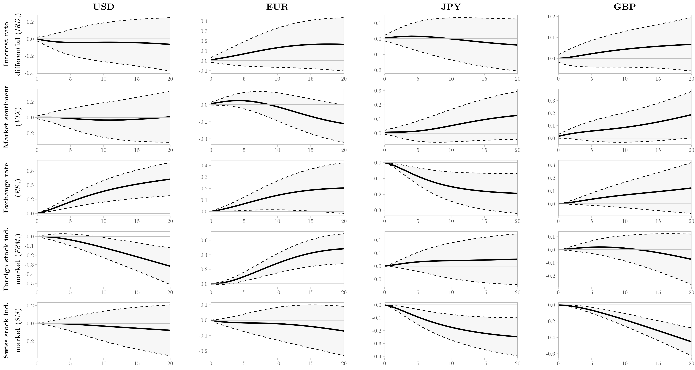
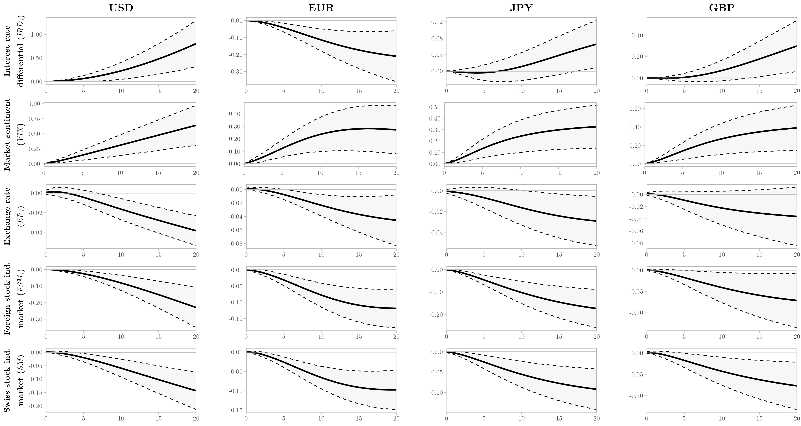

---
#########################################
# options for knitting a single chapter #
#########################################
output:
  bookdown::pdf_document2:
    template: templates/brief_template.tex
    citation_package: biblatex
  bookdown::html_document2: default
  bookdown::word_document2: default
documentclass: book
#bibliography: references.bib
---

```{r, include=FALSE}
options(tinytex.verbose = TRUE)
```

```{block type='savequote', quote_author='(ref:ustreasury-quote)', include=knitr::is_latex_output()}
Treasury therefore assesses, based on a range of evidence and circumstances, that at least part of Switzerland's exchange rate management over the four quarters through June 2020, and particularly its foreign exchange intervention, was for purposes of preventing effective balance of payments adjustments. Hence, Treasury has determined under the 1988 Act that Switzerland is a currency manipulator.
```
(ref:ustreasury-quote) --- U.S. Department of the Treasury [-@unitedstatesdepartmentofthetreasury2020, \text{p.} 5]

# Carry trade and negative interest rate policy in Switzerland: Low-lying fog or storm?^[This chapter is a joint-work with Guillaume Vallet. Submitted to a journal; currently under review.] {#four}
\minitoc <!-- this will include a mini table of contents-->

## Introduction {#fourone}

\noindent The COVID-19 crisis has mobilized central banks to an extent rarely seen in history, even during crises. Similar to the 2008 "Great recession" crisis, far-sweeping measures were enforced to avert the risk of financial turmoil and restore confidence in the global economy. Indeed, the 2020 crisis has increased global uncertainty on financial markets as well as countries’ economic vulnerability, which is likely to negatively affect the economies, compelling central banks to implement “loose” monetary policies durably. Symmetrically, such monetary policies exert consequences on monetary and financial activities. In particular, the rise in the monetary base and central banks’ low or even negative interest rates policies are likely to increase global financial instability: against this backdrop, speculators can look for high returns, akin to taking high risks.

This is the case for currency carry trade activities, which can be fostered through the search for safety and liquidity in the context of international capital mobility. Specifically, with carry trade activities, central banks whose currency is perceived as "safe haven assets" face an increased demand, leading to exchange rate instability. The case of the Swiss franc exemplifies this: despite of very low – and even negative sometimes – yields, assets denominated in this currency systematically face a strong demand in case of international turmoil [@guillaumin2012; @vallet2016]. As a result, the Swiss franc appreciates toward other currencies. Depending on the magnitude of the appreciation, the latter puts strain on the Swiss monetary policy [@gubler2014].

In the context of the Swiss National Bank's (SNB) negative policy interest rate, this paper aims to investigate the behavior of the Swiss franc (CHF) carry trade with four target currencies (U.S. dollar, euro, Japanese yen, and British pound) by disentangling the funding currency and safe haven effects. Whereas most of the literature on the currency carry trade focuses on the estimated excess returns of currency carry portfolios, we opt to proxy the carry trade using weekly positioning data released by the U.S. Commodity Futures Trading Commission (CFTC). Our carry trade proxy is constructed with the volume of hedge funds (leveraged funds) contracts, following @fong2013. More specifically, we refer to the Swiss franc carry trade as the strategy of shorting the Swiss franc (funding currency) to build long positions in the target currencies^[On currency futures, a short (long) position is an obligation to sell (buy) currencies at an agreed rate and a specified future date.].

The main contribution of this paper to the existing literature is the novel approach to investigate thoroughly the implied Swiss franc carry trade by exploring: (i) the hedge funds' behavior with CFTC data, i.e., quantity data [@dupuy2021], not prices as proxied by the expected excess returns, (ii) the period of negative policy interest rates and (iii) the dual role of the Swiss franc as a funding and safe haven currency. The paper's core examines the determinants and impacts of this carry trade activity using the results from impulse-response functions of a six-variable structural vector autoregressive model (SVAR) for each target currency. Besides our carry trade proxy, we focus on five financial variables: interest rate differential between Switzerland and target currency (market-driven interest rates), global market sentiment, nominal exchange rates, Swiss stock market index, and target currency stock market indices. 

Our results show salient features of the Swiss franc acting as a funding currency for carry trade activities, as well as a safe haven currency. Regarding the former, we find evidence that: (i) a higher market sentiment leads to an increase in the Swiss franc carry trade in the EUR model, (ii) the foreign stock market index in the EUR model shocks positively our carry trade proxy and (iii) the uncovered interest rate parity (UIP) does not hold for the USD, EUR and JPY models. The UIP failure is a significant result that confirms the existence of the carry trade activity, contradicting current international finance theory. For the latter, our carry trade proxy responds: (i) positively to an increase in the market sentiment in the GBP model and to a Swiss franc depreciation in the USD, EUR and JPY models and (ii) in an inverse manner with the foreign stock market index in the USD model and with the Swiss stock market index in the JPY and GBP models.

Most importantly, in all models, an increased Swiss franc carry trade activity increases global risk and contracts foreign and Swiss stock market prices. By creating an incentive to the Swiss franc carry trade activity, the impact of the SNB's negative policy interest rate resonates far beyond Switzerland, leading to a systemic risk externality. Furthermore, we document that hedge funds (i.e., institutional investors) are able to move asset prices.  

### Related literature {#one-one}

The Swiss franc presents us with a twofold interest. First, the Swiss franc is a funding currency by virtue of the long-established Swiss “interest rates bonus” [@kugler2002]. Historically, such a “bonus” usually kept both short and long real interest rates lower than in other countries. This specific monetary framework motivates investors to borrow and to contract debts labeled in Swiss francs. Besides this Swiss bonus, another contributing factor is the SNB’s monetary policy of negative interest rates, whose impact is far-reaching in the global financial system. Second, in times of turmoil, the Swiss franc reverts to its core function as a safe haven currency, leading to a rise in the demand in Swiss franc-denominated assets [@ranaldo2010]. 

From the investors’ perspective, the usual carry trade strategy is to derive profit from country-to-country interest rate differentials. This is only achievable in situations where the hypothesis of UIP does not hold. According to the UIP, the interest rate differential between the domestic country and the foreign country invariably matches the expected depreciation of the domestic country's currency. As the seminal paper by @fama1984 documents, all carry trade-derived profit relies on the invalidity of the UIP. @brunnermeier2008 refers to this condition as the “forward premium puzzle”. Furthermore, as widely documented in the literature, the UIP has repeatedly been proven invalid [e.g. @farhi2016; @dupuy2021]. This has been the case for the Swiss franc, whose fluctuations earned it the nickname of “strange animal” [@jochum2005].

The literature on carry trade is extensive. One large body of this literature focuses on empirical studies of hypothetical portfolios of carry trade. Overall, the data used to investigate these portfolios relates to carry trade's estimated profitability (excess returns) [e.g. @burnside2007; @clarida2009; @darvas2009; @menkhoff2012; @cenedese2014; @doskov2015; @breedon2016]. However, excessive attention has been paid to the simulation of carry trade-generated profits.

In this paper, we focus on the research that explores other aspects of carry trade, such as its impact on domestic economies, via exchange rates and financial markets channels, and on the stability of the international financial system. Of particular interest is the side effect of the above-mentioned “forward premium puzzle”, which is characterized by dramatic exchange rate fluctuations which disrupt the exchange rate equilibrium. Carry trade  no doubt accounts to a large extent for foreign exchange rate puzzles [@spronk2013]. Also, the likelihood of a crash due to losses in carry trade positions is high. To that extent, carry trade also increases the global risk [@brunnermeier2008]. 

In another strand of research on carry trade, broader capital flows are used as a proxy to explore the negative spillovers of this speculative activity [e.g. @dodd2007; @spronk2013; @fritz2014; @prates2017; @goda2019]. This is an arduous undertaking, as the balance of payments makes it impossible to distinguish carry trade from other types of flows. @miranda-agrippino2013 went down a similar path but relied on the data from banking statistics supplied by the Bank of International Settlements (BIS).

The literature on the linkages between carry trade and negative interest rates is recent, notably on the Swiss case. For example, @hameed2018 assert that negative interest rates in Switzerland bear no effect on carry trade returns. They find no sufficient evidence that negative interest rates change exchange rate behavior. This contradicts the view held by the SNB that the effects of a negative interest rate policy would become apparent in the exchange rate channel [@jordan2016]. Another example is @kay2018, who points out that negative policy interest rates encourage carry trade, which may also increase risks with their unpredictable unwind.

Such an increasing concern about the relation between negative interest rates and carry trade in the Swiss is highlighted further by the COVID-19 crisis. Indeed, the SNB warned very early, namely in March 2020, its intention to prevent the Swiss franc from appreciating due to its demand as a safe haven currency [@swissnationalbank2020]. Specifically, its intention was twofold: first, to maintain negative interest rates, and second, to massively intervene on the foreign markets in order to curb the Swiss franc appreciation. In March 2020, the SNB  stated that these two policies should go along with one another, considering the expected negative impact of the COVID-19 crisis on the Swiss economy  [@swissnationalbank2020, \text{p.} 46]. Consequently, the SNB purchased assets denominated in foreign currencies for CHF 110 billion, against CHF 13.5 billion in 2019 [@swissnationalbank2020, \text{p.} 50]. At the end of 2020, the assets held by the SNB amounted CHF 999 billion, in comparison to CHF 861 billion in 2019. As a result, purchases of foreign government bonds accounted for 85 % of its portfolio [@swissnationalbank2020, \text{p.} 16].

The major issue of such policies is that the foreign exchange risk and exposure getting larger for the SNB, as it acknowledges. [@swissnationalbank2020, \text{p.} 16]. Rather than a domestic problem, the SNB ends up impacting other central banks via the impact on exchange rates movements in the global financial market. For instance, the SNB was accused by the American fiscal authorities to manipulate its exchange rate against the dollar through its massive interventions on the foreign exchange market, which the SNB denied [@swissnationalbank2020, \text{p.} 21]. All in all, the recent policies implemented by the SNB incentivize to pay more attention to the Swiss franc carry trade activities, which is the purpose of this paper.

## Data and SVAR methodology {#fourtwo}

### Data specification^[Data and command (Stata Do-file) are available upon request.] {#fourtwoone}

To investigate the behavior of the Swiss franc carry trade in the context of the SNB's negative policy interest rate, we structure an individual dataset for each of the following target currencies: U.S. dollar (USD), euro (EUR), Japanese yen (JPY), and British pound (GBP). Table \@ref(tab:Table41) defines the six variables present in each dataset, where $i$ indicates the target currency. Whenever possible, variables are in logarithmic form to add non-linear information.

(ref:abel-citation0) @fong2013
(ref:abel-citation1) @ryan2020
(ref:abel-citation2) @perlin2020
(ref:abel-citation3) [@donnelly2019]
(ref:appendixc1) \@ref(appendixc1)

```{r Table41, echo = FALSE, message=FALSE, warning=FALSE}
library(dplyr)
library(kableExtra)
df <- data.frame(Variables = c("\\multirow{3}{*}[0pt]{\\(IRD_{i}\\)}", "$VIX$$\\textsuperscript{*}$", "\\multirow{2}{*}[0pt]{\\(CT_{i}\\)}",
                               "\\multirow{2}{*}[0pt]{\\(ER_{i}\\)$\\textsuperscript{*}$}", "\\multirow{3}{*}[0pt]{\\(FSM_{i}\\)$\\textsuperscript{*}$}",
                               "$SM$$\\textsuperscript{*}$"),
                 Text_1 = c("Interest rate differential using the 12-Month London Interbank Offered Rate (LIBOR) for CHF and the spot LIBOR\n rates for target currencies (USD, EUR, JPY, and GBP)",
                            "Market sentiment: CBOE DJIA Volatility Index",
                            "Net position of Swiss franc-funded carry trade by target \ncurrencies, following (ref:abel-citation0)",
                            "Nominal exchange rates: USD/CHF, EUR/CHF$\\textsuperscript{a}$, CHF/JPY$\\textsuperscript{a,b}$, \nGBP/CHF$\\textsuperscript{a}$",
                            "Foreign stock markets: S$\\&$P 500 ($\\textasciicircum$GSPC) - USD,\n EURONEXT 100 ($\\textasciicircum$N100) - EUR, Nikkei 225 ($\\textasciicircum$N225) - JPY,\n FTSE 100 ($\\textasciicircum$FTSE) - GBP",
                            "Domestic stock market: Swiss Market Index ($\\textasciicircum$SSMI)"),
                 Text_2 = c("\\multirow{3}{*}[0pt]{FRED}", "FRED", "\\multirow{2}{*}[0pt]{CFTC}", "\\multirow{2}{*}[0pt]{BIS}", "\\multirow{3}{*}[0pt]{Yahoo Finance}", "Yahoo Finance"), stringsAsFactors = F)
colnames(df) <- c("Variable", "Definition", "Source")
df %>%
mutate_all(linebreak) %>%
kable("latex", caption = "Description of variables", booktabs = T, linesep = "", position = "!ht", align = "clc", escape = F) %>%
  kable_styling(latex_options = "scale_down") %>%
  column_spec(2, width = "11,5cm") %>%
  row_spec(0, align = "c") %>%
    footnote(
    general = paste0("\\\\footnotesize{Yahoo Finance data is gathered using the R package quantmod (function GetSymbols), developed by (ref:abel-citation1). The R package BatchGetSymbols, written by (ref:abel-citation2), was used to confirm that the collected data was clean. R code used to collect data can be supplied upon request. See Appendix (ref:appendixc1) for more details on the data.}"),
    general_title = "\\\\footnotesize{Notes:}",
    footnote_as_chunk = T,
    escape = F,
    threeparttable = T,
    alphabet = c("\\\\footnotesize{Cross rates obtained with the USD exhange rate.}\n",
                 paste0("\\\\footnotesize{It follows the order of priority, with higher-ranked currency on top (ref:abel-citation3).}\n")),
    symbol = c("\\\\footnotesize{In logarithmic form.}\n"),
    footnote_order = c("symbol", "alphabet", "general")
    )
```

We rule out the possibility of sample-selection bias by using the longest available sample. Our period ranges from December 23, 2014, to November 24, 2020. On December 18, 2014, the SNB started with the negative policy interest rate by setting it at -0.25%. The use of weekly data is the reason for the mismatch between the initial date of our period and the beginning of the negative policy interest rates in Switzerland.

There is abundant past literature on the behavior of speculators, prime among which is the CFTC data [e.g. @houthakker1957; @chalupa1982; @goldstein1983; @chang1997; @adrangi1998; @klitgaard2004; @mogford2006; @galati2007; @nishigaki2007; @brunnermeier2008; @gubler2014; @mulligan2018; @tomio2020; @kang2020; @hasselgren2020].

As acknowledged by market participants, CFTC data is a reliable indicator of carry trade trends [@bankforinternationalsettlements2015]. It is weekly released to the public under the Commitments of Traders (COT) report, providing the open interest for futures and options on futures markets. Regarding currency futures and options positions, two COT reports are available: Legacy^[In this report, traders are classified either as commercial or non-commercial. After filling a statement and being verified, a trading entity is classified as commercial if it uses futures contracts for hedging, as defined in the  CFTC Regulation 1.3, 17 CFR 1.3(z) [@commodityfuturestradingcommission2020]. This categorization drew criticism on alleged grounds of "naivete" [@hartzmark1987, \text{p.} 1296], as all other traders that do not qualify as hedgers are classified as non-commercial or speculators.] and Traders in Financial Futures (TFF). Our positions data is extracted from the latter, which reports four trader categories: (1) Dealer/Intermediary, (2) Asset Manager/Institutional, (3) Leveraged Funds, and (4) Other Reportables.

The focus of this paper is the category "Leveraged Funds". Traders classified as such are part of the "buy-side" of the market. It is a group composed mainly of hedge funds, jointly with other types of money managers (for example, registered commodity trading advisors - CTAs). We choose this group because they commonly engage in speculative positions in order to arbitrage within and across markets with "proprietary futures trading and trading on behalf of speculative clients" [@commodityfuturestradingcommission2020]. Hereafter, we refer to this category as hedge funds.   

Any results derived from the use of our proxy of carry trade should be weighted against its shortcomings, as previously highlighted by @galati2007, @curcuru2011, and @bankforinternationalsettlements2015. The first caveat relates to the lack of definition of the trading activity, as some contracts by hedge funds may not be used in the carry trade strategy. Second, over-the-counter contracts, which are not subject to CFTC reporting requirements, are primarily used in carry trade activities. Third, only a tiny fraction of the overall foreign exchange market activity is executed through exchanges, as pointed out by the BIS Triennial Bank Survey of Foreign Exchange and Derivative Market Activity [@galati2007]. All caveats considered, we show that the data fits well many specific features of the carry trade activity.

As a proxy of carry trade, we calculate the net position of Swiss franc-funded carry trades by target currency. The procedure closely follows the construct of the implied yen-funded positions proposed by @fong2013. All positions in the TFF report are expressed in U.S. dollars. As an example, consider the Swiss franc carry trade with the euro (EUR) as a target currency ($CT_{EUR}$). First, on reporting day $t$ of a specific week^[This date is used as the reference for the other (daily) variables.], we collect data on the number of long USD/short CHF contracts and long EUR/short USD for that day. This is the data we can collect directly from the CFTC. We gather data for both futures and options contracts. Second, we multiply the number of contracts by the spot exchange rates^[For the USD model, we use the U.S. Dollar Index (ICE Futures U.S.), as it is specified in its contract.], respectively. The smaller of the two positions is then converted in CHF and divided by 125 000 (the minimum contract size for Swiss franc futures on the Chicago Mercantile Exchange)^[For the other currencies, the values are: 1 000 (U.S. dollar), 12 500 000 (Japanese yen), and 62 500 (British pound).]. The result is the number of implied long EUR/short CHF contracts ($LongPositions_{CT_{EUR}}$). Conversely, a similar manner is used to calculate the number of implied short EUR/long CHF contracts ($ShortPositions_{CT_{EUR}}$). In the last step, we calculate the Swiss franc carry trade with the euro as the target currency as follows:
\begin{equation}
CT_{i} = \frac{LongPositions_{CT_{i}}-ShortPositions_{CT_{i}}}{LongPositions_{CT_{i}}+ShortPositions_{CT_{i}}}
\end{equation}

where $i$ is replaced by EUR to derive $CT_{EUR}$. By applying this procedure to the other target currencies, we obtain $CT_{USD}$, $CT_{JPY}$, and $CT_{GBP}$. A positive (negative) net position indicates the presence (absence) of the Swiss franc carry trade activity with the target currency. We cross-analyze them against the backdrop of the structural vector autoregressive (SVAR) framework model devised by @nishigaki2007.

### The SVAR model {#fourtwotwo}

We design a SVAR model with a view to investigating the impacts of the Swiss franc carry trade. Our model follows this equation for each target currency $i$:
\begin{equation}
y_{i,t} = \phi_{i,1}y_{i,t-1} + \cdots + \phi_{i,p}y_{i,t-p} + A^{-1}Bv_{i,t}
\end{equation}

The first element, $y_{i,t}$, represents a vector of the endogenous variables in our system of equations. The vector of constants is hidden for simplicity’s sake. The matrices of coefficients are given by $\phi_i$. Matrices $A$ and $B$ are introduced to add structural parameters. In matrix $A$, we introduce additional contemporaneous endogenous variables to each equation. Matrix $B$ simplifies the error structure. In this sense, the matrix of random disturbances is transformed into $v_{i,t}$, with uncorrelated elements.
The SVAR model follows this specification:
\begin{equation}
A\epsilon_{i,t} = Bv_{i,t}
\end{equation}

Alternatively, in line with @nishigaki2007, we have:
\begin{equation}
\resizebox{.92\hsize}{!}
{$\left[\begin{array}{cccccc} 
1 & 0 & 0 & 0 & 0 & 0\\
g(VIX,IRD_{i}) & 1 & 0 & 0 & 0 & 0\\
g(CT_{i},IRD_{i}) & g(CT_{i},VIX) & 1 & 0 & 0 & 0\\
g(ER_{i},IRD_{i}) & g(ER_{i},VIX) & g(ER_{i},CT_{i}) & 1 & 0 & 0\\
g(FSM_{i},IRD_{i}) & g(FSM_{i},VIX) & g(FSM_{i},CT_{i}) & g(FSM_{i},ER_{i}) & 1 & 0\\
g(SM,IRD_{i}) & g(SM,VIX) & g(SM,CT_{i}) & g(SM,ER_{i}) & g(SM,FSM_{i}) & 1
\end{array}\right]
\left[\begin{array}{c} 
\epsilon^{IRD}_{i,t}\\ 
\epsilon^{VIX}_{i,t}\\ 
\epsilon^{CT}_{i,t}\\ 
\epsilon^{ER}_{i,t}\\ 
\epsilon^{FSM}_{i,t}\\ 
\epsilon^{SM}_{i,t} 
\end{array}\right]
=Bv_{i,t}$}
(\#eq:mainmodel)
\end{equation}

The choice of employing a lower-triangular contemporaneous-effect matrix $A$ imposes some important restrictions. The identification assumptions used in our SVAR model follow the model proposed by @nishigaki2007. The first equation represents the interest rate differentials ($IRD_{i}$) between Switzerland and the target currencies, which is assumed to be exogenous to the other variables in the model. As a borrowing cost, the interest rate differentials impact the global market sentiment ($VIX$) in the second equation. The Swiss franc carry trade activity ($CT_{i}$) appears in the third equation, depending on both interest rate differentials and market sentiment. An increase in the policy rate in Switzerland would increase the cost of borrowing, causing a decrease in carry trade. Further, pessimism in the market sentiment would hinder the carry trade [@brunnermeier2008].

The fourth equation shows that the exchange rates ($ER_{i}$) depend on interest rate differentials, market sentiment, and carry trade. Based on the interest rate parity, exchange rates are impacted by the differences in interest rates across countries/currencies. Following @grisse2015, the Swiss franc depreciates against the target currencies (U.S. dollar, Japanese yen, and British pound) in response to an increase in the global risk (market sentiment). As for the relation between the foreign exchange and the carry trade activity, a depreciation in the exchange rate is usually associated with a build-up in short positions [@mogford2006]. In the fifth and sixth equations, we state that the stock market indices ($SM$ and $FSM_{i}$) are affected by all the other variables in the model. This financial market linkage is related to the portfolio rebalancing, based on the uncovered equity parity condition (UEP) [@curcuru2014; @girardin2019].

## Empirical assessment {#fourthree}

In order to estimate the SVAR model, we follow in the footsteps of @chen2016, who use the approach formulated by @toda1995. @amiri2012 also favor this approach because it reduces the risks of a possible misspecification of the models in the presence of non-stationary variables. Most importantly, by applying this approach, we can capture long-term effects with variables in levels. This is preferable because our proxy of carry trade with CFTC data is related to the trends of this speculative activity.

The application of the Toda-Yamamoto (1995) approach to SVAR models is straightforward. First, we apply unit roots tests to find the integration order ($d$) of each variable^[See Appendix \@ref(appendixc2) for more details and results.]. Second, we estimate a VAR model for each target currency with variables in levels to find the maximum lag length ($p$)^[Check Appendix \@ref(appendixc3) for a thorough explanation of the model specification.]. Third, we estimate the SVAR models by adding of the lagged ($d+p$) non-stationary variables as exogenous variables. The structure of the exogenous variables of the final estimated models is provided in Table \@ref(tab:Table42).

```{r Table42, echo = FALSE, message=FALSE, warning=FALSE}
library(kableExtra)
library(tidyverse)
taba4 <- data.frame(Text_0 = c("USD", "EUR", "JPY", "GBP"),
                 Text_1 = c("2", "2", "1", "1"),
                 Text_2 = c("\\(VIX_{t-3}\\), \\(CT_{USD,t-3}\\),
                            \\(ER_{USD,t-3}\\), \\(FSM_{USD,t-3}\\),
                            \\(SM_{t-3}\\)",
                            "\\(VIX_{t-3}\\), \\(CT_{EUR, t-3}\\),
                            \\(ER_{EUR, t-4}\\), \\(FSM_{EUR, t-3}\\),
                            \\(SM_{t-3}\\)",
                            "\\(VIX_{t-2}\\), \\(CT_{JPY,t-2}\\),
                            \\(ER_{JPY,t-2}\\), \\(FSM_{JPY,t-2}\\),
                            \\(SM_{t-2}\\)",
                            "\\(VIX_{t-2}\\), \\(CT_{GBP,t-2}\\),
                            \\(SM_{t-2}\\)"))
kable(taba4, "latex", caption = "Exogenous variables for each model", booktabs = T, escape = F, align = "c", col.names = c("Model", "VAR lag length (\\(p)\\)", "Exogenous variables"), position = "!ht") %>%
  kable_styling(latex_options = "scale_down")
```

In the following subsections, we empirically investigate the dual role of the Swiss franc (funding and safe haven currency) with the SVAR model^[The number of lags used (20) was chosen based on the stability of the cumulative orthogonalized impulse–response functions.]. The determinants of the Swiss franc carry trade activity with each target currency during the negative interest rate policy period are explored in Section \@ref(fouroneone). Section \@ref(fouronetwo) explores how the Swiss franc carry trade impacts the other financial variables in each target currency model. In Section \@ref(fouronethree), we confirm the robustness of our results by analyzing the forecast-error variance decomposition and re-estimating the models using two new configurations (changing the ordering of the variables and excluding the carry trade proxy).

### Determinants of the Swiss franc carry trade in each model {#fouroneone}

In order to disentangle the funding and safe haven currency effects, we explore the role of the financial variables in explaining the Swiss franc carry trade. Figure \@ref(fig:Figure41) presents the cumulative responses of Swiss franc carry trade with each target currency to the impulses of interest rate differentials, market sentiment, exchange rates, foreign stock market indices, and Swiss market index.

```{r Figure41, out.width='0.99\\columnwidth', fig.align = "center", fig.cap = "Responses of Swiss franc carry trade (\\textit{CT\\textsubscript{i}}) to impulses of financial variables in each target currency model \\newline \\scriptsize Notes: Solid line is the cumulative orthogonalized impulse–response function. Dashed lines represent the 95\\% lower and upper bounds. We use bootstrap standard errors.", fig.scap="Responses of Swiss franc carry trade (\\textit{CT\\textsubscript{i}}) to impulses of financial variables in each target currency model", fig.pos="h", echo = FALSE, message=FALSE, warning=FALSE}

```

While there are no statistically significant results for the interest rate differential shock, two different results are found for the impact of a positive shock in the market sentiment on the Swiss franc carry trade. For the EUR model, this shock hinders carry trade. Meanwhile, in the GBP model, evidence for an inverse relationship is found. Both results are found in the long-run (20 weeks ahead the initial shock). While the former confirms the role of the Swiss franc as a funding currency, the latter shows evidence for the role as safe haven.

Regarding the exchange rate shock, a Swiss franc depreciation increases the Swiss franc carry trade activity with all target currencies, except the British pound. This result confirms the carry trade strategy, where the funding currency tends to depreciate while the target currency appreciates. For the USD model, the economic impact is relatively higher than the other exchange rates.

The stock market shocks highlight further the dual role of the Swiss franc. AAfter an increase in the foreign stock market, the USD model negatively impacts the Swiss franc carry trade. Moreover, a bearish stock market may generate better gains than engaging in the carry trade. There is also a statistically significant result for the euro model, where a higher stock activity in the euro area leads to a higher Swiss franc carry trade activity. Both results reinforce the funding role of the Swiss franc in the carry trade activity.

Last but not least, innovations in the Swiss stock market prices decrease the Swiss franc carry trade in both JPY and GBP models. This substitution effect needs to be interpreted cautiously since diversified portfolios to diminish risk are standard practice in the financial market. Another possible explanation is the search for higher yields in the financial markets, not risk mitigation, as indicated by the uncovered equity parity condition (UEP) [@curcuru2014]. Additionally, the argument about the funding role in the relationship between the foreign stock market and carry trade applies here.

### How does the Swiss franc carry trade impact the financial variables in each model? {#fouronetwo}

Figure \@ref(fig:Figure42) illustrates the Swiss franc carry trade shock on the financial variables in each target currency analyzed. With the negative interest rate policy, the SNB is extending the role of the Swiss franc as a funding currency. In this scenario, an increase in the Swiss franc carry trade activity is very plausible. 

```{r Figure42, out.width='0.99\\columnwidth', fig.align = "center", fig.cap = "Responses of financial variables to impulses of Swiss franc carry trade (\\textit{CT\\textsubscript{i}}) in each target currency model \\newline \\scriptsize Notes: Solid line is the cumulative orthogonalized impulse–response function. Dashed lines represent the 95\\% lower and upper bounds. We use bootstrap standard errors.", fig.scap="Responses of financial variables to impulses of Swiss franc carry trade (\\textit{CT\\textsubscript{i}}) in each target currency model", fig.pos="!ht", echo = FALSE, message=FALSE, warning=FALSE}

```

While a positive shock on Swiss franc carry trade increases market-driven interest rate differentials for the USD, JPY and GBP models, there is a negative impact on the EUR model. This divergent result may be explained by the different roles of the Swiss franc. While the negative relationship may be related to the safe haven role, the positive impact shows evidence of the funding role.

Following, all models show evidence for a higher market sentiment with a positive shock in the carry trade proxy. By increasing their speculative positions, hedge funds foment global risk, notably with their leveraged activity. In this sense, there is evidence that more speculative Swiss franc activity boosts market risk worldwide.

Particularly, we find evidence for the failure of the UIP in the USD, EUR and JPY models. The Swiss franc carry trade shock leads to a depreciation of both U.S. dollar and euro^[We do not take into account the EUR/CHF peg because it ended in January 2015, while the initial date of the negative interest rate policy in Switzerland is December 18, 2014. @accominotti2019 investigate the impact of currency regime shifting on the carry trade activity. They suggest that the fixed-to-floating regime switch by the SNB created carry trade losses, starting a global flight-to-safety phenomenon.] (appreciation of the Swiss franc) and to an appreciation of the Japanese yen (depreciation of the Swiss franc). This inverse relationship found in the JPY model, when compared to the results in USD and EUR models, may be related to the different international status of each currency. @hossfeld2015 classify the euro as a hedge currency, while classifying the Swiss franc, the U.S. dollar and the British pound as safe haven currencies and the Japanese yen as a "carry funding vehicle". Therefore, while the results in the USD and EUR models may be related to the Swiss franc as a funding currency, the safe haven role appears in the JPY model.

Conversely, there is a typical result for all models on the impacts of foreign and Swiss stock markets after a positive carry trade shock. These results reveal that institutional investors can move asset prices. Accordingly, this finding resonates with the yen carry trade [@fong2013]. For all models, bearish stock markets result from an increased Swiss franc carry trade activity. More importantly, these results imply that a higher Swiss franc speculative activity is problematic for the financial markets. Jointly, the responses of the market sentiment and both stock market indices indicate a higher systemic risk with the increased Swiss franc carry trade activity. This is also consistent with the adverse side effects of the negative interest rate policy, which have been highlighted by several authors [see @rossi2019].

### Robustness checks {#fouronethree}

The Granger causality tests confirm most of the results found on the impulse-response functions. As shown by Table \@ref(tab:Table445), all variables Granger cause the Swiss franc carry trade in the USD and GBP models. Although not statistically significant in the impulse-response function, the Granger causality test shows that the interest rate differentials impact the carry trade in both USD and GBP models. Some caution regarding the EUR model results is needed since there is no evidence of Granger causality among the variables. In a significant manner, strong evidence is found on the Granger causality of the carry trade proxy on market sentiment and stock market indices in all target currencies (see Table \@ref(tab:Table444)). Regarding the UIP failure, only the EUR model shows a statistically significant result.

```{r Table445, echo = FALSE, message=FALSE, warning=FALSE}
tab5 <- structure(list(c("$IRD_{i}$", "$VIX$", "$ER_{i}$", "$FSM_{i}$", 
"$SM$", "$All$ $variables$"), `$CT_{USD}$` = c("0.0483**  ", "0.9823    ", 
"0.0015*** ", "0.8945    ", "0.9624    ", "0.0311**  "), `$CT_{EUR}$` = c("0.7511    ", 
"0.2604    ", "0.1818    ", "0.3664    ", "0.3845    ", "0.5404    "
), `$CT_{JPY}$` = c("0.9286    ", "0.4740    ", "0.0241**  ", 
"0.1994    ", "0.0787*   ", "0.3112    "), `$CT_{GBP}$` = c("0.0558*   ", 
"0.5320    ", "0.0002*** ", "0.0034*** ", "0.2506    ", "0.0097*** "
)), class = "data.frame", row.names = c(NA, -6L))

kable(tab5, "latex", caption = "Granger causality tests for the direction $\\textit{All variables}$$\\rightarrow$$CT_{i}$, p-values", booktabs = T, linesep = "", align = "lcccccc", position = "!ht", escape = F) %>%
  footnote(
    general = "\\\\scriptsize{Null hypothesis is that \\\\textit{All variables} ‘does not’ Granger-cause $CT_{i}$. ‘***’, ‘**’, and ‘*’ denote statistical significance at 1\\\\%, 5\\\\%, and 10\\\\%, respectively.} ",
    general_title = "\\\\scriptsize{Notes: }",
    footnote_as_chunk = T,
    escape = F,
    threeparttable = T)
```

```{r Table444, echo = FALSE, message=FALSE, warning=FALSE}
tab4 <- structure(list(c("$CT_{USD}$", "$CT_{EUR}$", "$CT_{JPY}$", "$CT_{GBP}$"
), `$IRD_{i}$` = c("0.1881    ", "0.0810*   ", "0.5202    ", 
"0.8517    "), `$VIX$` = c("0.0217**  ", "0.0600*   ", "0.0395**  ", 
"0.0300**  "), `$ER_{i}$` = c("0.3625    ", "0.0648*   ", "0.7120    ", 
"0.1296    "), `$FSM_{i}$` = c("0.0656*   ", "0.0281**  ", "0.0017*** ", 
"0.0931*   "), `$SM$` = c("0.0442**  ", "0.0169**  ", "0.0255**  ", 
"0.0442**  ")), row.names = c(NA, -4L), class = "data.frame")

kable(tab4, "latex", caption = "Granger causality tests for the direction $CT_{i}$$\\rightarrow$$\\textit{All variables}$, p-values", booktabs = T, align = "lcccccc", position = "!ht", escape = F) %>%
  footnote(
    general = "\\\\scriptsize{Null hypothesis is that $CT_{i}$ ‘does not’ Granger-cause \\\\textit{All variables}. ‘***’, ‘**’, and ‘*’ denote statistical significance at 1\\\\%, 5\\\\%, and 10\\\\%, respectively.} ",
    general_title = "\\\\scriptsize{Notes: }",
    footnote_as_chunk = T,
    escape = F,
    threeparttable = T)
```

With the structural forecast-error variance decomposition analysis, we can determine the extent to which each variable may account for the other variable fluctuation. Table \@ref(tab:Table43) displays the variance decomposition results for the Swiss franc carry trade ($CT_i$).^[In Table \@ref(tab:Table43), Figures \@ref(fig:Figure41) and \@ref(fig:Figure42) are linked to "Response = $CT_i$" and "Impulse = $CT_i$", respectively.] Concerning the financial variables shocks ("Response = $CT_i$"), we find that the Swiss franc carry trade is sensitive to the disturbances in the following equations: (i) exchange rate ($ER_i$) in the USD model, (ii) foreign stock market index ($FSM_i$) in the EUR model and (iii) Swiss stock market index ($SM$) in the GBP model. Alike, the decomposition of the impulses of Swiss franc carry trade is presented in Table \@ref(tab:Table43) ("Impulse = $CT_i$"). For the USD model, results reinforce the argument on the increased systemic risk ($VIX$) and the UIP failure ($ER_{i}$). Likewise, the linkage between the Swiss carry trade ($CT_{i}$) and stock market indices ($FSM_{i}$ and $SM$) is well present in the USD, EUR and JPY models.

```{r Table43, echo = FALSE, message=FALSE, warning=FALSE}
library(kableExtra)
library(tidyverse)
tab3 <- structure(list(Steps = c(4, 8, 12, 16, 20, 4, 8, 12, 16, 20, 
4, 8, 12, 16, 20, 4, 8, 12, 16, 20), `$IRD_{i}$` = c(0.63, 0.43, 
0.36, 0.34, 0.36, 1.22, 2.02, 2.45, 2.47, 2.38, 0.18, 0.19, 0.36, 
0.54, 0.66, 0.16, 0.43, 0.54, 0.56, 0.55), `$VIX$` = c(0.02, 
0.14, 0.15, 0.16, 0.26, 1.33, 1.21, 3.16, 5.67, 7.15, 0.11, 0.35, 
1.11, 1.79, 2.15, 1.59, 1.78, 2.06, 2.66, 3.55), `$CT_{i}$` = c(92.36, 
86.69, 83.78, 81.98, 80.5, 94.38, 85.32, 76, 70.54, 68.72, 94.22, 
87.23, 83.86, 82.24, 81.52, 96.64, 91.12, 84.3, 77.3, 70.68), 
    `$ER_{i}$` = c(6.85, 11.88, 13.82, 14.52, 14.76, 1.13, 2.41, 
    3.12, 3.28, 3.24, 2.47, 5.41, 6.28, 6.43, 6.44, 0.42, 1.04, 
    1.32, 1.46, 1.58), `$FSM_{i}$` = c(0.13, 0.8, 1.76, 2.81, 
    3.87, 1.71, 8.86, 15.11, 17.81, 18.12, 0.12, 0.15, 0.15, 
    0.15, 0.15, 0.19, 0.23, 0.35, 0.82, 1.59), `$SM$` = c(0.01, 
    0.06, 0.13, 0.19, 0.25, 0.23, 0.17, 0.16, 0.23, 0.39, 2.9, 
    6.65, 8.25, 8.86, 9.08, 1, 5.4, 11.43, 17.19, 22.05), `$IRD_{i}$` = c(0.78, 
    2.95, 6.48, 10.55, 14.61, 2.08, 7, 9.25, 9.23, 8.3, 0.15, 
    0.28, 1.54, 3.3, 4.68, 0.04, 0.92, 2.99, 4.96, 6.38), `$VIX$` = c(4.04, 
    9.83, 14.52, 18.17, 21, 3.03, 7.47, 9.36, 9.44, 9.16, 3.1, 
    6.33, 7.42, 7.74, 7.83, 3.45, 7.33, 8.72, 8.99, 8.85), `$ER_{i}$` = c(0.8, 
    5.75, 10.78, 14.18, 16.64, 1.67, 6.31, 8.2, 7.88, 6.79, 0.66, 
    2.19, 3.58, 4.36, 4.7, 1.13, 2.71, 3.11, 2.99, 2.76), `$FSM_{i}$` = c(2.76, 
    10.75, 18.53, 24.26, 28.1, 3.36, 11.67, 17.91, 19.84, 19.34, 
    6.39, 11.52, 13.42, 14.18, 14.5, 1.57, 3.72, 4.71, 4.98, 
    4.9), `$SM$` = c(2.5, 10.35, 18.34, 24.17, 28, 4.07, 14.46, 
    20.8, 21.67, 20.11, 3.71, 8.4, 10.62, 11.56, 11.97, 2.09, 
    5.59, 7.25, 7.71, 7.62)), row.names = c(NA, -20L), class = "data.frame")

kable(tab3, "latex", caption = "Structural forecast-error variance decomposition (SFEVD) for each model, in percent", booktabs = T, align = "c", position = "!ht", escape = F) %>%
  add_header_above(c(" " = 1, "Impulse $=$" = 6, "Response $=$" = 5), escape = F, line = F, bold = T) %>%
  add_header_above(c(" " = 1, "Response $=$ $CT_{i}$" = 6, "Impulse $=$ $CT_{i}$" = 5), escape = F, bold = T) %>%
  pack_rows("USD model", 1, 5) %>%
  pack_rows("EUR model", 6, 10) %>%
  pack_rows("JPY model", 11, 15) %>%
  pack_rows("GBP model", 16, 20) %>%
  kable_styling(font_size = 8, latex_options = c("scale_down"))# %>%
#  collapse_rows(1, latex_hline = "major", valign = "middle") %>%
#  landscape()
# kable(linesep = "\\addlinespace")

# RESPONSE OF CT = Response of $CT$
# IMPULSE IN CT = Response to the $CT$ shock
```

Concerning to other robustness checks, four procedures are computed, as presented in Appendix \@ref(appendixc4). First, the models are estimated using a new ordering of variables, according to the Granger causality tests (Figures \@ref(fig:FigureD1) and \@ref(fig:FigureD2)). Second, the estimations obtained with the Toda-Yamamoto approach are compared to non-stationary variables (Figures \@ref(fig:FigureD3) and \@ref(fig:FigureD4)). Third, time dummies are added to verify the accuracy of the estimated models (Figures \@ref(fig:FigureD5) and \@ref(fig:FigureD6)). Last but not least, we exclude the Swiss franc carry trade in each model to verify the sensitivity of the results (Figures \@ref(fig:FigureD7), \@ref(fig:FigureD8), \@ref(fig:FigureD9) and \@ref(fig:FigureD10)). Overall, there is no significant change, showing our results are robust to different modeling configurations.

## Main conclusions and policy implications {#fourfour}

This paper takes a novel approach to examine the Swiss franc carry trade during the period of negative interest rate policy in Switzerland. Using data from hedge fund positions (i.e., volumes) in the U.S. futures market, we elaborated a new construct of Swiss franc carry trade with four target currencies (U.S. dollar, euro, Japanese yen, and British pound). Each target currency is modeled individually to investigate the behavior of the Swiss franc carry trade. More specifically, we use the formulated model to disentangle the funding currency and safe haven effects embedded in our carry trade proxy.

Our results are uncomplicated to summarize. First, our carry trade proxy captures the funding currency effect of the Swiss franc. In the analysis of the determinants of the Swiss franc carry trade activity, we find that a higher market sentiment leads to an increase in the Swiss franc carry trade in the EUR model, (ii) the foreign stock market index in the EUR model shocks positively the Swiss franc carry trade and (iii) the uncovered interest rate parity (UIP) does not hold for the USD, EUR and JPY models. With negative policy interest rates, the SNB is clearly creating an incentive to foster the Swiss franc as a funding currency in the carry trade strategy. Thus, rather than fulfilling its goal of boosting the Swiss economy, the SNB creates some negative international spillovers.

Second, we also find evidence for the Swiss currency acting as a safe haven currency. The Swiss franc carry trade proxy responds: (i) positively to an increase in the market sentiment in the GBP model and to a Swiss franc depreciation in the USD, EUR and JPY models and (ii) in an inverse manner with the foreign stock market index in the USD model and with the Swiss stock market index in the JPY and GBP models.

Third, we document the violation of the UIP in the USD, EUR and JPY models. By seeking to promote the international competitiveness of Swiss firms and to avoid deflation for the whole economy, the SNB is very keen to depreciate the Swiss franc in relation to other currencies, as seen with the euro peg. Also, with increased funding promoted by the SNB's negative interest rate policy, hedge funds are exploring the invalidity of the UIP to profit.

Fourth, our results suggest that the SNB's negative interest rate policy augments the systemic risk. Evidence for this externality is shown by the linkages between the Swiss franc carry trade activity and financial markets indicators. With all four target currencies, an increased Swiss franc carry trade activity increments the global risk and contracts stock market prices (foreign and Swiss stock market indices). Moreover, we also contribute to the literature of institutional investors by documenting that hedge funds can move asset prices. 

More importantly, our results resonate with increased systemic risk with higher speculative activity in Swiss franc. In this sense, our findings are consistent with the existing literature stressing the negative impact of carry trade activities on global financial and monetary risk. Conversely, we should remember that central banks’ monetary policies are also more likely to influence carry trade activities when these monetary policies are not coordinated. The SNB’s actual negative interest rates policy may have created perverse incentives for more speculation on the Swiss financial market [@rossi2019]. This finding vindicates the view that the SNB should strengthen its remit over asset price regulation in Switzerland. This entails that the SNB would benefit from consolidating its macro-prudential supervision, by setting up new instruments to respond to changing financial variables through new types of monetary and financial condition indices for instance [@guillaumin2017].

However, more broadly, far-sweeping measures enforced by central banks are needed to avert the risk of financial turmoil and to restore confidence in the global economy. Notably, this is the case with the COVID-crisis that questions the future of currency carry trade activities. Indeed, on the one hand, massive asset-purchasing programs, targeting government bonds in particular, participate in the reduction of the "safe asset trap" between bond yields [@reviglio2020]. This is likely to improve global stability through the increase of international supply of safe assets – warranted by central banks – with respect to the rise in global demand in search for a flight to safety and liquidity. Specifically, these measures could reduce the demand for safe haven currencies and, consequently, carry trade activities. On the other hand, if future central banks' future measures are non-coordinated or non-cooperative, they could increase exchange rates movements and financial turmoil. In the context of uncertainty characterizing the COVID-crisis, this could further incentivize the Swiss franc carry trade activities.